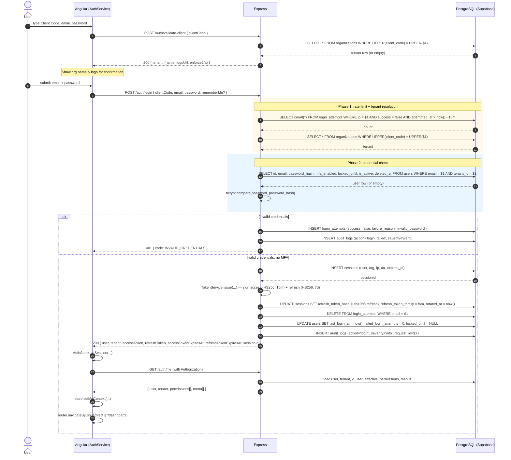
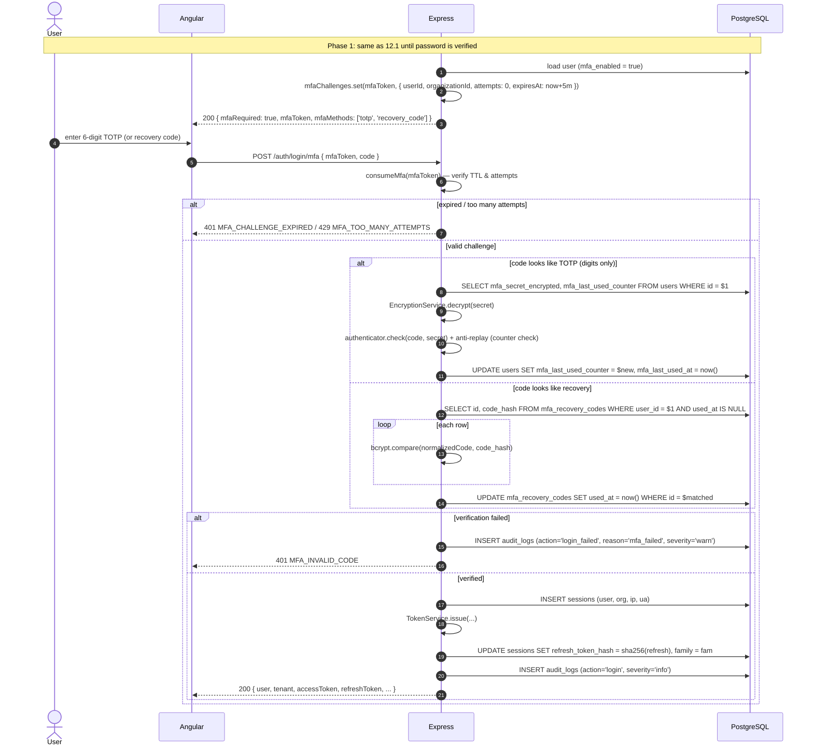
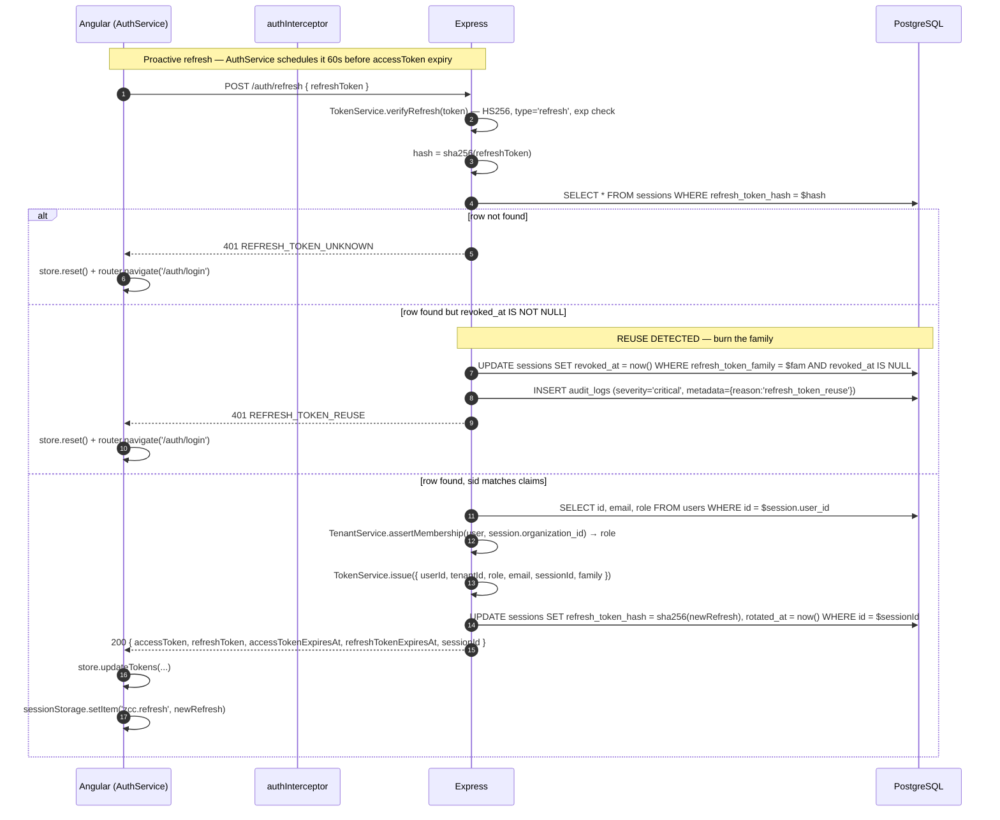
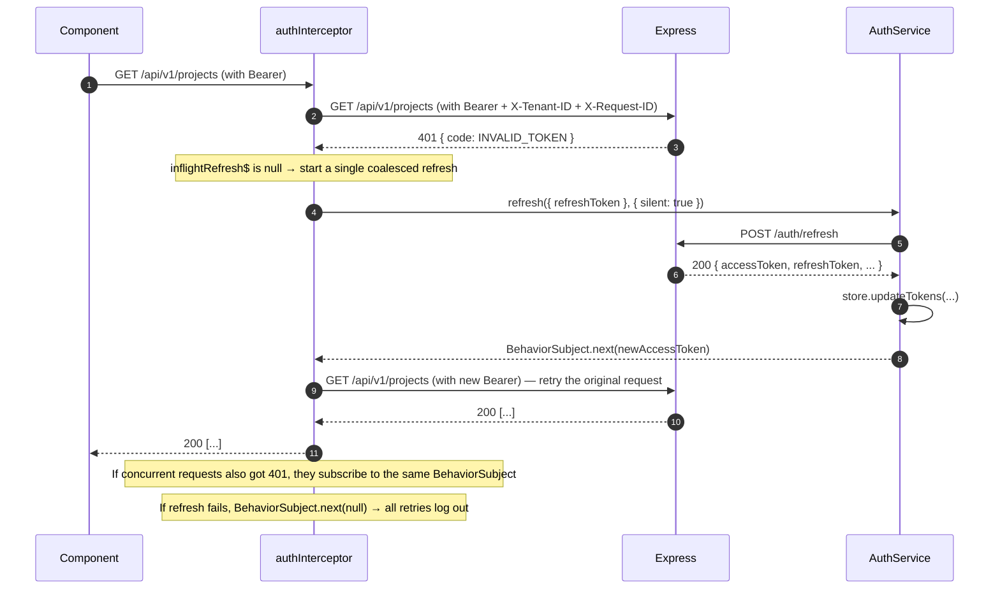
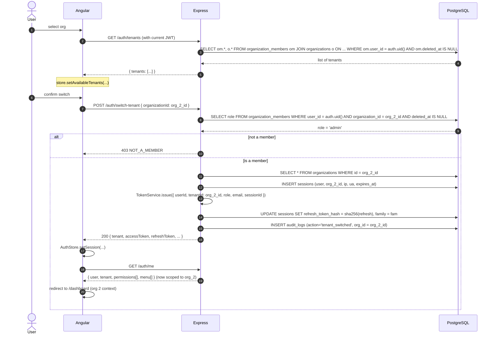
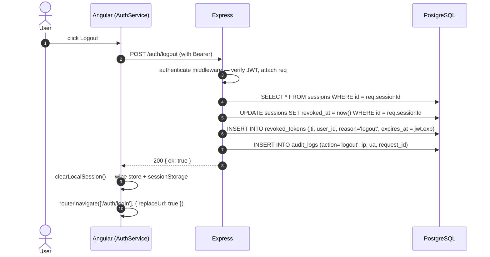
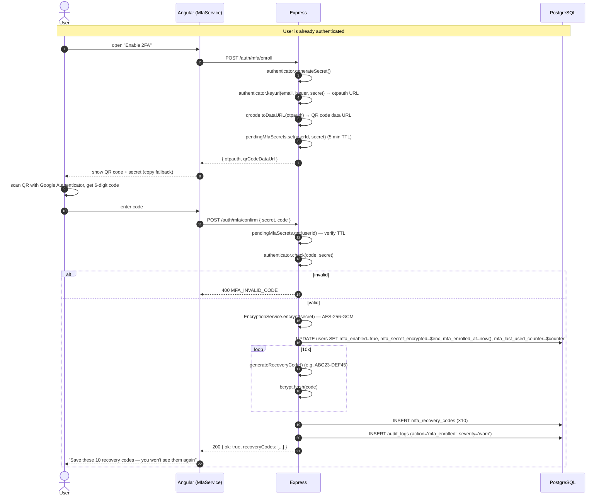
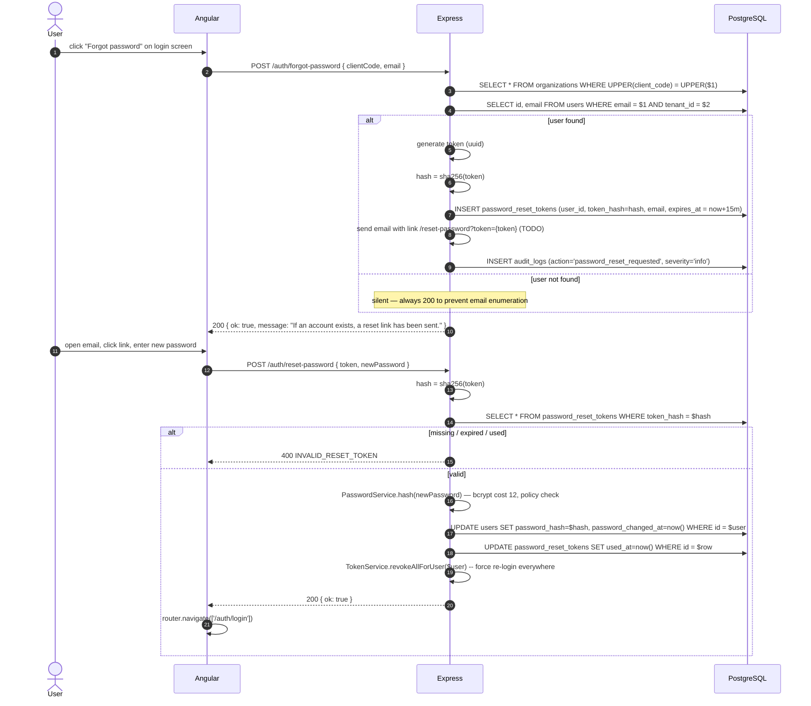
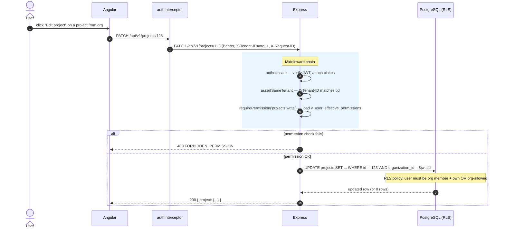
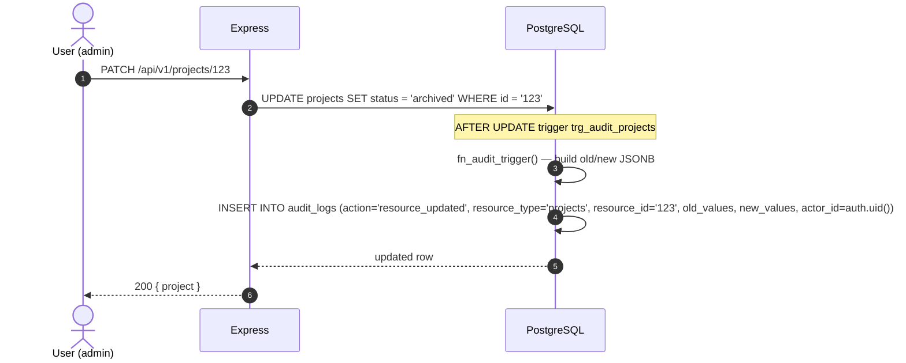

# Enterprise Multi-Tenant Authentication & Authorization System

**Version:** 1.0 — Production
**Stack:** Angular 17 (Signals) · Express + TypeScript · Supabase / PostgreSQL 15+ · JWT · TOTP (RFC 6238) · RLS

This is the authoritative reference for the ZCC auth system. It consolidates architecture, database design, RLS, login flow, session/refresh strategy, security best practices, the Angular service layer, error handling, audit logging, and sequence diagrams.

---

## Table of Contents

1. [System Architecture](#1-system-architecture)
2. [Authentication Flow](#2-authentication-flow)
3. [Database Schema](#3-database-schema)
4. [Row Level Security (RLS)](#4-row-level-security-rls)
5. [Session Management & Refresh Tokens](#5-session-management--refresh-tokens)
6. [Tenant Isolation](#6-tenant-isolation)
7. [Security Best Practices](#7-security-best-practices)
8. [Angular Authentication Services](#8-angular-authentication-services)
9. [Guards, Interceptors, and Stores](#9-guards-interceptors-and-stores)
10. [Error Handling](#10-error-handling)
11. [Audit Logs](#11-audit-logs)
12. [Sequence Diagrams](#12-sequence-diagrams)

---

## 1. System Architecture

```
┌────────────────────────────────────────────────────────────────────────┐
│                  Angular 17 Frontend (Signals, Standalone)            │
│                                                                        │
│  ┌──────────────┐  ┌──────────────┐  ┌──────────────┐  ┌──────────┐    │
│  │ AuthService  │  │TenantService │  │PermissionSvc │  │ MfaSvc   │    │
│  │ (HTTP + side)│  │ (current ctx)│  │  (has/all)   │  │(enroll)  │    │
│  └──────┬───────┘  └──────────────┘  └──────────────┘  └──────────┘    │
│         │                                                                │
│  ┌──────▼───────────────────────────────────────────────────────────┐  │
│  │                       AuthStore (Signals)                         │  │
│  │  user · tenant · permissions · menu · tokens · isAuthenticated   │  │
│  └──────┬───────────────────────────────────────────────────────────┘  │
│         │                                                                │
│  ┌──────▼───────────────┐  ┌─────────────────┐  ┌──────────────────┐    │
│  │ authInterceptor      │  │errorInterceptor │  │ErrorBus (toasts) │    │
│  │ JWT · X-Tenant-ID ·  │  │  normalize +    │  │                  │    │
│  │ 401-refresh-retry    │  │  tag reqId      │  │                  │    │
│  └──────┬───────────────┘  └─────────────────┘  └──────────────────┘    │
│         │                                                                │
│  Guards: authGuard · roleGuard · permissionGuard · mfaEnrolledGuard     │
└─────────┼──────────────────────────────────────────────────────────────┘
          │ HTTPS · Authorization · X-Tenant-ID · X-Request-ID
          ▼
┌────────────────────────────────────────────────────────────────────────┐
│                       Express + TypeScript API                         │
│  ┌──────────────────────────────────────────────────────────────────┐  │
│  │  Routes       /auth/validate-client · /login · /login/mfa ·       │  │
│  │               /refresh · /logout · /me · /tenants · /switch-tenant │  │
│  │               /mfa/* · /change-password · /forgot-password · ...   │  │
│  ├──────────────────────────────────────────────────────────────────┤  │
│  │  Middleware  helmet · cors · rate-limit · authenticate ·          │  │
│  │              assertSameTenant · requirePermission · audit-tap     │  │
│  ├──────────────────────────────────────────────────────────────────┤  │
│  │  Services    PasswordService (bcrypt 12)                          │  │
│  │              TokenService   (JWT HS256, rotating refresh)        │  │
│  │              SessionService (sessions table)                      │  │
│  │              TenantService  (case-insensitive client_code)        │  │
│  │              MfaService     (TOTP + recovery codes)               │  │
│  │              PermissionService (v_user_effective_permissions)    │  │
│  │              MenuService   (filtered by permission)               │  │
│  │              AuditService  (all sensitive events)                │  │
│  │              RateLimitService (login_attempts)                    │  │
│  │              EncryptionService (AES-256-GCM for TOTP secret)     │  │
│  └──────────────────────────────────────────────────────────────────┘  │
└─────────┬──────────────────────────────────────────────────────────────┘
          │ SQL via Supabase (service role + RLS bypass for trusted paths)
          ▼
┌────────────────────────────────────────────────────────────────────────┐
│             PostgreSQL 15+ (Supabase) with Row Level Security          │
│                                                                        │
│  organizations ─┬─ organization_members ─ users                        │
│                 ├─ sessions      (per-login, sliding window)           │
│                 ├─ mfa_recovery_codes                                    │
│                 ├─ permissions + role_permissions                       │
│                 ├─ menus  (filtered by user permission)                │
│                 ├─ api_keys (tenant-scoped)                             │
│                 ├─ login_attempts  (rate-limit + lockout source)        │
│                 ├─ revoked_tokens (JTI denylist)                        │
│                 ├─ audit_logs   (security event journal)                │
│                 └─ password_reset_tokens                                 │
│                                                                        │
│  Portfolio (RLS-isolated): profiles · skills · experience · education · │
│    services · testimonials · projects · project_gallery · blog_posts ·  │
│    blog_categories · media_files · technologies                         │
│                                                                        │
│  Helper view: v_user_effective_permissions (user × org → permission codes)│
└────────────────────────────────────────────────────────────────────────┘
```

### Layered Defense Model

| Layer | Enforces | Mechanism |
|---|---|---|
| 1. Transport | Confidentiality, integrity | TLS 1.3, HSTS, CORS allowlist |
| 2. Client | UX guards, redirect-to-login | Angular Guards, signal store |
| 3. API edge | Rate limit, helmet headers | `express-rate-limit`, `helmet` |
| 4. Application | Authn, authz, audit | JWT verify, RBAC, audit log |
| 5. Database | Tenant isolation | PostgreSQL RLS policies |

A bug in any single layer does not collapse the system; the next layer still enforces the same rule.

---

## 2. Authentication Flow

### 2.1 Step-by-step

```
[Screen 1 — Tenant Picker]
  User types Client Code (e.g. "ACME")
        ↓
  POST /api/v1/auth/validate-client   →  { tenant: {name, logoUrl, enforce2fa} }
  UI: shows the org name + logo as confirmation

[Screen 2 — Credentials]
  User enters email + password
        ↓
  POST /api/v1/auth/login  { clientCode, email, password, rememberMe? }
        ↓
  Server: rate-limit (IP) → resolve tenant → find user → bcrypt.verify
          → if MFA enabled: 200 { mfaRequired: true, mfaToken, mfaMethods: ['totp','recovery_code'] }
          → else: 200 { user, tenant, accessToken, refreshToken, expiresAt, sessionId }

[Screen 3 — MFA (only if mfaRequired)]
  User enters 6-digit TOTP (or recovery code)
        ↓
  POST /api/v1/auth/login/mfa  { mfaToken, code }
        ↓
  Server: verify TOTP (anti-replay counter) OR verify+burn recovery code
          → 200 { user, tenant, tokens, sessionId }   (same shape as login success)

[Authenticated state]
  AuthStore.hydrate(...)
  Angular loads /auth/me → permissions + dynamic menu
  Router redirects to /dashboard (or original URL)
```

### 2.2 JWT Payload

**Access token** (15 min, HS256)

```json
{
  "sub":   "550e8400-e29b-41d4-a716-446655440000",
  "tid":   "f47ac10b-58cc-4372-a567-0e02b2c3d479",
  "role":  "admin",
  "sid":   "a1b2c3d4-e5f6-7890-abcd-ef1234567890",
  "email": "alice@acme.com",
  "iss":   "zellavora-auth",
  "aud":   "zellavora-app",
  "jti":   "<uuid>",
  "iat":   1700000000,
  "exp":   1700000900
}
```

**Refresh token** (7 days, or 30 with `rememberMe`)

```json
{
  "sub":   "550e8400-e29b-41d4-a716-446655440000",
  "sid":   "a1b2c3d4-e5f6-7890-abcd-ef1234567890",
  "fam":   "<rotation-family-uuid>",
  "type":  "refresh",
  "jti":   "<uuid>",
  "iat":   1700000000,
  "exp":   1700604800
}
```

### 2.3 Account lockout & rate limiting

| Counter | Threshold | Window | Effect |
|---|---|---|---|
| Per IP failed logins | 10 | 15 min | 429 `RATE_LIMITED_IP` |
| Per account failed logins | 5 | 15 min | 423 `ACCOUNT_LOCKED` |
| Per MFA challenge attempts | 5 | 5 min | 429 `MFA_TOO_MANY_ATTEMPTS` |

`login_attempts` table is the source of truth; both are enforced at the API edge before any password check.

---

## 3. Database Schema

All primary keys are `UUID` (Postgres `gen_random_uuid()`). All `*_at` columns are `TIMESTAMPTZ`. All `*_id` columns are `UUID` foreign keys. Soft-delete uses `deleted_at TIMESTAMPTZ`.

### 3.1 Tenants & Users

```sql
organizations (
  id UUID PK,
  name VARCHAR(255),
  slug VARCHAR(255) UNIQUE,
  client_code VARCHAR(16) UNIQUE NOT NULL,   -- public tenant id
  plan VARCHAR(50),  status VARCHAR(50),
  enforce_sso BOOLEAN, enforce_2fa BOOLEAN,
  allowed_domains TEXT[],
  max_members INT, max_projects INT, max_storage_gb INT,
  owner_id UUID → users.id,
  deleted_at TIMESTAMPTZ
)

users (
  id UUID PK,
  email VARCHAR(255),
  full_name VARCHAR(255),
  password_hash VARCHAR(255),               -- bcrypt 12
  tenant_id UUID → organizations.id,        -- legacy pointer
  role VARCHAR(50),                         -- mirrored from organization_members
  mfa_enabled BOOLEAN, mfa_secret_encrypted TEXT,
  mfa_enrolled_at, mfa_last_used_at, mfa_last_used_counter BIGINT,
  failed_login_attempts INT DEFAULT 0,
  locked_until TIMESTAMPTZ,
  last_login_at TIMESTAMPTZ,
  is_active BOOLEAN,
  deleted_at TIMESTAMPTZ
)

organization_members (
  id UUID PK,
  organization_id UUID → organizations.id,
  user_id UUID → users.id,
  role organization_role,                    -- owner | admin | member
  invited_at, joined_at, deleted_at,
  UNIQUE(organization_id, user_id)
)
```

### 3.2 Sessions, tokens, MFA

```sql
sessions (
  id UUID PK,
  user_id UUID → users.id,
  organization_id UUID → organizations.id,
  session_token VARCHAR UNIQUE,
  refresh_token_hash VARCHAR(255),           -- sha256 of current refresh
  refresh_token_family UUID,                 -- rotation family
  ip_address INET, user_agent TEXT, device_fingerprint VARCHAR(255),
  created_at, last_activity_at, expires_at,
  revoked_at, rotated_at
)

revoked_tokens (                                -- JTI denylist for access tokens
  jti UUID PK,
  user_id UUID → users.id,
  reason VARCHAR(100),
  revoked_at, expires_at                       -- expires_at mirrors JWT exp
)

mfa_recovery_codes (
  id UUID PK,
  user_id UUID → users.id,
  code_hash VARCHAR(255),                      -- bcrypt of normalized code
  used_at, created_at
)

password_reset_tokens (
  id UUID PK,
  user_id UUID → users.id,
  token_hash VARCHAR(255) UNIQUE,
  email VARCHAR(255),
  created_at, expires_at, used_at
)
```

### 3.3 RBAC & dynamic menus

```sql
permissions (                                  -- canonical catalogue
  id UUID PK,
  code VARCHAR(100) UNIQUE,                    -- 'projects:read'
  resource VARCHAR(50), action VARCHAR(50),
  description TEXT
)

role_permissions (                              -- per-tenant role grants
  role_id UUID → roles.id,
  permission_id UUID → permissions.id,
  organization_id UUID → organizations.id,
  PRIMARY KEY (role_id, permission_id)
)

menus (                                        -- dynamic menu tree
  id UUID PK,
  organization_id UUID → organizations.id,
  parent_id UUID → menus.id,
  key VARCHAR(100),                            -- stable UI key
  label VARCHAR(255), icon VARCHAR(100),
  route VARCHAR(255),
  required_permission VARCHAR(100),            -- filter
  order_index INT, visible BOOLEAN
)
```

### 3.4 Audit & login tracking

```sql
login_attempts (
  id UUID PK,
  email VARCHAR(255), client_code VARCHAR(16),
  ip_address INET, user_agent TEXT,
  success BOOLEAN, failure_reason VARCHAR(50),
  attempted_at TIMESTAMPTZ
)

audit_logs (
  id UUID PK,
  organization_id UUID → organizations.id,
  actor_id UUID → users.id,
  action audit_action,                         -- login | logout | mfa_enrolled | ...
  resource_type VARCHAR(100), resource_id UUID,
  description TEXT,
  old_values JSONB, new_values JSONB,
  ip_address INET, user_agent TEXT,
  request_id UUID,                             -- for log correlation
  severity VARCHAR(20),                        -- info | warn | critical
  metadata JSONB,
  created_at TIMESTAMPTZ
)
```

### 3.5 Portfolio (tenant-isolated)

The portfolio tables (profiles, skills, experience, education, services, testimonials, projects, project_gallery, blog_posts, blog_categories, media_files, technologies) all carry `organization_id UUID → organizations.id` and `deleted_at TIMESTAMPTZ`. See `0002_add_multitenancy.sql`.

---

## 4. Row Level Security (RLS)

Every tenant-scoped table has RLS enabled. The base patterns are:

### 4.1 The four RLS patterns

```sql
-- PATTERN A: User-owned (private)
CREATE POLICY "table_view_own" ON table_name
  FOR SELECT USING (auth.uid() = user_id);

-- PATTERN B: Tenant members (semi-private)
CREATE POLICY "table_view_org_members" ON table_name
  FOR SELECT USING (
    organization_id IN (
      SELECT organization_id FROM organization_members
      WHERE user_id = auth.uid() AND deleted_at IS NULL
    )
  );

-- PATTERN C: Published-content (public read)
CREATE POLICY "table_view_published" ON table_name
  FOR SELECT USING (status = 'published' AND deleted_at IS NULL);

-- PATTERN D: Admin/owner management
CREATE POLICY "table_admin_manage" ON table_name
  FOR ALL USING (
    organization_id IN (
      SELECT organization_id FROM organization_members
      WHERE user_id = auth.uid()
        AND role IN ('owner','admin')
        AND deleted_at IS NULL
    )
  );
```

### 4.2 Helper view for the API

```sql
CREATE VIEW v_user_effective_permissions AS
SELECT om.user_id, om.organization_id, p.code AS permission_code
FROM organization_members om
JOIN roles r ON r.organization_id = om.organization_id
            AND r.name::text = om.role::text
JOIN role_permissions rp ON rp.role_id = r.id
                         AND rp.organization_id = om.organization_id
JOIN permissions p ON p.id = rp.permission_id
WHERE om.deleted_at IS NULL;
```

Used by `/auth/me` and `requirePermission()` middleware. The `v_` prefix is a Supabase convention to bypass RLS for views.

### 4.3 Defense-in-depth: a JWT is not enough

Even if a malicious user crafts a JWT with `tid` set to another tenant's id, the RLS policy still binds data access to `auth.uid()` which is the **Postgres session user**, not a JWT claim. So:

* The API uses the service-role key only on trusted paths.
* All browser-driven queries go through RLS via the user's `auth.uid()`.

The Express layer never trusts `tid` from the JWT in isolation — it always re-validates via `TenantService.assertMembership()` for any operation that creates/rotates state.

---

## 5. Session Management & Refresh Tokens

### 5.1 The lifecycle

```
POST /login  ──► INSERT sessions (id=S1) ──► issue access+refresh pair
                                                │
                                                │  refresh_token_hash = sha256(refresh)
                                                │  refresh_token_family = fam_1
                                                ▼
                            client uses access token (15 min) for API calls
                                                │
                                                ▼
                            POST /refresh { refreshToken }
                                                │
                                                ▼
                  TokenService.verifyRefresh()
                                                │
                                                ▼
                  findByRefreshTokenHash(sha256(refresh))  →  S1
                                                │
                                                ▼
                  issue new pair bound to S1, family fam_1
                  S1.refresh_token_hash = sha256(new_refresh)  (rotated_at updated)
                                                │
                                                ▼
                            client uses new access token
                                                │
                            (refresh token expires, or /logout)
                                                │
                                                ▼
                  S1.revoked_at = now()  (if logout)
                  or session naturally expires by expires_at
```

### 5.2 Reuse detection (theft)

If a previously-rotated refresh token is presented again, the server:

1. Finds the session row by the presented hash.
2. Sees the row is already revoked (or its `refresh_token_hash` is different).
3. **Burns the entire family** — every session sharing `fam_1` is revoked.
4. Logs `REFRESH_TOKEN_REUSE` as a critical audit event.
5. Returns 401 → client must log in again.

### 5.3 Access-token revocation (JTI denylist)

* Access tokens are short-lived (15 min) so most revocation is implicit.
* `revoked_tokens` table holds the `jti` of any access token that should be rejected early (logout, admin kill, compromised device).
* The check happens inside `TokenService.verifyAccess()` and is O(1) via the PK.
* The denylist self-cleans at `expires_at` (a daily job).

### 5.4 Sliding-window idle timeout

`SessionActivityService` (frontend) tracks mouse/keyboard activity. After 30 min of idle, the user is silently logged out. The server-side `sessions.last_activity_at` is touched on every authenticated request so admins can also detect idle users.

---

## 6. Tenant Isolation

### 6.1 The Client Code is the public identity

* `organizations.client_code` is the only public-facing tenant identifier.
* It's **case-insensitive** at the DB level (unique index on `UPPER(client_code)`).
* It's typed FIRST in the login flow — before email — so the user always knows which workspace they're entering.
* Lookup goes through `fn_org_by_client_code(p_code)` (SECURITY DEFINER, stable).

### 6.2 Two layers of isolation

| Layer | Mechanism |
|---|---|
| API | JWT `tid` claim; `TenantService.assertMembership()` re-checks at the SQL level on every state-changing call |
| DB | `organization_id` FK on every table; RLS policies on every table |

### 6.3 What a user sees

Alice is a member of two tenants. She logs into Acme with `clientCode=ACME`. The server issues a JWT with `tid = acme_id`. Every request she makes is scoped to Acme. If she switches to her Startup tenant, a NEW session is created and NEW tokens are issued with `tid = startup_id`. Her old session is left intact so she can switch back instantly.

---

## 7. Security Best Practices

### 7.1 What this system does

| Concern | How it's handled |
|---|---|
| Password storage | bcrypt cost 12; verify is constant-time |
| Password policy | Min 12, mixed case, digit, symbol; common-password denylist |
| Brute force | Per-IP + per-account counters; account lockout after 5 failed attempts |
| Session hijack | SHA-256 hashed refresh tokens; reuse detection kills the family |
| XSS | Access token kept in memory only (signal); refresh in sessionStorage (httponly cookie recommended in prod) |
| CSRF | SameSite=Strict cookies; Bearer tokens not auto-attached by browser |
| JWT tampering | HS256 with strong secret + issuer/audience verification |
| Token theft (short) | JTI denylist + short access token TTL |
| Privilege escalation | Granular `requirePermission()` middleware + DB RLS |
| Tenant escape | `tid` checked on every request; `assertSameTenant` middleware |
| Audit gap | All auth events go through `AuditService`; SQL triggers for resource changes |
| MFA | TOTP (RFC 6238, SHA-1, 30s); anti-replay counter; 10 single-use recovery codes |
| Sensitive field encryption | AES-256-GCM for TOTP secret (`EncryptionService`) |
| Secrets | `.env` only; never logged; warning on dev defaults in `env.ts` |
| Headers | `helmet` (HSTS, X-Frame, CSP), CORS allowlist, rate-limit on /login |

### 7.2 What you should still add in production

* **MFA required for admins** — change `enforce_2fa` to a per-role flag.
* **IP / device-binding** — bind a refresh token to the original IP range (or device fingerprint) and reject mismatches.
* **Step-up auth** — re-prompt for password or MFA before sensitive ops (delete org, transfer ownership, change billing).
* **Email verification** — required before first login.
* **SSO/SAML** — for enterprise tenants, delegate auth to their IdP.
* **CSP** — set a strict Content-Security-Policy in `helmet`.
* **WAF** — Cloudflare or similar in front of the API.
* **Pen-testing** — annual external pen-test.
* **Backups** — point-in-time recovery on Postgres; tested quarterly.
* **Key rotation** — quarterly rotation of `JWT_SECRET` / `REFRESH_TOKEN_SECRET` (with a deprecation window).
* **Log scrubbing** — never log `password`, `code`, `mfaToken`, `refreshToken`, `accessToken`.

---

## 8. Angular Authentication Services

### 8.1 The split

* **`AuthStore`** — pure state (signals). No HTTP, no side-effects. The only thing that mutates state is `AuthService`.
* **`AuthService`** — HTTP calls, side-effects, token scheduling, route redirects. The only thing the UI talks to.
* **`TenantService`** — read-only view of the current tenant + available tenants + switch action.
* **`PermissionService`** — `has`, `hasAll`, `hasAny`, `is(role)`. All reactive.
* **`MfaService`** — enrollment flow + `isChallenge()` helper.
* **`SessionActivityService`** — idle-timeout enforcement.

### 8.2 Why a separate store?

* It's **testable in isolation** — no HTTP mocks needed to verify state transitions.
* It can be **swapped** for NgRx Signal Store later without touching consumers.
* The **AuthService** stays focused on orchestration; it's easier to reason about.

### 8.3 Usage examples

```typescript
// Component: read state
@Component({ template: `Hello {{ name() }}` })
export class GreetingComponent {
  private auth = inject(AuthService);
  name = computed(() => this.auth.user()?.fullName ?? 'guest');
}

// Login
this.auth.login({ clientCode, email, password, rememberMe: true })
  .subscribe({
    next: (res) => {
      if (this.mfa.isChallenge(res)) {
        this.router.navigate(['/auth/mfa'], { queryParams: { token: res.mfaToken } });
      }
      // success path is handled inside the service (redirect)
    },
    error: (err) => toast.error(err.message),
  });

// Permission-gated template
@if (perms.has('projects:write')) {
  <button (click)="edit()">Edit</button>
}

// Route guard
{ path: 'settings', canActivate: [authGuard, permissionGuard('settings:manage')], ... }
```

---

## 9. Guards, Interceptors, and Stores

### 9.1 Guards (route protection)

| Guard | Purpose |
|---|---|
| `authGuard` | Must be authenticated. Stashes `redirect` URL. |
| `authChildGuard` | Same as `authGuard` for child routes. |
| `guestGuard` | Must NOT be authenticated. Used on `/auth/*`. |
| `roleGuard(...roles)` | Must hold at least one of the listed roles. |
| `permissionGuard(...codes)` | Must have ALL of the listed permission codes. |
| `anyPermissionGuard(...codes)` | Must have at least one of the listed permission codes. |
| `tenantResolvedGuard` | Sanity check — must have a tenant. |
| `mfaEnrolledGuard` | Forces 2FA for sensitive screens. |

All guards are `CanActivateFn` (functional). The old class-based `AuthGuard` is kept as a compatibility shim.

### 9.2 Interceptors

**`authInterceptor`** (order: 1st)

* Attaches `Authorization: Bearer <token>` (except on auth-free routes).
* Attaches `X-Tenant-ID: <tenantId>`.
* Attaches `X-Request-ID: <uuid>` for log correlation.
* On 401: coalesces concurrent failures into a single refresh, retries the request once, and only logs out if the refresh also fails.

**`errorInterceptor`** (order: 2nd)

* Normalizes errors into a consistent shape.
* Pushes global toasts (5xx → error, network → error, 423 → warning, 429 → warning).
* Tags every error with the request-id so support can correlate with server logs.

**Why this order?** The auth interceptor must run first so 401s are handled (refresh or logout) before the error interceptor decides what to do. The auth interceptor re-throws 401s of its own; the error interceptor won't re-toast them.

### 9.3 Stores

We use Angular Signals. State is a `signal<T>()`, derived views are `computed()`, mutations go through `AuthStore` actions. Side-effects (HTTP, timers) live in `AuthService`.

```typescript
// Reading from anywhere
const isAuth = inject(AuthStore).isAuthenticated;

// Mutating — only through AuthService
this.auth.login(...).subscribe();
```

### 9.4 APP_INITIALIZER

`provideAuthInitializer()` runs on app boot:

1. Attempts a silent refresh using the persisted refresh token.
2. If success → loads `/auth/me` → store is hydrated → router resolves the protected route.
3. If failure → store is reset → router resolves to `/auth/login`.
4. Starts the idle-timeout tracker.

This is the only correct way to bridge a page-reload with a logged-in SPA.

---

## 10. Error Handling

### 10.1 Shape

```typescript
interface ApiError {
  error: {
    code: string;          // 'INVALID_CREDENTIALS', 'ACCOUNT_LOCKED', ...
    message: string;       // human-readable
    status: number;        // HTTP status
    details?: object;      // optional context
  };
}
```

All API errors are normalized by the `errorInterceptor` to:

```typescript
interface NormalizedError {
  status: number;
  code: string;
  message: string;
  requestId?: string;      // for support
  original?: unknown;
}
```

### 10.2 Error codes

| Code | HTTP | Meaning |
|---|---|---|
| `INVALID_CREDENTIALS` | 401 | Bad email/password OR bad client code (anti-enumeration) |
| `ACCOUNT_LOCKED` | 423 | 5 failed attempts in 15 min |
| `RATE_LIMITED_IP` | 429 | 10 failed attempts from this IP |
| `MFA_REQUIRED_BY_ORG` | 403 | Tenant policy requires 2FA |
| `MFA_INVALID_CODE` | 401 | Wrong TOTP / recovery code |
| `MFA_CHALLENGE_EXPIRED` | 401 | 5-min MFA challenge window passed |
| `MFA_TOO_MANY_ATTEMPTS` | 429 | 5 wrong codes in one challenge |
| `INVALID_TOKEN` | 401 | JWT verify failed (signature, exp, audience, issuer) |
| `TOKEN_REVOKED` | 401 | JTI is in the denylist |
| `REFRESH_TOKEN_REUSE` | 401 | Refresh-token theft detected |
| `REFRESH_TOKEN_UNKNOWN` | 401 | Refresh token not recognized |
| `TENANT_MISMATCH` | 403 | `X-Tenant-ID` header doesn't match JWT `tid` |
| `FORBIDDEN_ROLE` | 403 | Role check failed |
| `FORBIDDEN_PERMISSION` | 403 | Permission check failed |
| `PASSWORD_POLICY_VIOLATION` | 400 | New password doesn't meet policy |
| `INVALID_RESET_TOKEN` | 400 | Reset token expired or already used |
| `NOT_A_MEMBER` | 403 | User not in target org |

### 10.3 Toast vs inline

* **Toasts (`ErrorBus`)** — for unexpected / cross-cutting errors (network, 5xx, 423 lockout, 429 rate-limit, 403 on button click).
* **Inline form errors** — for input validation (4xx with field-specific details).
* **Redirects** — for `auth` events (401 → login; `REFRESH_TOKEN_REUSE` → forced re-login with security notice).

---

## 11. Audit Logs

### 11.1 What's logged

| Action | Severity | Trigger |
|---|---|---|
| `login` | info | Successful login |
| `login_failed` | warn | Any failed login (with reason) |
| `lockout` | warn | Account locked (derived from login_failed) |
| `logout` | info | User logs out |
| `all_sessions_revoked` | warn | logout-all |
| `password_change` | warn | User changes password |
| `password_reset_requested` | info | Forgot-password request |
| `password_reset_completed` | warn | Reset-password applied |
| `mfa_enrolled` | warn | TOTP enrollment confirmed |
| `mfa_disabled` | critical | TOTP turned off |
| `mfa_recovery_used` | warn | Recovery code consumed at login |
| `tenant_switched` | info | User switches active tenant |
| `user_created` / `user_updated` / `user_deleted` | warn | Via the `fn_audit_trigger()` SQL trigger |
| `permission_updated` / `role_changed` | warn | RBAC changes |
| `api_key_created` / `api_key_revoked` | warn | API-key lifecycle |
| `resource_created` / `resource_updated` / `resource_deleted` | info | Resource table triggers (opt-in per table) |

### 11.2 Schema

```sql
audit_logs (
  id UUID PK,
  organization_id UUID → organizations.id,
  actor_id UUID → users.id,
  action audit_action,
  resource_type VARCHAR(100),
  resource_id UUID,
  description TEXT,
  old_values JSONB,          -- before
  new_values JSONB,          -- after
  ip_address INET,
  user_agent TEXT,
  request_id UUID,           -- X-Request-ID
  severity VARCHAR(20),
  metadata JSONB,
  created_at TIMESTAMPTZ
)
```

### 11.3 Triggers

For tables where you want automatic row-level auditing, attach the `fn_audit_trigger()` function (defined in `0004_enterprise_auth.sql`):

```sql
CREATE TRIGGER trg_audit_projects
  AFTER INSERT OR UPDATE OR DELETE ON projects
  FOR EACH ROW EXECUTE FUNCTION fn_audit_trigger();
```

This auto-writes a row to `audit_logs` on every change, with both `old_values` and `new_values` as JSONB. The function uses `SECURITY DEFINER` so it can write the audit row even when the change itself is denied by RLS.

### 11.4 Reading audit logs

* UI: `/audit` page, gated by `audit:read` permission.
* API: `GET /api/v1/audit?orgId=…&from=…&to=…&action=…` (paginated).
* Retention: `AUDIT_LOG_RETENTION_DAYS` (default 90). A daily job deletes older rows.
* Export: server-side CSV export (gated by `audit:read`).

---

## 12. Sequence Diagrams

### 12.1 Login (no MFA)



### 12.2 Login with MFA



### 12.3 Refresh (sliding window with rotation)



### 12.4 Reactive 401-refresh-retry (interceptor)



### 12.5 Tenant switch



### 12.6 Logout (with session revocation + JTI denylist)



### 12.7 MFA enrollment (TOTP)



### 12.8 Password reset



### 12.9 Permission-gated API call (RLS defense-in-depth)



### 12.10 Audit log capture (auto-trigger on resource change)



---

## Appendix A — Files added/changed

### SQL migrations
- `apps/backend/supabase/migrations/0004_enterprise_auth.sql` — client_code, permissions, menus, MFA, login_attempts, revoked_tokens, refresh rotation, audit triggers, RLS

### Backend (Express + TS)
- `apps/backend/src/services/auth/password.service.ts`
- `apps/backend/src/services/auth/token.service.ts`
- `apps/backend/src/services/auth/session.service.ts`
- `apps/backend/src/services/auth/tenant.service.ts`
- `apps/backend/src/services/auth/mfa.service.ts`
- `apps/backend/src/services/auth/encryption.service.ts`
- `apps/backend/src/services/auth/permission.service.ts`
- `apps/backend/src/services/auth/menu.service.ts`
- `apps/backend/src/services/auth/audit.service.ts`
- `apps/backend/src/services/auth/rate-limit.service.ts`
- `apps/backend/src/services/auth/index.ts`
- `apps/backend/src/middleware/auth.ts` (overwritten)
- `apps/backend/src/routes/auth.ts` (overwritten)
- `apps/backend/src/config/supabase.ts` (added `supabaseAdmin` alias)
- `apps/backend/package.json` (added bcrypt, otplib, qrcode, helmet, express-rate-limit, types)

### Frontend (Angular)
- `apps/admin/src/app/shared/models/index.ts` (overwritten)
- `apps/admin/src/app/core/auth/auth.store.ts` (new)
- `apps/admin/src/app/core/auth/auth.service.ts` (overwritten)
- `apps/admin/src/app/core/auth/tenant.service.ts` (new)
- `apps/admin/src/app/core/auth/permission.service.ts` (new)
- `apps/admin/src/app/core/auth/mfa.service.ts` (new)
- `apps/admin/src/app/core/auth/session-activity.service.ts` (new)
- `apps/admin/src/app/core/auth/auth.initializer.ts` (new)
- `apps/admin/src/app/core/auth/auth.guard.ts` (overwritten)
- `apps/admin/src/app/core/auth/auth.interceptor.ts` (overwritten)
- `apps/admin/src/app/core/auth/index.ts` (new)
- `apps/admin/src/app/core/error/error-bus.ts` (new)
- `apps/admin/src/app/core/error/error.interceptor.ts` (new)

## Appendix B — Install + run

```bash
# Backend deps
cd apps/backend
npm install
# Run the new migration against your Supabase project
supabase db push
# Start
npm run dev

# Frontend
cd ../admin
npm install
npm run dev
```

## Appendix C — Environment variables

```bash
# Required
JWT_SECRET=                       # >= 32 bytes
REFRESH_TOKEN_SECRET=             # different from JWT_SECRET
VITE_SUPABASE_URL=
VITE_SUPABASE_ANON_KEY=
SUPABASE_SERVICE_ROLE_KEY=

# Recommended
ENCRYPTION_KEY=                   # >= 32 bytes (hex or string) — used for TOTP secret
BCRYPT_ROUNDS=12
JWT_EXPIRY=15m
REFRESH_TOKEN_EXPIRY=7d
PASSWORD_RESET_TOKEN_EXPIRY_MINUTES=15
LOGIN_RATE_LIMIT_MAX_ATTEMPTS=5
LOGIN_RATE_LIMIT_WINDOW_MS=900000
AUDIT_LOG_RETENTION_DAYS=90

# Email (for forgot-password)
EMAIL_PROVIDER=smtp               # or sendgrid / console
SMTP_HOST=
SMTP_USER=
SMTP_PASSWORD=
SMTP_FROM_EMAIL=noreply@zellavora.com
```

## Appendix D — Glossary

| Term | Definition |
|---|---|
| **Tenant** | An organization (a row in `organizations`). Identified publicly by its `client_code`. |
| **Client Code** | Public, case-insensitive tenant identifier. Typed FIRST on the login screen. |
| **Session** | A row in `sessions` representing one authenticated browser/device. |
| **Refresh family** | UUID grouping all sessions created by successive token rotations of one login. |
| **MFA** | Multi-Factor Authentication — TOTP (RFC 6238) or single-use recovery codes. |
| **RLS** | Row Level Security — Postgres feature that filters rows based on `auth.uid()`. |
| **JTI** | JWT ID — unique per token. Used for denylist-based early revocation. |
| **Anti-replay** | Mechanism that rejects a TOTP code whose time-step has already been used. |
| **Sliding window** | Session that auto-extends on activity, hard-caps at absolute `expires_at`. |
| **Reuse detection** | If a rotated refresh token is presented again, the family is burned. |
