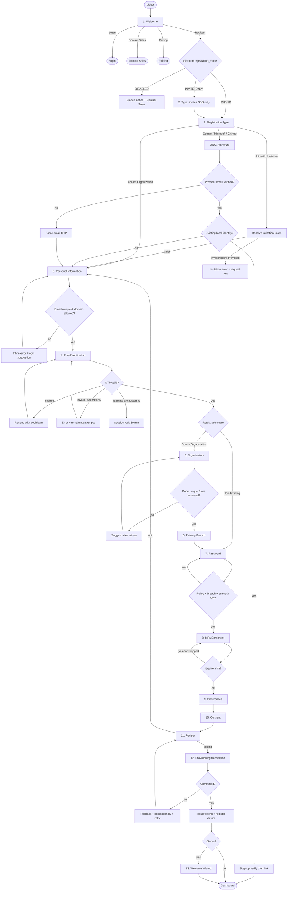
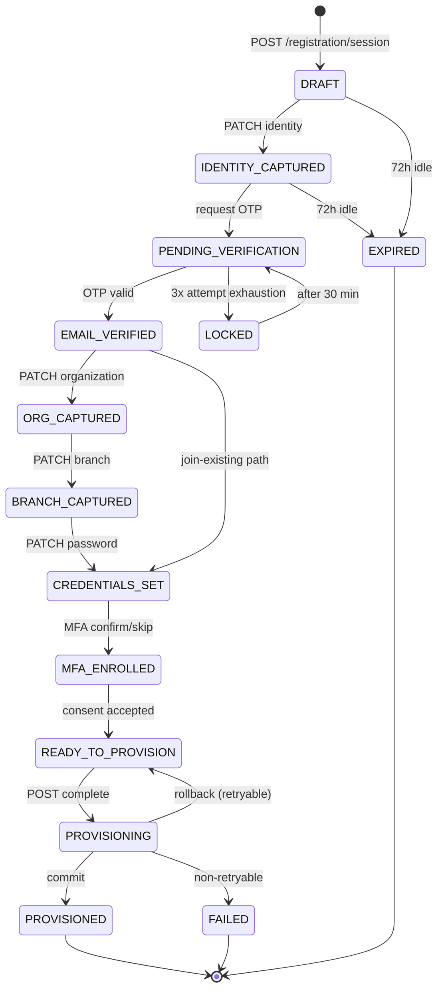
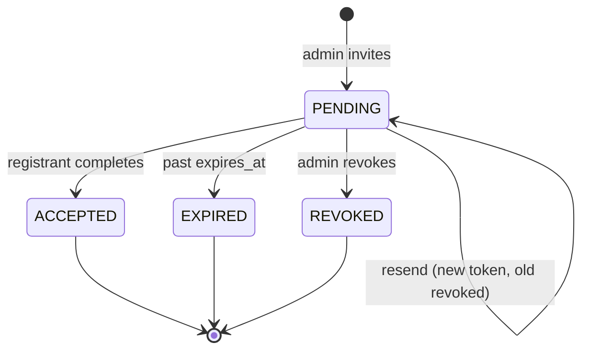
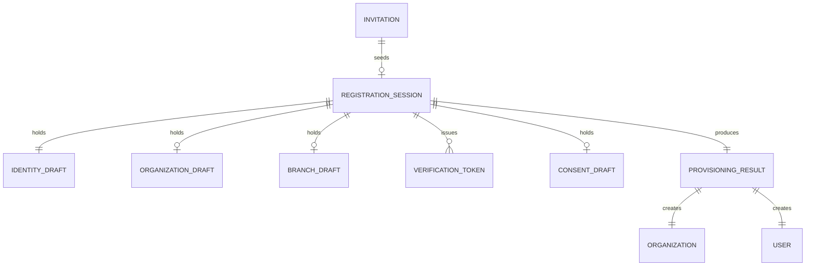
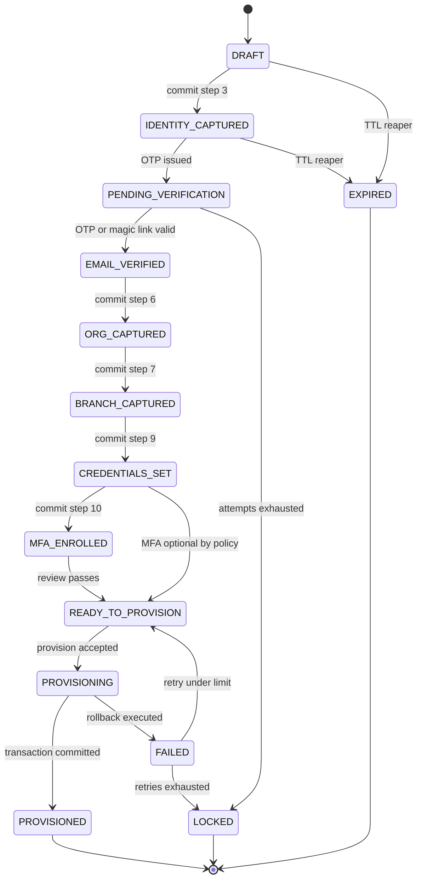
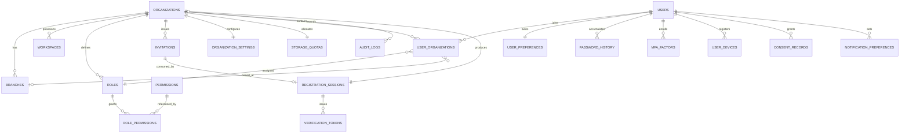

# Zellavora Control Center — Enterprise Registration Module

**Product:** Zellavora Control Center (ZCC)
**Company:** Zellavora Solutions
**Document type:** Production Engineering Specification (Build-Ready)
**Version:** 1.0.0
**Status:** Approved for Implementation
**Audience:** Frontend, Backend, QA, DevOps, UI/UX, Product, Security

---

## Document Control

| Field | Value |
|---|---|
| Owner | Principal Architect, ZCC Platform |
| Reviewers | Security Engineering, Product, UX, QA Lead, DevOps |
| Classification | Internal — Confidential |
| Supersedes | `REGISTRATION_13_STEPS_IMPLEMENTATION.md`, `REGISTRATION_CHECKLIST.md` |
| Related | `docs/RBAC_ARCHITECTURE.md`, `docs/MULTI_TENANT_ARCHITECTURE.md`, `docs/AUTHENTICATION_ARCHITECTURE.md` |

### Stack Alignment Notice (Read First)

This specification targets the stack mandated by Product:

- **Frontend:** Angular 22, standalone components, signals, zoneless change detection, SSR-compatible, Tailwind CSS, Angular CDK, RxJS, TypeScript (strict).
- **Backend:** NestJS + PostgreSQL + Prisma + JWT/Refresh rotation + Redis + BullMQ.
- **Storage:** Supabase Storage.

§7 defines the NestJS backend target directly. The contracts in §8 (Database) and §9 (API) are transport-agnostic and binding regardless of the HTTP framework in place at implementation time.

### Terminology

| Term | Meaning |
|---|---|
| **Organization** | The tenant root. Formerly `tenant` (renamed; see migration `rename tenants to organizations`). |
| **Workspace** | A provisioned functional surface inside an Organization (Dashboard, Users, Roles, …). |
| **Branch** | A physical/legal location belonging to an Organization. |
| **Registration Session** | Server-side, resumable, expiring record of an in-flight registration. |
| **Provisioning** | The single-transaction creation of Organization + Owner + Workspace + Branch + Roles + Settings. |
| **Owner** | The first user of an Organization; holds `organization.owner` role, non-deletable while sole owner. |

---

# 1. Functional Requirements

## 1.1 Requirement Register

Legend — Priority: `P0` launch-blocking, `P1` launch, `P2` fast-follow.

### 1.1.1 Entry & Routing

| ID | Requirement | Priority |
|---|---|---|
| FR-001 | System SHALL present an unauthenticated Welcome screen at `/register` describing the product, with actions: Register Organization, Login, Contact Sales, View Pricing. | P0 |
| FR-002 | System SHALL allow the registrant to choose a registration type: Create Organization, Join Existing Organization (invitation code), or Federated (Google / Microsoft / GitHub). | P0 |
| FR-003 | System SHALL honour platform-level `registration_mode` (`PUBLIC`, `INVITE_ONLY`, `DISABLED`) and hide/disable non-permitted paths with an explanatory message. | P0 |
| FR-004 | System SHALL deep-link invitation acceptance via `/register?invite=<token>`, pre-resolving the invitation and skipping organization/branch steps. | P0 |
| FR-005 | System SHALL redirect an already-authenticated user hitting `/register` to `/dashboard` unless `?force=1` and an active elevated session. | P1 |

### 1.1.2 Identity Capture

| ID | Requirement | Priority |
|---|---|---|
| FR-010 | System SHALL capture First Name, Last Name, Display Name, Business Email, Mobile Number (E.164), Country, Timezone, Language. | P0 |
| FR-011 | System SHALL auto-derive Display Name as `First Last` and allow override; override SHALL disable further auto-derivation. | P0 |
| FR-012 | System SHALL perform debounced (400 ms) asynchronous uniqueness checks on email and mobile against the global identity space. | P0 |
| FR-013 | System SHALL classify the email domain as `BUSINESS`, `FREE`, `DISPOSABLE`, or `ROLE_ACCOUNT` and enforce policy per registration type. | P0 |
| FR-014 | System SHALL reject disposable domains for `CREATE_ORGANIZATION`; free-mail domains SHALL produce a non-blocking warning. | P0 |
| FR-015 | System SHALL auto-detect Country/Timezone/Language from request geo-IP and `Accept-Language`, pre-filling but never locking the fields. | P1 |
| FR-016 | System SHALL validate the mobile number against the selected country's numbering plan (libphonenumber) and normalise to E.164. | P0 |
| FR-017 | System SHALL auto-save the registration session server-side on every step transition and every 10 s of form idle-after-change. | P0 |
| FR-018 | System SHALL allow resumption of an incomplete registration from a signed resume link valid for 72 h. | P1 |

### 1.1.3 Verification

| ID | Requirement | Priority |
|---|---|---|
| FR-020 | System SHALL verify the email via 6-digit numeric OTP, expiring in 15 minutes. | P0 |
| FR-021 | System SHALL also support a Magic Link alternative carrying a single-use token with identical 15-minute expiry. | P1 |
| FR-022 | System SHALL permit a maximum of 5 OTP sends per session with an exponential resend cooldown: 30 s, 60 s, 120 s, 300 s. | P0 |
| FR-023 | System SHALL permit a maximum of 5 verification attempts per issued OTP; exceeding invalidates the OTP and requires a resend. | P0 |
| FR-024 | System SHALL lock the registration session for 30 minutes after 3 consecutive OTP invalidations. | P0 |
| FR-025 | System SHALL optionally verify mobile via SMS OTP when `require_phone_verification` is enabled. | P1 |
| FR-026 | System SHALL display a live countdown for OTP expiry and resend cooldown. | P0 |
| FR-027 | System SHALL invalidate all outstanding OTPs when the target email is changed. | P0 |

### 1.1.4 Organization

| ID | Requirement | Priority |
|---|---|---|
| FR-030 | System SHALL capture Organization Name, Organization Code (slug), Industry, Organization Size, Website, Tax/GST identifier, Currency, Fiscal Year Start, Timezone, Logo. | P0 |
| FR-031 | System SHALL auto-generate the Organization Code from the name (lowercase, ASCII-folded, hyphenated, ≤40 chars) and check availability in real time. | P0 |
| FR-032 | System SHALL reject codes matching the reserved-word list (§10.6) and enforce global uniqueness on `LOWER(code)`. | P0 |
| FR-033 | System SHALL suggest up to 3 alternative codes when the desired code is taken. | P1 |
| FR-034 | System SHALL validate the GST/Tax ID against the country-specific format when the country has a known pattern. | P0 |
| FR-035 | System SHALL accept a logo of type PNG/JPEG/WEBP/SVG, ≤2 MB, ≤2048×2048, and store it in Supabase Storage under a private bucket. | P0 |
| FR-036 | System SHALL derive default Currency and Fiscal Year Start from the selected country, overridable. | P1 |

### 1.1.5 Branch

| ID | Requirement | Priority |
|---|---|---|
| FR-040 | System SHALL capture a primary Branch: Name, Address lines, Country, State, City, Postal Code, Phone, Latitude, Longitude. | P0 |
| FR-041 | System SHALL mark the first branch as both `is_primary` and `is_default` and prevent unsetting while it is the only branch. | P0 |
| FR-042 | System SHALL validate the postal code against the country pattern where defined. | P0 |
| FR-043 | System SHALL offer optional geocoding of the entered address to populate latitude/longitude; failure is non-blocking. | P2 |
| FR-044 | System SHALL allow the branch step to be skipped when `CREATE_ORGANIZATION` is performed under `quick_start` mode, defaulting to a "Head Office" branch. | P2 |

### 1.1.6 Credentials & MFA

| ID | Requirement | Priority |
|---|---|---|
| FR-050 | System SHALL enforce the enterprise password policy in §10.5 with a live strength meter (zxcvbn score ≥ 3 required). | P0 |
| FR-051 | System SHALL provide show/hide toggles and SHALL disable copy and cut on password inputs; paste SHALL be permitted (password-manager compatibility). | P0 |
| FR-052 | System SHALL check the password against a breach corpus via k-anonymity range query and reject known-breached passwords. | P0 |
| FR-053 | System SHALL reject passwords containing the user's name, email local-part, or organization name/code. | P0 |
| FR-054 | System SHALL offer optional MFA enrolment (TOTP, SMS, Email) during registration, mandatory when `require_mfa` is on. | P0 |
| FR-055 | System SHALL issue 10 single-use recovery codes upon MFA enrolment and require explicit acknowledgement of download/copy. | P0 |

### 1.1.7 Review, Consent, Provisioning

| ID | Requirement | Priority |
|---|---|---|
| FR-060 | System SHALL present an editable review summary grouped by step with inline "Edit" deep-links preserving state. | P0 |
| FR-061 | System SHALL present a validation summary enumerating errors, missing optional fields, and warnings, and SHALL block submission on errors. | P0 |
| FR-062 | System SHALL require explicit acceptance of Terms of Service and Privacy Policy with recorded version, timestamp, and IP. | P0 |
| FR-063 | System SHALL capture optional marketing-communication consent, defaulted to unchecked. | P0 |
| FR-064 | System SHALL provision Organization, Owner, Workspace, Branch, Roles, Permissions, Settings, Preferences, Notification channels, Storage bucket, and Audit entries in a single atomic transaction. | P0 |
| FR-065 | System SHALL roll back completely on any provisioning failure, leaving no partial tenant, and SHALL return a correlation ID. | P0 |
| FR-066 | System SHALL be idempotent on retry via an `Idempotency-Key` header, returning the original result for a repeated key. | P0 |
| FR-067 | System SHALL issue an access token and a rotating refresh token upon successful provisioning and register the device. | P0 |

### 1.1.8 Onboarding

| ID | Requirement | Priority |
|---|---|---|
| FR-070 | System SHALL present a 7-step Welcome Wizard: Logo, Theme, Invite Users, Departments, Branch, Notifications, Finish. | P1 |
| FR-071 | Every wizard step SHALL be skippable, and progress SHALL persist so the wizard resumes at the first incomplete step. | P1 |
| FR-072 | System SHALL surface remaining wizard tasks as a dismissible checklist on the Dashboard until complete. | P2 |

### 1.1.9 Join-Existing / Federated

| ID | Requirement | Priority |
|---|---|---|
| FR-080 | System SHALL validate an invitation code/token for existence, expiry, revocation, and email binding. | P0 |
| FR-081 | System SHALL bind the invited user to the invitation's Organization, Branch, Department, and Role without allowing elevation. | P0 |
| FR-082 | System SHALL skip email OTP when the invitation was delivered to the same address and the token proves possession. | P1 |
| FR-083 | System SHALL support OIDC registration with Google, Microsoft (Entra ID), and GitHub, mapping verified provider email to the identity. | P1 |
| FR-084 | System SHALL link a federated identity to an existing local account only after step-up verification of the local account. | P0 |
| FR-085 | System SHALL support Just-In-Time provisioning into an organization when the provider domain matches a verified `allowed_domain`. | P2 |

## 1.2 Out of Scope (v1)

SAML 2.0 IdP-initiated flows; SCIM user provisioning; organization mergers; self-serve billing at registration; multi-owner registration; on-premise deployment mode.

## 1.3 Global Acceptance Criteria

- **AC-G1** — A new visitor can go from Welcome to a provisioned, logged-in Dashboard in ≤ 13 steps with zero support contact.
- **AC-G2** — No step loses data on refresh, back-navigation, browser crash, or 72 h absence.
- **AC-G3** — Every failure path yields a human-readable message, a correlation ID, and a recovery action.
- **AC-G4** — All 20 sections of this document have passing automated coverage per §19.
- **AC-G5** — Zero partial tenants exist in the database after chaos-testing 1,000 injected provisioning failures.

---

# 2. Business Requirements

## 2.1 Objectives

| ID | Objective | Metric | Target |
|---|---|---|---|
| BR-001 | Minimise time-to-value for new organizations | Median Welcome → Dashboard | ≤ 6 minutes |
| BR-002 | Maximise funnel completion | Started → Provisioned | ≥ 65 % |
| BR-003 | Guarantee tenant isolation from creation | Cross-tenant leakage incidents | 0 |
| BR-004 | Ensure regulatory defensibility of consent | Consent records with version+IP+timestamp | 100 % |
| BR-005 | Suppress fraudulent/bot registrations | Disposable/bot registrations reaching provisioning | < 0.5 % |
| BR-006 | Support enterprise procurement | Orgs registered via invitation-only mode | Supported at GA |
| BR-007 | Contain support cost | Registration-related tickets per 100 signups | ≤ 2 |

## 2.2 Business Rules

| ID | Rule | Enforcement |
|---|---|---|
| BRU-001 | An email address is globally unique across the platform identity space. | DB unique index + API check |
| BRU-002 | An organization code is globally unique, case-insensitive, and immutable after provisioning. | DB unique index on `LOWER(code)`; no PATCH route |
| BRU-003 | Every organization has exactly one Owner at creation; the Owner cannot be removed while sole owner. | Provisioning + RBAC guard |
| BRU-004 | Every organization has at least one branch, exactly one of which is `is_default`. | Partial unique index + trigger |
| BRU-005 | A user may belong to many organizations; roles are scoped per organization membership. | `user_organizations` composite key |
| BRU-006 | Registration is only complete when email is verified, password set, and consent recorded. | Provisioning precondition checks |
| BRU-007 | An invitation is single-use, expires in 7 days (configurable 1–30), and is bound to the invited email. | Token table + status machine |
| BRU-008 | An organization starts on the `TRIAL` plan for 14 days unless the invitation carries a plan grant. | Provisioning default |
| BRU-009 | Free-mail domains are permitted but flagged `requires_review` for organizations with size ≥ 201. | Risk engine |
| BRU-010 | Registration data for abandoned sessions is purged after 30 days. | BullMQ nightly job |
| BRU-011 | GST/Tax ID is mandatory when country is India and org size ≥ 51; otherwise optional. | Conditional validator |
| BRU-012 | The trial organization is capped at 25 users, 5 branches, and 5 GB storage until upgrade. | Quota records at provisioning |
| BRU-013 | Country restrictions (sanctions list) block registration with a generic refusal and an audit entry. | Geo/IP + declared-country check |
| BRU-014 | An organization code, once released by deletion, is quarantined for 180 days. | Soft-delete + reservation table |

## 2.3 Stakeholders & RACI

| Activity | Product | Architect | Frontend | Backend | Security | QA | DevOps |
|---|---|---|---|---|---|---|---|
| Requirements sign-off | **A** | C | I | I | C | C | I |
| Flow & IA | **A/R** | C | C | I | I | I | I |
| Frontend build | I | C | **A/R** | C | C | C | I |
| Backend & provisioning | I | **A** | I | **R** | C | C | C |
| Threat model & pen-test | I | C | I | C | **A/R** | C | C |
| Test strategy & release gate | C | C | C | C | C | **A/R** | C |
| Infra, secrets, rollout | I | C | I | C | C | I | **A/R** |

## 2.4 Assumptions, Dependencies, Risks

**Assumptions** — Transactional email provider ≥ 99.9 % availability; SMS provider covers all target countries; geo-IP database refreshed monthly; Supabase Storage reachable from the backend network.

**Dependencies** — Redis (sessions, rate limits, OTP), BullMQ (email/SMS/provisioning side-effects), Supabase Storage (logos), CAPTCHA provider (Cloudflare Turnstile), breach corpus API, libphonenumber dataset.

| Risk | Impact | Likelihood | Mitigation |
|---|---|---|---|
| Email provider outage blocks all verification | High | Med | Secondary provider with automatic failover; magic-link fallback; queue with retry+DLQ |
| Provisioning transaction exceeds statement timeout on large seed | High | Low | Seed roles/permissions from pre-built templates; move non-critical seeds to post-commit jobs |
| Bot-driven org squatting on codes | Med | Med | CAPTCHA at type-selection; code reserved only at provisioning; rate limits per IP/ASN |
| Slug collisions at scale | Low | High | Suggestion engine + numeric suffix strategy |
| GDPR erasure vs. audit retention conflict | High | Low | Pseudonymise PII in audit rows; retain hashed identifiers |

---

# 3. User Journey

## 3.1 Personas

| Persona | Goal | Entry point | Success signal |
|---|---|---|---|
| **Priya — Founder / Org Owner** | Stand up a workspace for a 40-person firm | Marketing site → Register Organization | Dashboard with branding + 5 invited users |
| **Marcus — Enterprise IT Admin** | Evaluate ZCC under corporate policy | Procurement link → invitation-only | MFA enforced, SSO domain verified |
| **Aisha — Invited Manager** | Join her employer's existing workspace | Invitation email | Lands in assigned branch with correct role |
| **Diego — Employee via SSO** | Access with corporate Google account | SSO button | One-click into workspace, no password |
| **Sam — Viewer / Auditor** | Read-only access to audit logs | Invitation with Viewer role | Sees only permitted screens |

## 3.2 Journey Map — Priya (Create Organization)

| Stage | Actions | Thoughts | Emotion | Pain risk | Design mitigation |
|---|---|---|---|---|---|
| Discover | Lands on Welcome | "Is this credible?" | Curious | Trust gap | Security badges, SOC2/ISO marks, customer logos |
| Choose | Picks Create Organization | "How long is this?" | Cautious | Length anxiety | Stepper with "≈5 min", progress %, save-and-resume note |
| Identify | Enters name, email, phone | "Will they spam me?" | Neutral | Consent unclear | Inline privacy microcopy, marketing consent unchecked |
| Verify | Enters OTP | "Did it arrive?" | Impatient | Email delay | Countdown, resend, magic-link alt, spam-folder hint |
| Organize | Org name → code auto-fills | "Is this name taken?" | Engaged | Slug rejection | Live availability + suggestions |
| Locate | Enters branch address | "Why do they need this?" | Mildly resistant | Perceived friction | "Used for tax and locale defaults" tooltip; skip option |
| Secure | Sets password, enables MFA | "Is this strong enough?" | Focused | Policy frustration | Live checklist, strength meter, generate-password |
| Review | Scans summary | "Did I get it right?" | Careful | Editing fear | Inline edit returning to review |
| Provision | Waits ~2 s | "Is it working?" | Anxious | Blank wait | Staged progress: Creating org → Workspace → Roles → Done |
| Onboard | Runs wizard | "Now what?" | Motivated | Overwhelm | Skippable steps, dashboard checklist |

## 3.3 Journey Map — Aisha (Invitation)

Email → click → invite resolved server-side → identity pre-filled and email locked → password + MFA → consent → membership created → lands on assigned workspace. Steps 5–8 (Organization, Branch) are suppressed entirely. Target: ≤ 90 seconds.

## 3.4 Emotional Curve & Drop-off Instrumentation

Highest measured drop-off risk in order: (1) OTP entry, (2) Password policy, (3) Branch address, (4) Organization code collision. Each is instrumented with `registration.step.abandoned` carrying `step_id`, `dwell_ms`, `error_count`, `last_error_code` (§17.4).

---

# 4. Registration Flow Diagram

## 4.1 Canonical 13-Step Flow

| # | Step ID | Screen | Applies to | Skippable |
|---|---|---|---|---|
| 1 | `WELCOME` | Welcome | All | n/a |
| 2 | `TYPE` | Registration Type | All | No |
| 3 | `IDENTITY` | Personal Information | All | No |
| 4 | `EMAIL_VERIFY` | Email Verification | All (auto-pass on bound invite) | Conditional |
| 5 | `ORGANIZATION` | Organization Details | Create only | No |
| 6 | `BRANCH` | Primary Branch | Create only | Quick-start only |
| 7 | `PASSWORD` | Password & Policy | Local auth only | Skipped for SSO |
| 8 | `MFA` | MFA Enrolment | All | Unless `require_mfa` |
| 9 | `PREFERENCES` | Preferences & Notifications | All | Yes |
| 10 | `CONSENT` | Terms & Privacy | All | No |
| 11 | `REVIEW` | Review & Confirm | All | No |
| 12 | `PROVISION` | Provisioning | All | n/a (system) |
| 13 | `WIZARD` | Welcome Wizard | Owner only | Yes |

## 4.2 Master Flow



## 4.3 Provisioning Sequence

```mermaid
sequenceDiagram
    autonumber
    participant FE as Angular SPA
    participant API as NestJS RegistrationController
    participant SVC as ProvisioningService
    participant DB as PostgreSQL (Prisma tx)
    participant R as Redis
    participant Q as BullMQ
    participant ST as Supabase Storage

    FE->>API: POST /registration/complete (Idempotency-Key, sessionId)
    API->>R: GET idem:{key}
    alt cached result
        R-->>API: stored response
        API-->>FE: 200 (replayed)
    else new
        API->>R: SET NX idem:{key} = IN_PROGRESS (ttl 24h)
        API->>SVC: provision(sessionId)
        SVC->>R: load + validate session (state = READY_TO_PROVISION)
        SVC->>DB: BEGIN (isolation: READ COMMITTED, timeout 10s)
        SVC->>DB: INSERT organizations
        SVC->>DB: INSERT organization_settings, organization_quotas
        SVC->>DB: INSERT users (argon2id hash)
        SVC->>DB: INSERT user_organizations (role=owner)
        SVC->>DB: INSERT branches (primary+default)
        SVC->>DB: INSERT roles + role_permissions from template
        SVC->>DB: INSERT workspaces (11 modules)
        SVC->>DB: INSERT user_preferences, notification_preferences
        SVC->>DB: INSERT storage_containers
        SVC->>DB: INSERT audit_logs (ORG_CREATED, USER_CREATED, ...)
        SVC->>DB: COMMIT
        DB-->>SVC: ok
        SVC->>Q: enqueue welcome-email, org-created-email, search-index, crm-sync
        SVC->>ST: finalize logo (move temp → org bucket)
        SVC->>R: DEL registration session; SET idem:{key} = response
        SVC-->>API: {organizationId, userId, tokens}
        API-->>FE: 201 Created + Set-Cookie refresh_token
    end
```

## 4.4 Registration Session State Machine



## 4.5 Invitation State Machine



---

# 5. Information Architecture

## 5.1 Route Map

| Route | Guard | Resolver | SSR | Purpose |
|---|---|---|---|---|
| `/register` | `guestGuard` | `registrationConfigResolver` | Yes (prerender) | Welcome |
| `/register/type` | `guestGuard`, `registrationOpenGuard` | — | Yes | Registration type |
| `/register/invite/:token` | `guestGuard` | `invitationResolver` | No | Invitation landing |
| `/register/identity` | `registrationSessionGuard` | `sessionResolver` | No | Personal information |
| `/register/verify` | `registrationSessionGuard`, `stepGuard('IDENTITY_CAPTURED')` | — | No | Email verification |
| `/register/organization` | `registrationSessionGuard`, `stepGuard('EMAIL_VERIFIED')` | `industriesResolver` | No | Organization |
| `/register/branch` | `registrationSessionGuard`, `stepGuard('ORG_CAPTURED')` | `geoResolver` | No | Branch |
| `/register/password` | `registrationSessionGuard` | `passwordPolicyResolver` | No | Password |
| `/register/mfa` | `registrationSessionGuard` | — | No | MFA |
| `/register/preferences` | `registrationSessionGuard` | — | No | Preferences |
| `/register/consent` | `registrationSessionGuard` | `legalDocsResolver` | No | Terms |
| `/register/review` | `registrationSessionGuard`, `stepGuard('READY_TO_PROVISION')` | — | No | Review |
| `/register/provisioning` | `registrationSessionGuard` | — | No | Progress |
| `/onboarding` | `authGuard`, `ownerGuard` | `wizardStateResolver` | No | Welcome wizard |
| `/register/resume/:token` | none | `resumeResolver` | No | Resume link |
| `/register/blocked` | none | — | Yes | Country/mode block |

Deep-linking beyond the current session state redirects to the furthest legal step and raises `registration.deeplink.redirected`.

## 5.2 Content Model



## 5.3 Navigation Rules

1. **Forward** is permitted only when the current step is valid and the server has acknowledged the patch.
2. **Backward** is always permitted to any completed step; data is retained and re-editable.
3. **Editing an earlier step** that invalidates a later one (e.g. changing email after verification) resets the dependent steps and warns before applying.
4. **Exit** prompts a confirmation dialog offering "Email me a resume link".
5. **Stepper** is clickable only for completed steps; future steps are `aria-disabled`.

## 5.4 Copy Hierarchy per Screen

`Eyebrow (step x of 13)` → `H1 title` → `supporting paragraph` → `form region` → `inline help` → `primary action` → `secondary action` → `legal footnote`.

## 5.5 Provisioned Workspace IA

| Workspace | Key | Default Route | Min Role |
|---|---|---|---|
| Dashboard | `dashboard` | `/dashboard` | viewer |
| User Management | `users` | `/admin/users` | manager |
| Role Management | `roles` | `/admin/roles` | admin |
| Permission Management | `permissions` | `/admin/permissions` | super_admin |
| Settings | `settings` | `/admin/settings` | admin |
| Notifications | `notifications` | `/notifications` | viewer |
| Audit Logs | `audit-logs` | `/admin/audit` | admin |
| Activity Logs | `activity-logs` | `/admin/activity` | manager |
| Storage | `storage` | `/admin/storage` | admin |
| API Keys | `api-keys` | `/admin/api-keys` | super_admin |
| Webhooks | `webhooks` | `/admin/webhooks` | super_admin |

---

# 6. Frontend Architecture

## 6.1 Folder Structure

```
apps/admin/src/app/features/registration/
├── registration.routes.ts
├── pages/
│   ├── welcome/                welcome.page.ts|html|css
│   ├── type/                   type.page.*
│   ├── identity/               identity.page.*
│   ├── verify-email/           verify-email.page.*
│   ├── organization/           organization.page.*
│   ├── branch/                 branch.page.*
│   ├── password/               password.page.*
│   ├── mfa/                    mfa.page.*
│   ├── preferences/            preferences.page.*
│   ├── consent/                consent.page.*
│   ├── review/                 review.page.*
│   ├── provisioning/           provisioning.page.*
│   └── blocked/                blocked.page.*
├── components/
│   ├── registration-stepper/
│   ├── registration-shell/
│   ├── otp-input/
│   ├── password-strength-meter/
│   ├── password-policy-checklist/
│   ├── availability-indicator/
│   ├── logo-uploader/
│   ├── phone-field/
│   ├── country-select/
│   ├── timezone-select/
│   ├── industry-select/
│   ├── address-field/
│   ├── review-section/
│   ├── validation-summary/
│   ├── recovery-codes-panel/
│   ├── provisioning-progress/
│   └── security-badges/
├── dialogs/
│   ├── exit-registration.dialog.ts
│   ├── change-email-warning.dialog.ts
│   ├── recovery-codes.dialog.ts
│   └── terms-viewer.dialog.ts
├── store/
│   ├── registration.store.ts
│   ├── registration.state.ts
│   └── registration.selectors.ts
├── services/
│   ├── registration.api.ts
│   ├── registration-autosave.service.ts
│   ├── otp-timer.service.ts
│   ├── password-policy.service.ts
│   ├── geo.service.ts
│   ├── slug.service.ts
│   └── analytics.service.ts
├── guards/
│   ├── guest.guard.ts
│   ├── registration-session.guard.ts
│   ├── step.guard.ts
│   └── registration-open.guard.ts
├── resolvers/
│   ├── registration-config.resolver.ts
│   ├── invitation.resolver.ts
│   ├── password-policy.resolver.ts
│   └── legal-docs.resolver.ts
├── models/
│   ├── registration.models.ts
│   ├── organization.models.ts
│   ├── branch.models.ts
│   └── api-contracts.ts
├── validators/
│   ├── async-unique.validator.ts
│   ├── password.validators.ts
│   ├── phone.validator.ts
│   ├── slug.validator.ts
│   └── tax-id.validator.ts
└── animations/registration.animations.ts
```

## 6.2 Routing (Lazy, Deferred)

```ts
// registration.routes.ts
import { Routes } from '@angular/router';
import { guestGuard } from './guards/guest.guard';
import { registrationSessionGuard } from './guards/registration-session.guard';
import { stepGuard } from './guards/step.guard';
import { registrationConfigResolver } from './resolvers/registration-config.resolver';

export const REGISTRATION_ROUTES: Routes = [
  {
    path: '',
    loadComponent: () => import('./components/registration-shell/registration-shell.component')
      .then(m => m.RegistrationShellComponent),
    resolve: { config: registrationConfigResolver },
    children: [
      { path: '', canActivate: [guestGuard],
        loadComponent: () => import('./pages/welcome/welcome.page').then(m => m.WelcomePage),
        data: { ssr: true, title: 'Create your Zellavora organization' } },
      { path: 'type', canActivate: [guestGuard],
        loadComponent: () => import('./pages/type/type.page').then(m => m.TypePage) },
      { path: 'identity', canActivate: [registrationSessionGuard],
        loadComponent: () => import('./pages/identity/identity.page').then(m => m.IdentityPage) },
      { path: 'verify', canActivate: [registrationSessionGuard, stepGuard('IDENTITY_CAPTURED')],
        loadComponent: () => import('./pages/verify-email/verify-email.page').then(m => m.VerifyEmailPage) },
      { path: 'organization', canActivate: [registrationSessionGuard, stepGuard('EMAIL_VERIFIED')],
        loadComponent: () => import('./pages/organization/organization.page').then(m => m.OrganizationPage) },
      { path: 'branch', canActivate: [registrationSessionGuard, stepGuard('ORG_CAPTURED')],
        loadComponent: () => import('./pages/branch/branch.page').then(m => m.BranchPage) },
      { path: 'password', canActivate: [registrationSessionGuard],
        loadComponent: () => import('./pages/password/password.page').then(m => m.PasswordPage) },
      { path: 'mfa', canActivate: [registrationSessionGuard],
        loadComponent: () => import('./pages/mfa/mfa.page').then(m => m.MfaPage) },
      { path: 'preferences', canActivate: [registrationSessionGuard],
        loadComponent: () => import('./pages/preferences/preferences.page').then(m => m.PreferencesPage) },
      { path: 'consent', canActivate: [registrationSessionGuard],
        loadComponent: () => import('./pages/consent/consent.page').then(m => m.ConsentPage) },
      { path: 'review', canActivate: [registrationSessionGuard, stepGuard('READY_TO_PROVISION')],
        loadComponent: () => import('./pages/review/review.page').then(m => m.ReviewPage) },
      { path: 'provisioning', canActivate: [registrationSessionGuard],
        loadComponent: () => import('./pages/provisioning/provisioning.page').then(m => m.ProvisioningPage) },
      { path: 'blocked',
        loadComponent: () => import('./pages/blocked/blocked.page').then(m => m.BlockedPage) },
      { path: '**', redirectTo: '' },
    ],
  },
];
```

## 6.3 Signal Store

```ts
// registration.state.ts
export type RegistrationType = 'CREATE_ORGANIZATION' | 'JOIN_EXISTING' | 'SSO';
export type SessionState =
  | 'DRAFT' | 'IDENTITY_CAPTURED' | 'PENDING_VERIFICATION' | 'EMAIL_VERIFIED'
  | 'ORG_CAPTURED' | 'BRANCH_CAPTURED' | 'CREDENTIALS_SET' | 'MFA_ENROLLED'
  | 'READY_TO_PROVISION' | 'PROVISIONING' | 'PROVISIONED' | 'FAILED' | 'LOCKED' | 'EXPIRED';

export interface RegistrationState {
  sessionId: string | null;
  sessionState: SessionState;
  type: RegistrationType | null;
  currentStep: number;
  furthestStep: number;
  identity: IdentityDraft;
  organization: OrganizationDraft;
  branch: BranchDraft;
  credentials: { passwordSet: boolean; strengthScore: number };
  mfa: { enabled: boolean; method: 'TOTP' | 'SMS' | 'EMAIL' | null; recoveryCodesAcknowledged: boolean };
  preferences: PreferencesDraft;
  consent: ConsentDraft;
  invitation: ResolvedInvitation | null;
  otp: { sentAt: string | null; expiresAt: string | null; resendCount: number;
         cooldownEndsAt: string | null; attemptsRemaining: number };
  availability: { email: AvailabilityStatus; mobile: AvailabilityStatus; orgCode: AvailabilityStatus };
  provisioning: { stage: ProvisioningStage | null; correlationId: string | null };
  ui: { loading: boolean; saving: boolean; submitting: boolean; dirty: boolean;
        lastSavedAt: string | null; error: ApiError | null; warnings: Warning[] };
}
```

```ts
// registration.store.ts (excerpt)
@Injectable({ providedIn: 'root' })
export class RegistrationStore {
  private readonly api = inject(RegistrationApi);
  private readonly analytics = inject(AnalyticsService);
  private readonly state = signal<RegistrationState>(INITIAL_REGISTRATION_STATE);

  // ---- selectors -------------------------------------------------------
  readonly sessionId       = computed(() => this.state().sessionId);
  readonly currentStep     = computed(() => this.state().currentStep);
  readonly type            = computed(() => this.state().type);
  readonly identity        = computed(() => this.state().identity);
  readonly organization    = computed(() => this.state().organization);
  readonly branch          = computed(() => this.state().branch);
  readonly otp             = computed(() => this.state().otp);
  readonly isOwnerPath     = computed(() => this.state().type === 'CREATE_ORGANIZATION');
  readonly visibleSteps    = computed(() => STEP_DEFS.filter(s => s.appliesTo(this.state())));
  readonly progressPercent = computed(() => Math.round(
      (this.state().currentStep / this.visibleSteps().length) * 100));
  readonly canAdvance      = computed(() => !this.state().ui.saving && !this.state().ui.error);
  readonly otpExpired      = computed(() => {
    const e = this.state().otp.expiresAt; return !!e && Date.parse(e) <= Date.now();
  });
  readonly validationSummary = computed(() => buildValidationSummary(this.state()));
  readonly reviewModel       = computed(() => buildReviewModel(this.state()));

  // ---- effects ---------------------------------------------------------
  constructor() {
    effect(() => {              // autosave on dirty
      const s = this.state();
      if (s.ui.dirty && s.sessionId && !s.ui.saving) queueMicrotask(() => this.persist());
    });
    effect(() => this.analytics.track('registration.step.viewed',
      { step: this.state().currentStep, type: this.state().type }));
  }

  // ---- mutations -------------------------------------------------------
  patchIdentity(v: Partial<IdentityDraft>) {
    this.state.update(s => ({ ...s, identity: { ...s.identity, ...v }, ui: { ...s.ui, dirty: true } }));
  }

  async verifyOtp(code: string): Promise<void> {
    this.state.update(s => ({ ...s, ui: { ...s.ui, submitting: true, error: null } }));
    try {
      const r = await firstValueFrom(this.api.verifyOtp(this.state().sessionId!, code));
      this.state.update(s => ({ ...s, sessionState: r.sessionState,
        otp: { ...s.otp, attemptsRemaining: r.attemptsRemaining },
        ui: { ...s.ui, submitting: false } }));
    } catch (e) {
      const err = toApiError(e);
      this.state.update(s => ({ ...s,
        otp: { ...s.otp, attemptsRemaining: err.meta?.attemptsRemaining ?? s.otp.attemptsRemaining },
        ui: { ...s.ui, submitting: false, error: err } }));
      throw e;
    }
  }
}
```

**Rules:** the state signal is private and never exposed; components read only `computed` selectors; all mutations are immutable spreads; async work sets `submitting` and always clears it in a `finally`-equivalent path.

## 6.4 Form Architecture

- Typed reactive forms (`FormGroup<{...}>`), one form per page, hydrated from the store on `ngOnInit` and pushed back via `valueChanges` → `patch*` with `debounceTime(250)` + `distinctUntilChanged`.
- Async validators are `debounceTime(400)` + `switchMap`, wired only on `blur` for the network-hitting ones to avoid keystroke amplification.
- Cross-field validators live at the group level (`passwordsMatch`, `latLngPair`, `gstRequiredForIndia`).
- `updateOn: 'blur'` for email/mobile/code; `'change'` for password (live meter).

```ts
this.form = this.fb.group({
  firstName:   this.fb.control('', { validators: [V.required, V.maxLength(50), nameCharset()] }),
  lastName:    this.fb.control('', { validators: [V.required, V.maxLength(50), nameCharset()] }),
  displayName: this.fb.control('', { validators: [V.required, V.maxLength(100)] }),
  email:       this.fb.control('', {
                 validators: [V.required, V.email, V.maxLength(254)],
                 asyncValidators: [uniqueEmailValidator(this.api), businessEmailValidator(this.api)],
                 updateOn: 'blur' }),
  mobile:      this.fb.control('', { validators: [V.required, phoneValidator(() => this.country())],
                 asyncValidators: [uniqueMobileValidator(this.api)], updateOn: 'blur' }),
  country:     this.fb.control('', { validators: [V.required] }),
  timezone:    this.fb.control('', { validators: [V.required] }),
  language:    this.fb.control('en', { validators: [V.required] }),
});
```

## 6.5 Interceptors

| Interceptor | Order | Responsibility |
|---|---|---|
| `correlationIdInterceptor` | 1 | Attach `X-Correlation-Id` (UUID v4 per request) |
| `registrationSessionInterceptor` | 2 | Attach `X-Registration-Session` header |
| `csrfInterceptor` | 3 | Attach `X-CSRF-Token` from the `XSRF-TOKEN` cookie on mutating verbs |
| `captchaInterceptor` | 4 | Attach `X-Captcha-Token` on protected endpoints |
| `retryInterceptor` | 5 | Retry idempotent GETs 2× with jittered backoff |
| `errorNormalizeInterceptor` | 6 | Map RFC 7807 problem+json → `ApiError` |
| `loadingInterceptor` | 7 | Drive a global progress bar |
| `telemetryInterceptor` | 8 | Emit latency/status to analytics |

## 6.6 Reusable Components (Contracts)

| Component | Inputs | Outputs | Notes |
|---|---|---|---|
| `zc-registration-stepper` | `steps`, `current`, `furthest` | `stepSelected` | `role="list"`, `aria-current="step"` |
| `zc-otp-input` | `length=6`, `disabled`, `invalid`, `autoFocus` | `completed`, `changed` | One input per digit, paste-distributes, arrow-key nav, `inputmode="numeric"`, `autocomplete="one-time-code"` |
| `zc-password-strength-meter` | `password`, `userInputs[]` | `scoreChange` | zxcvbn lazy-loaded via `@defer` |
| `zc-password-policy-checklist` | `password`, `policy` | — | `aria-live="polite"`, per-rule pass/fail |
| `zc-availability-indicator` | `status`, `suggestions[]` | `suggestionPicked` | idle / checking / available / taken / error |
| `zc-logo-uploader` | `maxBytes`, `accept[]`, `aspect` | `uploaded`, `removed` | Drag-drop, CDK a11y, client-side crop, EXIF strip |
| `zc-phone-field` | `country`, `value` | `valueChange`, `validityChange` | Country dial-code combobox + national number |
| `zc-review-section` | `title`, `items[]`, `editRoute` | `editRequested` | Renders label/value/warning triplets |
| `zc-validation-summary` | `errors[]`, `warnings[]`, `missing[]` | `focusRequested` | Focus-jumps to the offending control |
| `zc-provisioning-progress` | `stage`, `stages[]` | — | `aria-live="polite"` stage narration |
| `zc-recovery-codes-panel` | `codes[]` | `acknowledged` | Copy/download/print; ack required |

## 6.7 Loading, Empty, Skeleton, Animation

- **Skeletons** for resolver-fed data (industries, countries, legal docs) using shimmering Tailwind blocks matched to final layout dimensions to avoid CLS.
- **Deferred blocks** — `@defer (on viewport)` for security badges and pricing teaser; `@defer (on interaction)` for the terms viewer and zxcvbn.
- **Empty states** — no invitations found, no suggestions available, geocoding returned nothing: each with an icon, one-line explanation, and a corrective action.
- **Animations** — 200 ms horizontal slide between steps, 120 ms fade for inline errors, 400 ms staged checkmarks in provisioning. All wrapped in `prefers-reduced-motion` guards that collapse to instant transitions.

## 6.8 SSR & Zoneless Notes

- Only `/register` and `/register/type` are server-rendered/prerendered; all session-bearing routes are CSR to avoid leaking draft PII into the SSR cache.
- No `window`/`document` access outside `afterNextRender`; timers use `PLATFORM_ID` guards so OTP countdowns never run on the server.
- Zoneless: every async completion must mutate a signal — no `setTimeout` mutating a plain field. `provideZonelessChangeDetection()` is asserted in the app config test.
- `TransferState` carries the registration config so the client does not refetch it.

---

# 7. Backend Architecture

## 7.1 Module Map (NestJS Target)

The registration domain is a bounded context. It owns the `registration_sessions` aggregate and orchestrates other contexts through their public application services only - never through their repositories.

```
src/
  registration/
    registration.module.ts
    api/
      registration.controller.ts          # session lifecycle + step commits
      verification.controller.ts          # OTP / magic link
      availability.controller.ts          # email / mobile / org-code checks
      invitation.controller.ts            # invitation resolve + accept
      provisioning.controller.ts          # provision + status polling
    application/
      registration-session.service.ts     # state machine owner
      identity.service.ts
      organization-draft.service.ts
      branch-draft.service.ts
      credential.service.ts               # Argon2id, history, dictionary
      mfa-enrollment.service.ts
      review.service.ts                   # completeness + warnings
      provisioning.orchestrator.ts        # the transaction
      registration-config.service.ts      # admin-tunable policy
    domain/
      registration-session.aggregate.ts
      session-state.machine.ts
      provisioning-plan.ts
      policies/
        password.policy.ts
        email-domain.policy.ts
        reserved-words.policy.ts
        risk.policy.ts
      events/                             # RegistrationCompleted, OtpIssued, ...
    infrastructure/
      prisma/registration-session.repository.ts
      prisma/provisioning.repository.ts
      redis/otp.store.ts
      redis/rate-limit.store.ts
      redis/idempotency.store.ts
      queue/registration.producer.ts
      supabase/logo-storage.adapter.ts
      geo/geoip.adapter.ts
    dto/                                  # zod / class-validator request + response
    guards/  pipes/  filters/  interceptors/
    jobs/
      send-otp.processor.ts
      send-welcome-email.processor.ts
      provisioning-compensation.processor.ts
      session-reaper.processor.ts
```

The current Express implementation lives at [apps/backend/src/modules/registration/](apps/backend/src/modules/registration/) with siblings `verification`, `invitation`, `organization`, `branch`, `role`, `permission`, `settings`, `storage`, `notification`, `audit`. The NestJS target above maps 1:1 onto those modules; the migration is a wrapper exercise, not a rewrite, because all business logic is required to sit in `application/` and `domain/` with zero framework imports.

## 7.2 Layering Contract

| Layer | May depend on | Must never |
|---|---|---|
| `api` (controllers) | `application`, `dto` | Touch Prisma, Redis, or domain internals |
| `application` (services) | `domain`, repository ports | Import HTTP types or Nest decorators beyond `@Injectable` |
| `domain` | Nothing (pure TypeScript) | Import Prisma, Redis, Nest, Express |
| `infrastructure` | `domain` types, Prisma/Redis clients | Contain business rules or branch on policy |

Every repository is declared as an interface in `application/ports/` and bound by token in the module. This is what makes the provisioning orchestrator unit-testable without a database.

## 7.3 Registration Session Aggregate

```ts
// domain/registration-session.aggregate.ts
export class RegistrationSession {
  private constructor(private props: RegistrationSessionProps) {}

  static start(input: StartInput, clock: Clock, policy: RegistrationConfig): RegistrationSession {
    return new RegistrationSession({
      id: input.id,
      state: 'DRAFT',
      type: input.type,
      currentStep: 1,
      furthestStep: 1,
      data: emptyDraft(),
      attempts: { otp: 0, resend: 0, provision: 0 },
      expiresAt: clock.now().plus(policy.sessionTtlMinutes, 'minutes'),
      createdAt: clock.now(),
      version: 0,
    });
  }

  commitStep(step: StepNumber, payload: StepPayload, ctx: CommitContext): DomainEvent[] {
    this.assertNotTerminal();
    this.assertNotExpired(ctx.clock);
    SessionStateMachine.assertTransitionAllowed(this.props.state, step);
    // merge payload, advance state, bump furthestStep
    this.props.version += 1;
    return [new StepCommitted(this.props.id, step, this.props.state)];
  }

  markReadyToProvision(review: ReviewResult): DomainEvent[] { /* requires zero blocking gaps */ }
  beginProvisioning(): DomainEvent[] { /* READY_TO_PROVISION -> PROVISIONING, idempotent */ }
  failProvisioning(reason: FailureReason): DomainEvent[] { /* increments attempt, may LOCK */ }
}
```

Concurrency is optimistic: `UPDATE registration_sessions SET ... WHERE id = $1 AND version = $2`. A zero row count raises `409 REGISTRATION_SESSION_CONFLICT`, which the client resolves by refetching the session and replaying the step.

## 7.4 State Machine



Transitions are declared as a frozen table in `session-state.machine.ts` and asserted in a table-driven unit test that enumerates every `(state, event)` pair - including the illegal ones, which must throw.

## 7.5 Request Pipeline

```
Request
  -> Helmet + CORS + body size limit (256 KB JSON, 5 MB multipart)
  -> RequestIdInterceptor        (x-request-id, correlationId)
  -> RateLimitGuard              (Redis sliding window: per-IP, per-email, per-session)
  -> CaptchaGuard                (risk-triggered only)
  -> RegistrationSessionGuard    (validates opaque session token, loads aggregate)
  -> IdempotencyInterceptor      (mutating endpoints; Idempotency-Key -> Redis, 24 h)
  -> ZodValidationPipe           (strict, strips unknown, no silent coercion)
  -> Controller -> Application Service -> Domain
  -> AuditInterceptor            (emits audit event on success and on failure)
  -> ResponseEnvelopeInterceptor (uniform envelope)
  -> DomainExceptionFilter       (domain error -> RFC 9457 application/problem+json)
```

## 7.6 Provisioning Orchestrator

```ts
async provision(sessionId: string, ctx: RequestContext): Promise<ProvisioningResult> {
  const lock = await this.locks.acquire(`provision:${sessionId}`, { ttlMs: 60_000 });
  if (!lock) throw new ConflictError('PROVISIONING_IN_PROGRESS');
  try {
    const session = await this.sessions.load(sessionId);
    session.beginProvisioning();
    await this.sessions.save(session);
    const plan = ProvisioningPlan.from(session, this.config);

    const result = await this.prisma.$transaction(async (tx) => {
      const org        = await this.orgRepo.create(tx, plan.organization);
      const owner      = await this.userRepo.create(tx, plan.owner);        // Argon2id hash precomputed
      const roles      = await this.roleRepo.seedSystemRoles(tx, org.id);
      await this.permRepo.bindRolePermissions(tx, org.id, roles);
      await this.membershipRepo.link(tx, org.id, owner.id, roles.owner.id);
      const branch     = await this.branchRepo.createPrimary(tx, org.id, plan.branch);
      const workspaces = await this.workspaceRepo.provisionDefaults(tx, org.id);
      await this.settingsRepo.seedDefaults(tx, org.id, plan.preferences);
      await this.prefsRepo.seed(tx, owner.id, plan.preferences);
      await this.notifRepo.seedDefaults(tx, org.id, owner.id);
      await this.storageRepo.createQuota(tx, org.id, plan.tier);
      await this.consentRepo.record(tx, owner.id, plan.consent, ctx);
      await this.auditRepo.writeMany(tx, auditEntries(org, owner, branch, ctx));
      if (plan.invitationId) await this.invitationRepo.markAccepted(tx, plan.invitationId, owner.id);
      return { org, owner, branch, workspaces, roles };
    }, { isolationLevel: 'ReadCommitted', timeout: 15_000, maxWait: 5_000 });

    await this.finalize(result, ctx);   // post-commit, non-transactional
    return result;
  } catch (e) {
    await this.compensate(sessionId, e, ctx);
    throw e;
  } finally {
    await lock.release();
  }
}
```

**Post-commit (`finalize`) - never inside the transaction:**

| Action | Mechanism | Failure behaviour |
|---|---|---|
| Move logo from `staging/` to `org/{id}/branding/` | Supabase Storage adapter | Retry job; org keeps placeholder logo |
| Welcome email | BullMQ `notifications` | 5 retries, exponential backoff |
| Organization-created email | BullMQ `notifications` | as above |
| Security alert (new org, new device) | BullMQ `notifications` | as above |
| Analytics / warehouse push | BullMQ | best effort |
| Access + refresh token issuance | Synchronous, in response body | Fatal - surfaced to client |
| Session -> `PROVISIONED` | Separate write, same DB | Reaper reconciles |

**Rollback strategy.** A single `$transaction` covers all relational writes, so a database failure needs no manual compensation. Nothing outside the transaction executes before commit. The `provisioning-compensation` processor handles the one genuinely non-transactional resource - the staged logo blob - by deleting orphans older than 24 h.

**Retry strategy.** Client-visible retry is capped at 3 per session with 2 s / 8 s / 30 s backoff. Retries are safe because provisioning is idempotent on `session_id`: a unique index on `organizations.registration_session_id` turns a duplicate commit into a `P2002`, which the orchestrator translates into "already provisioned" and returns the existing result. Serialization failures (`40001`) and deadlocks (`40P01`) are retried internally 3 times before being reported.

## 7.7 Queues (BullMQ)

| Queue | Jobs | Concurrency | Attempts | Backoff | DLQ |
|---|---|---|---|---|---|
| `registration.otp` | `send-email-otp`, `send-sms-otp`, `send-magic-link` | 20 | 5 | exponential 2 s | `registration.otp.dlq` |
| `notifications` | `welcome`, `org-created`, `password-created`, `security-alert` | 30 | 5 | exponential 5 s | `notifications.dlq` |
| `registration.maintenance` | `session-reaper` (cron `*/5 * * * *`), `staging-blob-sweeper` (hourly) | 2 | 3 | fixed 60 s | - |
| `registration.compensation` | `orphan-logo-delete`, `provision-reconcile` | 5 | 10 | exponential 30 s | manual review |

All jobs carry `correlationId` and use a `jobId` derived from the business key, so a duplicate enqueue is a no-op.

## 7.8 Caching (Redis)

| Key | Value | TTL | Notes |
|---|---|---|---|
| `reg:sess:{id}` | Serialized draft (write-through; DB is source of truth) | 30 min sliding | Read path only |
| `reg:otp:{sessionId}:{channel}` | `{hash, expiresAt, attempts}` | 15 min | SHA-256 + pepper; never plaintext |
| `reg:otp:cooldown:{sessionId}` | timestamp | 60 s | Resend gate |
| `reg:rl:{scope}:{key}` | Sliding-window counters | window | See 11.6 |
| `reg:idem:{key}` | Cached response envelope | 24 h | Idempotency |
| `ref:ddl:{name}:{locale}` | Countries, industries, timezones, currencies | 12 h | Served with `ETag` |
| `reg:avail:{type}:{hash}` | Availability answer | 60 s | Hashed input blunts enumeration |

## 7.9 Configuration and Feature Flags

| Key | Default | Scope | Effect |
|---|---|---|---|
| `ALLOW_SELF_REGISTRATION` | `true` | Global | Hides the "Create Organization" branch when false |
| `REGISTRATION_INVITE_ONLY` | `false` | Global | Forces the invitation-code path |
| `REGISTRATION_SESSION_TTL_MIN` | `60` | Global | Aggregate TTL |
| `OTP_TTL_MIN` | `15` | Global / Org | Per section 10 |
| `OTP_MAX_ATTEMPTS` | `5` | Global / Org | Then `LOCKED` |
| `OTP_MAX_RESENDS` | `3` | Global / Org | Per session |
| `MFA_REQUIRED_FOR_OWNER` | `true` | Global / Org | Blocks review when unmet |
| `BLOCK_FREE_EMAIL_DOMAINS` | `true` | Global | Business-email detection |
| `ALLOWED_COUNTRIES` | `*` | Global / Org | Geo restriction |
| `MAX_LOGO_BYTES` | `2097152` | Global | 2 MB |
| `CAPTCHA_MODE` | `RISK_BASED` | Global | `OFF` / `RISK_BASED` / `ALWAYS` |

Flags resolve global -> organization -> request override. Request overrides are permitted only for platform super-admins and are always audited.

---

# 8. Database Design

## 8.1 ER Diagram



## 8.2 Core Tables

### 8.2.1 `registration_sessions`

| Column | Type | Constraints | Notes |
|---|---|---|---|
| `id` | `uuid` | PK, `gen_random_uuid()` | |
| `token_hash` | `char(64)` | UNIQUE, NOT NULL | SHA-256 of opaque client token |
| `state` | `registration_session_state` | NOT NULL, default `DRAFT` | Enum per 7.4 |
| `type` | `registration_type` | NOT NULL | `CREATE_ORGANIZATION` / `JOIN_EXISTING` / `SSO` |
| `current_step` | `smallint` | NOT NULL, CHECK 1..13 | |
| `furthest_step` | `smallint` | NOT NULL, CHECK 1..13 | Prevents step skipping |
| `email` | `citext` | NULL until step 3 | |
| `email_normalized` | `citext` | Generated (lowercase, provider dot-stripping) | Dedup key |
| `mobile_e164` | `varchar(20)` | NULL | |
| `draft` | `jsonb` | NOT NULL, default `{}` | Encrypted-at-rest PII envelope |
| `invitation_id` | `uuid` | FK -> `invitations(id)`, NULL | |
| `otp_attempts` | `smallint` | NOT NULL default 0 | |
| `otp_resends` | `smallint` | NOT NULL default 0 | |
| `provision_attempts` | `smallint` | NOT NULL default 0 | |
| `risk_score` | `smallint` | NOT NULL default 0 | 0-100 |
| `ip_address` | `inet` | NULL | |
| `country_code` | `char(2)` | NULL | |
| `user_agent_hash` | `char(64)` | NULL | |
| `version` | `integer` | NOT NULL default 0 | Optimistic lock |
| `expires_at` | `timestamptz` | NOT NULL | |
| `provisioned_organization_id` | `uuid` | FK, UNIQUE, NULL | Idempotency anchor |
| `created_at` / `updated_at` | `timestamptz` | NOT NULL | Audit columns |
| `deleted_at` | `timestamptz` | NULL | Soft delete |

Indexes: `UNIQUE(token_hash)`; `UNIQUE(provisioned_organization_id)`; `(email_normalized, state)`; `(state, expires_at)` for the reaper; `(created_at DESC)`; GIN on `draft` for support lookups.

### 8.2.2 `organizations`

| Column | Type | Constraints |
|---|---|---|
| `id` | `uuid` | PK |
| `name` | `varchar(120)` | NOT NULL, CHECK length >= 2 |
| `slug` | `citext` | UNIQUE, NOT NULL, CHECK `^[a-z0-9][a-z0-9-]{1,48}[a-z0-9]$` |
| `code` | `citext` | UNIQUE, NOT NULL, CHECK `^[A-Z0-9-]{3,20}$` |
| `industry_code` | `varchar(32)` | FK -> `ref_industries(code)` |
| `size_band` | `org_size_band` | NOT NULL |
| `website` | `varchar(255)` | NULL, CHECK https URL |
| `tax_id` | `varchar(64)` | NULL, encrypted (GST / VAT / EIN) |
| `tax_id_type` | `varchar(16)` | NULL |
| `currency_code` | `char(3)` | NOT NULL, FK -> `ref_currencies` |
| `fiscal_year_start_month` | `smallint` | NOT NULL, CHECK 1..12 |
| `timezone` | `varchar(64)` | NOT NULL, IANA |
| `locale` | `varchar(10)` | NOT NULL default `en-US` |
| `logo_url` | `text` | NULL |
| `status` | `org_status` | NOT NULL default `ACTIVE` |
| `plan_tier` | `varchar(32)` | NOT NULL default `TRIAL` |
| `registration_session_id` | `uuid` | UNIQUE, NULL, FK |
| `created_by` / `updated_by` | `uuid` | Audit columns |
| `created_at` / `updated_at` / `deleted_at` | `timestamptz` | Soft delete |

Indexes: `UNIQUE(slug) WHERE deleted_at IS NULL`; `UNIQUE(code) WHERE deleted_at IS NULL`; `(status)`; `(industry_code)`; trigram index on `name` for admin search.

### 8.2.3 `users`

| Column | Type | Constraints |
|---|---|---|
| `id` | `uuid` | PK |
| `email` | `citext` | UNIQUE partial (non-deleted), NOT NULL |
| `email_verified_at` | `timestamptz` | NULL |
| `mobile_e164` | `varchar(20)` | NULL, UNIQUE partial |
| `mobile_verified_at` | `timestamptz` | NULL |
| `password_hash` | `text` | NOT NULL - Argon2id, excluded from default selects |
| `password_algo` | `varchar(16)` | NOT NULL default `argon2id` |
| `password_updated_at` | `timestamptz` | NOT NULL |
| `password_expires_at` | `timestamptz` | NULL - rotation policy |
| `first_name` / `last_name` | `varchar(80)` | NOT NULL |
| `display_name` | `varchar(160)` | NOT NULL |
| `country_code` | `char(2)` | NOT NULL |
| `timezone` | `varchar(64)` | NOT NULL |
| `locale` | `varchar(10)` | NOT NULL |
| `gender` | `varchar(24)` | NULL |
| `status` | `user_status` | NOT NULL default `ACTIVE` |
| `failed_login_count` | `smallint` | NOT NULL default 0 |
| `locked_until` | `timestamptz` | NULL |
| `mfa_enabled` | `boolean` | NOT NULL default false |
| audit + soft delete | | as above |

### 8.2.4 Supporting Tables

| Table | Purpose | Key columns and constraints |
|---|---|---|
| `user_organizations` | Membership | `UNIQUE(user_id, organization_id) WHERE deleted_at IS NULL`; `role_id` FK; `branch_id` FK NULL; `is_owner`; `status` |
| `branches` | Locations | `UNIQUE(organization_id, code)`; partial `UNIQUE(organization_id) WHERE is_primary`; `lat numeric(9,6)`, `lng numeric(9,6)` with CHECK ranges |
| `workspaces` | Provisioned surfaces | `UNIQUE(organization_id, key)`; `key` from the 11 defaults; `enabled` |
| `roles` | RBAC roles | `UNIQUE(organization_id, key)`; `is_system` (system roles undeletable) |
| `permissions` | Global catalogue | `UNIQUE(key)`; `resource`, `action`, `scope` |
| `role_permissions` | Join | `PK(role_id, permission_id)` |
| `organization_settings` | Per-org policy | `UNIQUE(organization_id)`; `jsonb` policy blobs with CHECK on shape |
| `user_preferences` | Per-user | `UNIQUE(user_id)` |
| `notification_preferences` | Channel matrix | `UNIQUE(user_id, event_key)` |
| `storage_quotas` | Supabase quota | `UNIQUE(organization_id)`; `bytes_limit`, `bytes_used` |
| `invitations` | Invite lifecycle | `UNIQUE(code_hash)`; partial `UNIQUE(organization_id, email) WHERE status='PENDING'`; `expires_at`, `status` |
| `verification_tokens` | OTP / magic link | `UNIQUE(token_hash)`; `purpose`, `expires_at`, `consumed_at`, `attempts` |
| `password_history` | Reuse prevention | `(user_id, created_at DESC)`; retains last 5 |
| `mfa_factors` | TOTP / SMS / Email | `UNIQUE(user_id, type)`; `secret_encrypted`, `verified_at` |
| `mfa_recovery_codes` | One-time codes | `(user_id)`; `code_hash`, `used_at` |
| `user_devices` | Device tracking | `UNIQUE(user_id, device_fingerprint)`; `trusted_until`, `last_seen_at` |
| `consent_records` | Legal | `(user_id, document_key, version)`; `ip_address`, `accepted_at` - append only |
| `audit_logs` | Immutable trail | `(organization_id, created_at DESC)`; `(actor_id)`; `(action)`; monthly partitions; no UPDATE/DELETE grant |
| `ref_countries` / `ref_industries` / `ref_currencies` / `ref_timezones` | Reference data | `PK(code)`; seeded by migration |
| `reserved_words` | Slug and code blocklist | `PK(word)`; seeded (`admin`, `api`, `www`, `support`, `zellavora`, ...) |

## 8.3 Constraint and Integrity Rules

1. Every tenant-scoped table carries `organization_id NOT NULL` and a composite index leading with it.
2. Row-Level Security is enabled on all tenant-scoped tables; policy `organization_id = current_setting('app.current_org')::uuid`. The registration service assumes a privileged role only inside the provisioning transaction.
3. Soft delete everywhere via `deleted_at`. All unique indexes are partial on `deleted_at IS NULL`, so a deleted slug can be reclaimed by platform admins.
4. Audit columns (`created_at`, `updated_at`, `created_by`, `updated_by`) are mandatory. `updated_at` is maintained by a `BEFORE UPDATE` trigger, not by application code.
5. `audit_logs` and `consent_records` are append-only: `REVOKE UPDATE, DELETE` from the application role, backed by a trigger that raises on either.
6. No cross-organization foreign key is permitted. A trigger on `user_organizations` asserts that `branch_id` belongs to `organization_id`.
7. Monetary and geographic values use exact types (`numeric`), never floating point.

## 8.4 Prisma Excerpt

```prisma
model RegistrationSession {
  id                        String   @id @default(uuid()) @db.Uuid
  tokenHash                 String   @unique @map("token_hash") @db.Char(64)
  state                     RegistrationSessionState @default(DRAFT)
  type                      RegistrationType
  currentStep               Int      @default(1) @map("current_step") @db.SmallInt
  furthestStep              Int      @default(1) @map("furthest_step") @db.SmallInt
  email                     String?  @db.Citext
  draft                     Json     @default("{}")
  invitationId              String?  @map("invitation_id") @db.Uuid
  otpAttempts               Int      @default(0) @map("otp_attempts") @db.SmallInt
  otpResends                Int      @default(0) @map("otp_resends") @db.SmallInt
  provisionAttempts         Int      @default(0) @map("provision_attempts") @db.SmallInt
  riskScore                 Int      @default(0) @map("risk_score") @db.SmallInt
  ipAddress                 String?  @map("ip_address") @db.Inet
  countryCode               String?  @map("country_code") @db.Char(2)
  version                   Int      @default(0)
  expiresAt                 DateTime @map("expires_at") @db.Timestamptz
  provisionedOrganizationId String?  @unique @map("provisioned_organization_id") @db.Uuid
  createdAt                 DateTime @default(now()) @map("created_at") @db.Timestamptz
  updatedAt                 DateTime @updatedAt @map("updated_at") @db.Timestamptz
  deletedAt                 DateTime? @map("deleted_at") @db.Timestamptz

  invitation   Invitation?   @relation(fields: [invitationId], references: [id])
  organization Organization? @relation("SessionOrganization", fields: [provisionedOrganizationId], references: [id])

  @@index([state, expiresAt])
  @@index([email, state])
  @@map("registration_sessions")
}
```

## 8.5 Retention

| Data | Retention | Mechanism |
|---|---|---|
| Abandoned registration sessions | 30 days, then hard delete | `session-reaper` |
| Draft PII inside abandoned sessions | Purged at 7 days (draft nulled, shell kept for analytics) | `session-reaper` |
| Verification tokens | Deleted 24 h after expiry | Cron |
| Audit logs | 7 years, partitioned, cold storage after 13 months | Partition rotation |
| Consent records | Life of account plus 7 years | Never purged automatically |

---

# 9. API Specification

## 9.1 Conventions

| Aspect | Rule |
|---|---|
| Base path | `/api/v1/registration` |
| Media type | `application/json; charset=utf-8`; errors use `application/problem+json` |
| Auth | Registration endpoints are **unauthenticated** but **session-bound** via `X-Registration-Session` (opaque 43-char base64url token). Admin endpoints use `Authorization: Bearer <access_token>`. |
| Required headers | `X-Request-Id` (client UUID, echoed), `X-Client-Version`, `Accept-Language` |
| Idempotency | `Idempotency-Key` required on all `POST` that create or mutate durable state |
| CSRF | Cookie-bearing routes require `X-CSRF-Token` (double-submit); the registration session token is sent as a header, not a cookie, so registration is CSRF-inert by construction |
| Envelope (success) | `{ "data": {...}, "meta": { "requestId", "timestamp" } }` |
| Envelope (error) | RFC 9457: `{ "type", "title", "status", "detail", "code", "requestId", "errors": [{ "field", "code", "message" }] }` |
| Versioning | URI-versioned; breaking changes ship a new major path. Additive fields are non-breaking. |
| Pagination | `?page`, `?pageSize` (max 100), response `meta.pagination` |
| Rate limits | Advertised via `RateLimit-Limit`, `RateLimit-Remaining`, `RateLimit-Reset`; `429` carries `Retry-After` |

### Canonical Error Codes

| Code | HTTP | Meaning |
|---|---|---|
| `VALIDATION_FAILED` | 422 | One or more fields failed schema or business validation |
| `REGISTRATION_DISABLED` | 403 | `ALLOW_SELF_REGISTRATION=false` |
| `SESSION_NOT_FOUND` | 404 | Unknown or purged session token |
| `SESSION_EXPIRED` | 410 | TTL elapsed |
| `SESSION_LOCKED` | 423 | Attempt limits exhausted |
| `SESSION_CONFLICT` | 409 | Optimistic-lock version mismatch |
| `STEP_OUT_OF_ORDER` | 409 | Step commit violates the state machine |
| `EMAIL_ALREADY_REGISTERED` | 409 | Only returned post-verification; pre-verification returns a neutral response |
| `EMAIL_DOMAIN_NOT_ALLOWED` | 422 | Free or blocklisted domain when policy forbids it |
| `ORG_CODE_TAKEN` | 409 | Duplicate organization code or slug |
| `RESERVED_WORD` | 422 | Slug or code hits the blocklist |
| `OTP_INVALID` | 401 | Wrong code |
| `OTP_EXPIRED` | 410 | Past TTL |
| `OTP_ATTEMPTS_EXCEEDED` | 429 | Attempt limit hit; session locked |
| `OTP_COOLDOWN_ACTIVE` | 429 | Resend requested inside cooldown |
| `INVITATION_INVALID` | 404 | Unknown code |
| `INVITATION_EXPIRED` | 410 | Past `expires_at` |
| `INVITATION_ALREADY_USED` | 409 | Consumed |
| `PASSWORD_POLICY_VIOLATION` | 422 | Fails policy; `errors[]` lists each unmet rule |
| `PASSWORD_REUSED` | 422 | Matches password history |
| `CAPTCHA_REQUIRED` | 428 | Risk threshold crossed |
| `CAPTCHA_FAILED` | 403 | Token rejected by provider |
| `RATE_LIMITED` | 429 | Sliding window exceeded |
| `FILE_TOO_LARGE` | 413 | Logo exceeds `MAX_LOGO_BYTES` |
| `UNSUPPORTED_MEDIA_TYPE` | 415 | Logo MIME or magic-byte mismatch |
| `PROVISIONING_IN_PROGRESS` | 409 | Distributed lock held |
| `PROVISIONING_FAILED` | 500 | Transaction rolled back; retry permitted |
| `COUNTRY_NOT_ALLOWED` | 451 | Geo restriction |

## 9.2 Endpoint Register

| # | Method | Path | Auth | Purpose |
|---|---|---|---|---|
| 1 | `GET` | `/config` | none | Public registration configuration |
| 2 | `POST` | `/sessions` | none | Start a registration session |
| 3 | `GET` | `/sessions/me` | session | Resume / rehydrate |
| 4 | `PATCH` | `/sessions/me/step/{step}` | session | Commit a step (autosave and advance) |
| 5 | `DELETE` | `/sessions/me` | session | Abandon and purge |
| 6 | `POST` | `/availability/email` | session | Email uniqueness and domain check |
| 7 | `POST` | `/availability/mobile` | session | Mobile uniqueness and format check |
| 8 | `POST` | `/availability/organization-code` | session | Code / slug availability + suggestions |
| 9 | `POST` | `/verification/otp/send` | session | Issue email or SMS OTP |
| 10 | `POST` | `/verification/otp/verify` | session | Verify OTP |
| 11 | `POST` | `/verification/magic-link/send` | session | Issue magic link |
| 12 | `GET` | `/verification/magic-link/consume` | token | Consume magic link |
| 13 | `POST` | `/invitations/resolve` | none | Resolve an invitation code |
| 14 | `POST` | `/password/evaluate` | session | Server-side strength and policy evaluation |
| 15 | `POST` | `/mfa/enroll` | session | Begin TOTP / SMS / Email enrolment |
| 16 | `POST` | `/mfa/verify` | session | Confirm enrolment, return recovery codes |
| 17 | `POST` | `/logo/upload-url` | session | Signed Supabase upload URL |
| 18 | `GET` | `/review` | session | Review summary, gaps, warnings |
| 19 | `POST` | `/provision` | session | Execute provisioning |
| 20 | `GET` | `/provision/status` | session | Poll provisioning stage |
| 21 | `GET` | `/reference/{dataset}` | none | Countries, industries, timezones, currencies |
| 22 | `GET` | `/admin/settings` | bearer | Read registration policy |
| 23 | `PUT` | `/admin/settings` | bearer | Update registration policy |

## 9.3 Detailed Specifications

### 9.3.1 `GET /api/v1/registration/config`

Returns everything the client needs to render Screens 1-2 without a round trip per option.

- **Auth:** none. **Rate limit:** 60/min/IP. **Cache:** `public, max-age=300`, `ETag`.

Response `200`:

```json
{
  "data": {
    "selfRegistrationEnabled": true,
    "inviteOnly": false,
    "ssoProviders": ["GOOGLE", "MICROSOFT", "GITHUB"],
    "passwordPolicy": {
      "minLength": 12, "maxLength": 128,
      "requireUppercase": true, "requireLowercase": true,
      "requireNumber": true, "requireSpecial": true,
      "minStrengthScore": 3, "historyDepth": 5, "dictionaryCheck": true
    },
    "otp": { "length": 6, "ttlSeconds": 900, "maxAttempts": 5, "maxResends": 3, "cooldownSeconds": 60 },
    "mfa": { "requiredForOwner": true, "methods": ["TOTP", "SMS", "EMAIL"] },
    "logo": { "maxBytes": 2097152, "accept": ["image/png", "image/jpeg", "image/svg+xml", "image/webp"] },
    "blockFreeEmailDomains": true,
    "allowedCountries": "*",
    "captchaMode": "RISK_BASED",
    "legalDocuments": [
      { "key": "TERMS", "version": "2026-05-01", "url": "/legal/terms" },
      { "key": "PRIVACY", "version": "2026-05-01", "url": "/legal/privacy" },
      { "key": "DPA", "version": "2026-03-15", "url": "/legal/dpa" }
    ]
  },
  "meta": { "requestId": "0f2a...", "timestamp": "2026-08-01T09:00:00Z" }
}
```

Errors: `429 RATE_LIMITED`.

### 9.3.2 `POST /api/v1/registration/sessions`

Request:

```json
{ "type": "CREATE_ORGANIZATION", "invitationCode": null, "locale": "en-IN", "captchaToken": null }
```

Response `201`:

```json
{
  "data": {
    "sessionToken": "b1Qw...43chars",
    "sessionId": "6f0e2a5c-...",
    "state": "DRAFT",
    "currentStep": 3,
    "expiresAt": "2026-08-01T10:00:00Z"
  },
  "meta": { "requestId": "..." }
}
```

- Headers: `Idempotency-Key` required.
- Business rules: `403 REGISTRATION_DISABLED` if self-registration is off and no invitation code; `451 COUNTRY_NOT_ALLOWED` when the GeoIP country is excluded; captcha demanded (`428`) when the risk score exceeds 60.
- Audit: `registration.session.started`.

### 9.3.3 `PATCH /api/v1/registration/sessions/me/step/{step}`

Single write path for steps 3, 6, 7, 8, 9, 10, 12. Body shape is discriminated by `step`.

Example - step 3 (Personal Information):

```json
{
  "version": 4,
  "payload": {
    "firstName": "Priya", "lastName": "Raman", "displayName": "Priya Raman",
    "email": "priya@acme.co.in", "mobile": { "country": "IN", "national": "9876543210" },
    "countryCode": "IN", "timezone": "Asia/Kolkata", "locale": "en-IN", "gender": "FEMALE"
  },
  "advance": true
}
```

Response `200`:

```json
{
  "data": {
    "state": "IDENTITY_CAPTURED",
    "currentStep": 4,
    "furthestStep": 4,
    "version": 5,
    "warnings": [{ "code": "PERSONAL_EMAIL_DOMAIN", "field": "email", "message": "A business email is recommended." }],
    "savedAt": "2026-08-01T09:04:11Z"
  }
}
```

- `advance: false` performs an autosave without a state transition (used by the 800 ms debounce).
- Errors: `422 VALIDATION_FAILED`, `409 SESSION_CONFLICT` (stale `version`), `409 STEP_OUT_OF_ORDER`, `410 SESSION_EXPIRED`, `423 SESSION_LOCKED`.
- Audit: `registration.step.committed` with the step number and changed field names - never field values.

Example - step 6 (Organization):

```json
{
  "version": 9,
  "payload": {
    "name": "Acme Manufacturing Pvt Ltd", "code": "ACME-MFG", "slug": "acme-manufacturing",
    "industryCode": "MANUFACTURING", "sizeBand": "51_200", "website": "https://acme.co.in",
    "taxId": "29AABCU9603R1ZM", "taxIdType": "GSTIN",
    "currencyCode": "INR", "fiscalYearStartMonth": 4, "timezone": "Asia/Kolkata",
    "logoObjectKey": "staging/6f0e2a5c/logo.png"
  },
  "advance": true
}
```

Example - step 7 (Branch):

```json
{
  "version": 11,
  "payload": {
    "name": "Head Office", "code": "HO",
    "addressLine1": "12 Industrial Estate", "addressLine2": "Phase II",
    "countryCode": "IN", "state": "Karnataka", "city": "Bengaluru", "postalCode": "560058",
    "phone": { "country": "IN", "national": "8041234567" },
    "latitude": 13.0176, "longitude": 77.5142,
    "isPrimary": true, "isDefault": true
  },
  "advance": true
}
```

### 9.3.4 `POST /api/v1/registration/availability/email`

Request `{ "email": "priya@acme.co.in" }`. Response `200`:

```json
{ "data": { "status": "AVAILABLE", "domainType": "BUSINESS", "disposable": false, "mxValid": true, "suggestion": null } }
```

`status` is one of `AVAILABLE`, `UNAVAILABLE`, `INDETERMINATE`. To prevent enumeration, an unauthenticated caller exceeding 10 checks/minute receives `INDETERMINATE` with a constant-time response, and every response is padded to a fixed latency band. `suggestion` carries a typo correction (`gmial.com` -> `gmail.com`).

### 9.3.5 `POST /api/v1/registration/availability/organization-code`

Request `{ "code": "ACME", "name": "Acme Manufacturing Pvt Ltd" }`. Response `200`:

```json
{
  "data": {
    "code": { "status": "UNAVAILABLE", "reason": "TAKEN" },
    "slug": { "value": "acme-manufacturing", "status": "AVAILABLE" },
    "suggestions": ["ACME-MFG", "ACME-IN", "ACME-2026"]
  }
}
```

Errors: `422 RESERVED_WORD`.

### 9.3.6 `POST /api/v1/registration/verification/otp/send`

Request `{ "channel": "EMAIL" }` (or `"SMS"`). Response `202`:

```json
{ "data": { "channel": "EMAIL", "maskedTarget": "p***a@acme.co.in", "expiresAt": "2026-08-01T09:19:00Z",
            "cooldownEndsAt": "2026-08-01T09:05:00Z", "resendsRemaining": 2 } }
```

Rules: 6 digits, cryptographically random, 15-minute TTL, at most 3 resends per session, 60-second cooldown, previous OTP invalidated on reissue. Errors: `429 OTP_COOLDOWN_ACTIVE`, `429 RATE_LIMITED`, `423 SESSION_LOCKED`.

### 9.3.7 `POST /api/v1/registration/verification/otp/verify`

Request `{ "channel": "EMAIL", "code": "482913" }`. Response `200`:

```json
{ "data": { "verified": true, "state": "EMAIL_VERIFIED", "currentStep": 5, "version": 8 } }
```

Comparison is constant-time against the stored hash. Errors: `401 OTP_INVALID` (with `attemptsRemaining`), `410 OTP_EXPIRED`, `429 OTP_ATTEMPTS_EXCEEDED` (session moves to `LOCKED`). On the fifth failure a `security.otp.lockout` audit event and a security-alert email are emitted.

### 9.3.8 `POST /api/v1/registration/invitations/resolve`

Request `{ "code": "ZCC-4K7P-QW21" }`. Response `200`:

```json
{
  "data": {
    "organization": { "name": "Acme Manufacturing", "logoUrl": "https://.../logo.png" },
    "invitedEmail": "aisha@acme.co.in", "roleName": "Manager",
    "branchName": "Head Office", "expiresAt": "2026-08-08T00:00:00Z",
    "requiresPassword": true, "emailLocked": true
  }
}
```

`emailLocked: true` means the email field is read-only for the remainder of the flow. Errors: `404 INVITATION_INVALID`, `410 INVITATION_EXPIRED`, `409 INVITATION_ALREADY_USED`, `429 RATE_LIMITED` (5/min/IP - invitation codes are brute-forceable and are therefore 96-bit random).

### 9.3.9 `POST /api/v1/registration/password/evaluate`

Request `{ "password": "..." }`. The password is never logged and never persisted at this endpoint. Response `200`:

```json
{
  "data": {
    "score": 3, "acceptable": true, "crackTimeDisplay": "3 centuries",
    "rules": [
      { "code": "MIN_LENGTH", "satisfied": true },
      { "code": "UPPERCASE", "satisfied": true },
      { "code": "LOWERCASE", "satisfied": true },
      { "code": "NUMBER", "satisfied": true },
      { "code": "SPECIAL", "satisfied": true },
      { "code": "NOT_CONTAINS_IDENTITY", "satisfied": true },
      { "code": "NOT_BREACHED", "satisfied": true },
      { "code": "NOT_DICTIONARY", "satisfied": true }
    ],
    "warnings": []
  }
}
```

Breach checking uses k-anonymity (first 5 SHA-1 hex characters only) against the local breach corpus - no plaintext or full hash leaves the process.

### 9.3.10 `POST /api/v1/registration/mfa/enroll` and `/mfa/verify`

`enroll` request `{ "method": "TOTP" }`; response `200` returns `{ "method": "TOTP", "secret": "JBSW...", "otpauthUri": "otpauth://totp/ZCC:priya%40acme.co.in?...", "qrPngBase64": "..." }`. The secret is stored encrypted (AES-256-GCM, KMS-held key) and is only usable once `verify` succeeds.

`verify` request `{ "method": "TOTP", "code": "552310" }`; response `200` returns ten single-use recovery codes. Recovery codes are returned exactly once; only their Argon2id hashes are stored. `recoveryCodesAcknowledged` must be set before the review step will pass.

### 9.3.11 `POST /api/v1/registration/logo/upload-url`

Request `{ "fileName": "logo.png", "contentType": "image/png", "byteSize": 184320, "sha256": "..." }`. Response `200` returns a Supabase signed upload URL scoped to `staging/{sessionId}/`, valid 10 minutes, with a hard byte ceiling. Server-side post-upload validation re-checks magic bytes, dimensions (min 64x64, max 2048x2048), aspect ratio, and strips EXIF; SVGs are sanitised (scripts, external references, and entities removed) or rejected. Errors: `413 FILE_TOO_LARGE`, `415 UNSUPPORTED_MEDIA_TYPE`.

### 9.3.12 `GET /api/v1/registration/review`

Response `200`:

```json
{
  "data": {
    "sections": [
      { "key": "IDENTITY", "editStep": 3, "complete": true,
        "items": [{ "label": "Business email", "value": "priya@acme.co.in", "verified": true }] },
      { "key": "ORGANIZATION", "editStep": 6, "complete": true, "items": [] },
      { "key": "BRANCH", "editStep": 7, "complete": true, "items": [] },
      { "key": "SECURITY", "editStep": 9, "complete": true, "items": [] }
    ],
    "missingFields": [],
    "warnings": [{ "code": "NO_TAX_ID", "severity": "LOW", "message": "GSTIN not provided; invoicing setup will prompt for it later." }],
    "checklist": [
      { "key": "TERMS", "required": true, "accepted": false },
      { "key": "PRIVACY", "required": true, "accepted": false },
      { "key": "DPA", "required": false, "accepted": false },
      { "key": "MARKETING_OPT_IN", "required": false, "accepted": false }
    ],
    "canProvision": false,
    "blockingReasons": ["CONSENT_REQUIRED"]
  }
}
```

### 9.3.13 `POST /api/v1/registration/provision`

Request:

```json
{
  "version": 21,
  "consent": [
    { "documentKey": "TERMS", "version": "2026-05-01", "accepted": true },
    { "documentKey": "PRIVACY", "version": "2026-05-01", "accepted": true },
    { "documentKey": "MARKETING_OPT_IN", "version": "2026-05-01", "accepted": false }
  ],
  "captchaToken": "0.AQAA..."
}
```

Headers: `Idempotency-Key` required. Response `201`:

```json
{
  "data": {
    "organization": { "id": "9c1e...", "name": "Acme Manufacturing Pvt Ltd", "slug": "acme-manufacturing", "code": "ACME-MFG" },
    "user": { "id": "3b7d...", "email": "priya@acme.co.in", "displayName": "Priya Raman", "role": "owner" },
    "branch": { "id": "51aa...", "name": "Head Office", "isPrimary": true },
    "workspaces": ["DASHBOARD","USER_MANAGEMENT","ROLE_MANAGEMENT","PERMISSION_MANAGEMENT","SETTINGS",
                   "NOTIFICATIONS","AUDIT_LOGS","ACTIVITY_LOGS","STORAGE","API_KEYS","WEBHOOKS"],
    "tokens": { "accessToken": "eyJ...", "expiresIn": 900, "tokenType": "Bearer" },
    "onboarding": { "wizardRequired": true, "resumeUrl": "/onboarding/step/1" }
  }
}
```

The refresh token is set as an `HttpOnly; Secure; SameSite=Strict; Path=/api/v1/auth` cookie and is never present in the body. Errors: `409 PROVISIONING_IN_PROGRESS`, `409 SESSION_CONFLICT`, `422 VALIDATION_FAILED`, `500 PROVISIONING_FAILED` (with `retryable: true` and `attemptsRemaining`).

### 9.3.14 `GET /api/v1/registration/provision/status`

Response `200`: `{ "data": { "stage": "SEEDING_ROLES", "percent": 55, "stages": [...], "failed": false } }`. Polled at 1 s intervals for at most 60 s, then the client falls back to a manual "Check status" action.

### 9.3.15 Admin - `GET` / `PUT /api/v1/registration/admin/settings`

Bearer token with `settings.registration.read` / `settings.registration.write`. `PUT` requires `If-Match` with the current `ETag` and writes a `settings.registration.updated` audit entry containing a before/after diff. Body mirrors the `/config` policy object plus `allowedEmailDomains[]`, `sessionTimeoutMinutes`, `defaultRoleKey`, and `countryRestrictions[]`.

---

# 10. Validation Rules

## 10.1 Field Matrix

| Field | Client | Server | Business | Database |
|---|---|---|---|---|
| First / Last name | Required, 2-80, Unicode letters + `.'-` and spaces, trimmed | Same, plus NFC normalisation and control-character strip | No leading/trailing punctuation | `varchar(80) NOT NULL`, CHECK length |
| Display name | Required, 2-160; auto-derived, user-editable | Same | Uniqueness not required | `varchar(160) NOT NULL` |
| Business email | Required, RFC 5322 subset, <= 254, debounce 500 ms | Same + MX lookup + disposable-domain list + normalisation | Free-domain block when `BLOCK_FREE_EMAIL_DOMAINS`; invitation email is immutable | `citext`, partial UNIQUE |
| Mobile | Required, E.164 via libphonenumber against selected country | Re-parsed server-side; stored E.164 | Must be mobile-capable line type | `varchar(20)`, partial UNIQUE |
| Country | Required, ISO 3166-1 alpha-2 from reference list | Membership check + `ALLOWED_COUNTRIES` | GeoIP mismatch raises risk, never blocks alone | `char(2)` FK |
| Timezone | Required, IANA; defaulted from country/browser | Membership in `ref_timezones` | Must be consistent with country (warning only) | `varchar(64)` |
| Language | Required, BCP-47 from supported list | Membership check | - | `varchar(10)` |
| OTP | 6 digits, numeric-only input mask, paste-friendly | Constant-time hash compare, TTL, attempt counter | Max 5 attempts, 3 resends, 60 s cooldown | Redis + `verification_tokens` |
| Organization name | Required, 2-120 | Same + profanity screen | Duplicate name allowed (code/slug are the identity) | `varchar(120)` |
| Organization code | Required, 3-20, `^[A-Z0-9-]+$`, live availability | Same + reserved words + uniqueness | Immutable after provisioning | `citext` UNIQUE partial |
| Slug | Auto-generated, editable, 3-50, `^[a-z0-9][a-z0-9-]*[a-z0-9]$` | Same + reserved words + uniqueness | No consecutive hyphens; not purely numeric | `citext` UNIQUE partial |
| Industry | Required, from `ref_industries` | Membership check | - | FK |
| Organization size | Required, one of `1_10`,`11_50`,`51_200`,`201_1000`,`1000_PLUS` | Enum check | Drives trial quota | enum |
| Website | Optional, `https://` only, <= 255, valid host | Same + DNS resolution (warning only) | Domain mismatch with email raises a warning | `varchar(255)` |
| GST / Tax ID | Optional, country-specific regex (GSTIN `^[0-9]{2}[A-Z]{5}[0-9]{4}[A-Z]{1}[A-Z0-9]{1}Z[A-Z0-9]{1}$`) | Same + checksum where defined | Required when country is IN and size >= `51_200` (warning at v1) | encrypted `varchar(64)` |
| Currency | Required, ISO 4217 | Membership check | Defaulted from country | `char(3)` FK |
| Fiscal year start | Required, 1-12 | Range check | Defaulted from country (IN -> 4, US -> 1) | `smallint` CHECK |
| Logo | Optional, <= 2 MB, PNG/JPEG/WebP/SVG, 64-2048 px | Magic bytes, dimensions, SVG sanitisation, EXIF strip | Rejected if animated | object key `text` |
| Branch name | Required, 2-120 | Same | Unique per organization | UNIQUE(org, name) |
| Address line 1 | Required, 4-160 | Same | - | `varchar(160)` |
| State / City | Required, 2-80, from reference list when available | Membership check when list-backed | Must belong to selected country | `varchar(80)` |
| Postal code | Required, country-specific regex (IN `^[1-9][0-9]{5}$`, US `^\d{5}(-\d{4})?$`) | Same | Must match country | `varchar(16)` |
| Latitude / Longitude | Optional, -90..90 / -180..180, 6 dp | Range + precision check | Both present or both absent | `numeric(9,6)` CHECK |
| Password | Policy rules live, strength meter, confirm match | Full re-validation, breach and dictionary check | Cannot contain name, email local part, org name, or code | Argon2id hash only |
| Consent | Required checkboxes for TERMS and PRIVACY | Version must equal the current published version | Recorded with IP, UA, timestamp | append-only row |

## 10.2 Validation Layers

1. **Frontend** - `ReactiveForms` with synchronous validators for shape and asynchronous validators (debounced 500 ms, `switchMap`-cancelled) for availability. Errors render on `blur` or `submit`, never on the first keystroke of an untouched control.
2. **Backend schema** - Zod schemas compiled once, `strict()` so unknown keys are rejected rather than silently dropped. Strings are trimmed and NFC-normalised before validation.
3. **Business** - Domain policies (`password.policy.ts`, `email-domain.policy.ts`, `reserved-words.policy.ts`) evaluated in the application layer. These are the rules QA writes table-driven tests against.
4. **Database** - CHECK constraints, partial unique indexes, foreign keys and triggers as the final authority. Every application-level uniqueness rule has a matching database constraint; the application never relies on a check-then-insert race.
5. **Security** - Input length caps before parsing, JSON depth limit of 8, array element caps, and rejection of prototype-polluting keys (`__proto__`, `constructor`, `prototype`).
6. **API** - Content-type enforcement, body size limits, header allowlist, and rejection of unexpected HTTP methods with `405`.
7. **File upload** - Extension plus MIME plus magic-byte triple check, dimension bounds, decompression-bomb guard, SVG sanitisation, EXIF and GPS stripping, virus scan hook before promotion out of `staging/`.

## 10.3 Client / Server Parity

The Zod schemas are the single source of truth and are published to the frontend as a generated `@zcc/contracts` package. The frontend derives its validators from the same schema, so a rule can never drift between layers. A CI check fails the build if `@zcc/contracts` is stale relative to the backend schema files.

---

# 11. Security Requirements

## 11.1 Credential Handling

| Control | Specification |
|---|---|
| Hashing | Argon2id, memory 64 MiB, iterations 3, parallelism 4, 16-byte salt, 32-byte tag. Parameters stored alongside the hash to permit rehash-on-login upgrades. |
| Pepper | 32-byte application pepper from KMS, concatenated before hashing, rotatable |
| Transport | TLS 1.3 only; HSTS `max-age=63072000; includeSubDomains; preload` |
| Storage | `password_hash` excluded from every default Prisma select; a lint rule forbids selecting it outside `credential.service.ts` |
| History | Last 5 hashes retained; reuse rejected with `PASSWORD_REUSED` |
| Rotation | `password_expires_at` set from `organization_settings.passwordRotationDays` (default: disabled; 90 days when enabled) |
| Breach check | Local k-anonymity corpus; no external call with user data |

## 11.2 Tokens and Sessions

| Token | Lifetime | Storage | Notes |
|---|---|---|---|
| Registration session token | 60 min sliding | Client memory + `sessionStorage`; SHA-256 hash server-side | Opaque, 256-bit entropy; not a JWT, so it carries no claims to forge |
| Access token (JWT) | 15 min | Memory only - never `localStorage` | RS256, `kid` rotation, claims: `sub`, `org`, `roles[]`, `sid`, `jti`, `iat`, `exp`, `aud`, `iss` |
| Refresh token | 30 days | `HttpOnly; Secure; SameSite=Strict` cookie | Opaque, rotated on every use; reuse of a consumed token revokes the entire family and raises `security.token.reuse_detected` |
| Magic link token | 15 min, single use | Emailed; hash stored | Bound to session ID and user agent family |
| OTP | 15 min, single use | Redis hash | 6 digits; constant-time compare |

Session timeout is idle-based (default 30 min, org-configurable 5-480 min) with an absolute cap of 12 h.

## 11.3 MFA and Device Trust

- TOTP (RFC 6238, SHA-1, 6 digits, 30 s step, +/-1 step drift window), SMS, and Email are supported; TOTP is the recommended default and the only one that satisfies `MFA_REQUIRED_FOR_OWNER` on high-risk tenants.
- Ten single-use recovery codes, Argon2id-hashed, shown exactly once, acknowledgement mandatory.
- Device fingerprint = SHA-256 of (user agent family, platform, screen class, timezone, accept-language). Trust lasts 30 days and is revocable from Settings. Fingerprints are never treated as an authentication factor on their own - only as a risk signal.

## 11.4 Risk Detection

Risk score (0-100) is computed at session start, before OTP send, and before provisioning:

| Signal | Weight |
|---|---|
| Disposable or newly registered email domain | +25 |
| IP reputation: Tor exit, known VPN, datacentre ASN | +20 |
| GeoIP country differs from declared country | +10 |
| More than 3 sessions from the same IP in 1 h | +15 |
| Headless browser or automation signature | +25 |
| Impossible travel between session start and OTP verify | +20 |
| Form completed faster than a human floor (< 8 s per step) | +15 |
| Email domain matches an existing organization's domain | +10 |

Thresholds: `>= 40` requires CAPTCHA; `>= 70` requires CAPTCHA plus email OTP even on the SSO path; `>= 90` soft-blocks with `SESSION_LOCKED` and queues manual review. Scores and contributing signals are written to the audit trail.

## 11.5 Bot and Abuse Defence

- CAPTCHA (Cloudflare Turnstile) in `RISK_BASED` mode; token verified server-side against the siteverify endpoint, single use, bound to session ID and IP, 5-minute validity.
- Honeypot field plus a minimum form-fill time on the identity step.
- Invitation codes are 96-bit random, hash-stored, and rate-limited at 5 resolutions/min/IP with exponential penalty.

## 11.6 Rate Limiting

| Scope | Endpoint | Limit | Window | Penalty |
|---|---|---|---|---|
| IP | `POST /sessions` | 10 | 1 h | 429 + 15 min block |
| IP | `POST /availability/*` | 30 | 1 min | 429 + constant-time `INDETERMINATE` |
| Session | `POST /verification/otp/send` | 3 | session lifetime | Session lock |
| Session | `POST /verification/otp/verify` | 5 | session lifetime | Session lock |
| IP | `POST /invitations/resolve` | 5 | 1 min | Exponential backoff to 1 h |
| Session | `POST /provision` | 3 | session lifetime | Session lock |
| IP | All registration routes | 300 | 5 min | 429 |
| Global | `POST /provision` | 500 | 1 min | Shed load with `503` and `Retry-After` |

Implemented as a Redis sliding-window counter with a Lua script for atomicity; limits are advertised in `RateLimit-*` headers.

## 11.7 Account Lockout

Registration sessions lock after 5 failed OTP attempts or 3 failed provisioning attempts and cannot be unlocked - the user starts a new session, which is safe because nothing durable was created. Provisioned accounts lock after 10 failed logins for 30 minutes with exponential escalation, and a `security.account.locked` alert email is sent.

## 11.8 Web Application Security

| Threat | Control |
|---|---|
| XSS | Angular's default contextual escaping; `bypassSecurityTrust*` forbidden by lint rule; user-supplied SVG sanitised server-side; strict CSP |
| CSP | `default-src 'self'; script-src 'self' 'nonce-{random}'; style-src 'self' 'nonce-{random}'; img-src 'self' data: https://*.supabase.co; connect-src 'self' https://api.zellavora.com; frame-ancestors 'none'; base-uri 'self'; form-action 'self'; object-src 'none'; upgrade-insecure-requests` |
| CSRF | Registration is header-token based (immune). Cookie-bearing auth routes use double-submit tokens plus `SameSite=Strict`. |
| SQL injection | Prisma parameterised queries exclusively; `$queryRawUnsafe` banned by lint rule; `$queryRaw` requires tagged templates and a review label |
| Clickjacking | `X-Frame-Options: DENY` plus `frame-ancestors 'none'` |
| MIME sniffing | `X-Content-Type-Options: nosniff` |
| Referrer leakage | `Referrer-Policy: strict-origin-when-cross-origin` |
| Feature abuse | `Permissions-Policy: camera=(), microphone=(), geolocation=(self), payment=()` |
| Open redirect | Post-registration redirects validated against an allowlist of internal paths |
| Mass assignment | Zod `strict()` plus explicit DTO mapping; no spread of request bodies into Prisma calls |
| SSRF | Website and logo URL fetches go through an egress proxy with a domain allowlist and private-CIDR blocking |
| Dependency risk | `npm audit` plus SCA gate in CI; lockfile pinned; provenance verified |
| Secrets | KMS-backed; no secret in the repository; CI secret scanning blocks merges |

## 11.9 Data Protection

- PII in `registration_sessions.draft` is encrypted at rest with AES-256-GCM under a KMS data key (envelope encryption); the column is excluded from logical replication to analytics.
- Tax IDs and MFA secrets are encrypted at the column level with separate keys.
- Logs are PII-scrubbed by a serialiser allowlist: emails are masked (`p***a@acme.co.in`), passwords, OTPs, tokens, and secrets are replaced with `[REDACTED]`.
- GDPR/DPDP: consent versioning, data export, and erasure are supported. Erasure anonymises the user row and purges drafts, but retains audit and consent records under the legal-obligation basis.
- Data residency: the organization's country selects the storage region for logo objects; the primary database region is configured per deployment.

## 11.10 Security Checklist

- [ ] Argon2id parameters verified against the current OWASP recommendation
- [ ] All registration endpoints rate-limited and load-tested at the limit
- [ ] OTP compared in constant time; no early return on length mismatch
- [ ] No plaintext OTP, password, token, or secret in any log sink
- [ ] Idempotency enforced on every mutating endpoint
- [ ] RLS enabled and tested with a cross-tenant read attempt per table
- [ ] `audit_logs` UPDATE/DELETE revoked and verified by an integration test
- [ ] CSP deployed in report-only, reviewed for one week, then enforced
- [ ] Refresh-token reuse detection tested end to end
- [ ] SVG sanitiser tested against the XSS payload corpus
- [ ] Enumeration timing verified: existing and non-existing emails respond within the same latency band
- [ ] Penetration test completed and all high and critical findings closed
- [ ] Threat model (STRIDE) reviewed and signed off by Security Engineering

---

# 12. UI Requirements

## 12.1 Design Foundations

| Token group | Values |
|---|---|
| Grid | 4 px base; container max 1280 px; form column max 560 px; two-pane split at `lg` (>= 1024 px) |
| Spacing | 4 / 8 / 12 / 16 / 24 / 32 / 48 / 64 |
| Type scale | 12 / 14 / 16 / 20 / 24 / 32 / 40; body 16 px / 1.5; headings `-0.01em` tracking |
| Radii | `sm` 6 px (inputs), `md` 10 px (cards), `lg` 16 px (panels), `full` (pills) |
| Elevation | Four levels, all colour-matched to the surface; no pure-black shadows in dark mode |
| Colour | Brand primary, neutral ramp 0-950, semantic success / warning / danger / info; every pair verified >= 4.5:1 for text and >= 3:1 for UI boundaries |
| Motion | 120 ms micro, 200 ms transitions, 400 ms staged sequences; `cubic-bezier(0.2, 0, 0, 1)`; all gated on `prefers-reduced-motion` |
| Breakpoints | `sm` 640, `md` 768, `lg` 1024, `xl` 1280, `2xl` 1536 |

The existing dark-mode split-layout system in `auth-shell.css` is the base. Registration extends it with a stepper rail on the left pane and the form on the right; below `lg` the rail collapses to a horizontal progress bar pinned under the header.

## 12.2 Shared Chrome

```
+----------------------------------------------------------------------------------+
| [Zellavora]                                  Help  |  Language v  |  Sign in      |
+---------------------------+------------------------------------------------------+
|                           |                                                      |
|   Step 6 of 13            |   Organization details                               |
|                           |   Tell us about your company.                        |
|   (1) Welcome        DONE |                                                      |
|   (2) Type           DONE |   [ form area, max 560px ]                           |
|   (3) Your details   DONE |                                                      |
|   (4) Verify email   DONE |                                                      |
|   (5) Verified       DONE |                                                      |
|   (6) Organization   NOW  |                                                      |
|   (7) Branch              |                                                      |
|   ...                     |   [ Back ]                        [ Continue ]       |
|                           |                                                      |
|   Autosaved 09:04         |                                                      |
+---------------------------+------------------------------------------------------+
|  Terms  Privacy  DPA  Status              SOC 2 Type II  |  ISO 27001  |  GDPR    |
+----------------------------------------------------------------------------------+
```

## 12.3 Screen Catalogue

Each screen below carries the full specification set: purpose, business rules, layout, components, fields, validation, API, database, permissions, audit, analytics, the four UI states, accessibility, security, and acceptance criteria.

### Screen 1 - Welcome

**Purpose.** Establish trust, explain the product in one sentence, and route the visitor to the correct entry point.

**Business rules.** Renders for unauthenticated visitors only; an authenticated visitor is redirected to `/dashboard`. "Register Organization" is hidden when `selfRegistrationEnabled` is false and replaced by "I have an invitation code". Security badges are static assets, never live claims.

**Layout.**

```
+----------------------------------------------------------------------------------+
|                     [ ZELLAVORA CONTROL CENTER ]                                 |
|          One control plane for your people, roles, and operations.               |
|                                                                                  |
|      [ Register Organization ]   [ Sign in ]                                     |
|      [ Contact sales ]           [ View pricing ]                                |
|                                                                                  |
|   We never sell your data. Read our Privacy Notice.                              |
|   [SOC 2 Type II]  [ISO 27001]  [GDPR]  [DPDP]                                   |
+----------------------------------------------------------------------------------+
```

**Components.** `zc-auth-shell`, `zc-brand-mark`, `zc-cta-group`, `zc-trust-badges` (deferred on viewport), `zc-language-switcher`.
**Fields.** None. **Validation.** None.
**API.** `GET /config` (prefetched, `TransferState`-hydrated on SSR).
**Database.** Read-only. **Permissions.** Public.
**Audit.** None (page views are analytics, not audit).
**Analytics.** `registration_welcome_viewed`, `registration_cta_clicked{cta}`.
**Loading.** Prerendered HTML; CTAs are interactive at first paint. **Empty.** N/A.
**Error.** If `/config` fails, CTAs still render with defaults and a non-blocking banner appears.
**Success.** Navigation to `/register/type`.
**Accessibility.** `h1` is the product name; CTA group is a `nav` landmark; badges have descriptive `alt`; focus ring visible at 3:1.
**Security.** No PII; no session created; CSP-clean, no inline scripts.
**Acceptance criteria.**
- Given self-registration is disabled, when the page loads, then "Register Organization" is absent and the invitation CTA is present.
- Given an authenticated user, when they visit `/register`, then they are redirected to `/dashboard` without a flash of the welcome screen.
- LCP <= 1.8 s on a mid-tier mobile device over 4G.

### Screen 2 - Registration Type

**Purpose.** Branch the flow into create-organization, join-existing, or federated identity.

**Business rules.** Exactly one option is selectable. "Join existing organization" reveals the invitation-code field inline rather than navigating. SSO options render only for providers enabled in `/config`. Choosing SSO still requires organization and branch capture; it only replaces password creation.

**Layout.**

```
| How would you like to start?                                     |
|                                                                  |
| ( ) Create a new organization                                    |
|     Set up a new workspace and become its owner.                 |
| ( ) Join an existing organization                                |
|     [ Invitation code: ZCC-____-____ ]        [ Verify ]         |
|                                                                  |
| ---------------------- or continue with ----------------------   |
| [ Google ]   [ Microsoft ]   [ GitHub ]                          |
```

**Fields.** `type` (radio, required); `invitationCode` (conditional, `^ZCC-[A-Z0-9]{4}-[A-Z0-9]{4}$`).
**Validation.** Code format client-side; existence, expiry, and single-use server-side.
**API.** `POST /sessions`, `POST /invitations/resolve`.
**Database.** `registration_sessions` insert; `invitations` read.
**Permissions.** Public. **Audit.** `registration.session.started`, `registration.invitation.resolved`.
**Analytics.** `registration_type_selected{type}`, `invitation_code_submitted`, `sso_provider_clicked{provider}`.
**Loading.** Verify button shows an inline spinner and is disabled; radios stay interactive.
**Empty.** N/A. **Error.** Invalid/expired/used codes map to distinct inline messages with a recovery action ("Ask your admin to resend").
**Success.** Resolved invitation renders an organization preview card and advances to step 3 with the email locked.
**Accessibility.** Radios in a `fieldset`/`legend`; conditional field announced via `aria-live="polite"`; the code input accepts paste of the full code and auto-formats.
**Security.** Invitation resolution is rate-limited (5/min/IP) with constant-time responses; codes carry 96 bits of entropy.
**Acceptance criteria.**
- Given a valid code, when verified, then the organization name and assigned role are displayed and the email field is locked for the rest of the flow.
- Given an expired code, then `INVITATION_EXPIRED` renders as "This invitation expired on {date}" with a request-new-invite action.
- Given `inviteOnly` is true, then the create-organization option is not rendered.

### Screen 3 - Personal Information

**Purpose.** Capture the identity of the prospective owner or member.

**Business rules.** Email is immutable when it arrives from an invitation. Display name defaults to `First Last` and remains editable. Country drives the default timezone, currency, and phone dial code. Autosave fires 800 ms after the last keystroke on a valid control. A personal-email domain produces a warning, or a hard block when `BLOCK_FREE_EMAIL_DOMAINS` is true.

**Layout.**

```
| First name *          | Last name *          |
| [__________________]  | [_________________]  |
| Display name *                                |
| [___________________________________________] |
| Business email *                              |
| [___________________________]  [ available ]  |
| Mobile number *                               |
| [ +91 v ][ 98765 43210 ]                      |
| Country * [ India        v ]                  |
| Timezone * [ Asia/Kolkata v ]                 |
| Language * [ English (IN) v ]                 |
|                                Autosaved 09:04|
```

**Fields and validation.** Per the matrix in section 10.1.
**API.** `PATCH /sessions/me/step/3`, `POST /availability/email`, `POST /availability/mobile`, `GET /reference/countries|timezones`.
**Database.** `registration_sessions.draft` update. **Permissions.** Session-bound.
**Audit.** `registration.step.committed{step:3}` - field names only, never values.
**Analytics.** `registration_step_viewed{step:3}`, `registration_field_error{field,code}`, `registration_step_completed{step:3, durationMs}`.
**Loading.** Country and timezone selects show skeleton options until the resolver settles; availability badges show an inline spinner.
**Empty.** Timezone search with no match offers "Use my device timezone".
**Error.** Field-level messages under each control; a summary region at the top on submit failure.
**Success.** Green check badge next to email and mobile; Continue enables.
**Accessibility.** Every input has a persistent visible label; errors linked with `aria-describedby` and `aria-invalid`; the availability badge is `aria-live="polite"`; the phone country selector is a CDK combobox with type-ahead.
**Security.** Enumeration-resistant availability responses; inputs length-capped before parsing.
**Acceptance criteria.**
- Given a duplicate email, then the field shows "This email is already registered" with a "Sign in instead" link, and the response latency is indistinguishable from the available case.
- Given a personal email domain and `BLOCK_FREE_EMAIL_DOMAINS=true`, then Continue is blocked with `EMAIL_DOMAIN_NOT_ALLOWED`.
- Given the browser is closed and reopened within the TTL, then the session resumes at step 3 with all values restored.

### Screen 4 - Email Verification

**Purpose.** Prove control of the email address before anything durable is created.

**Business rules.** Six digits, 15-minute expiry, maximum 3 resends, 60-second cooldown, 5 attempts then session lock. Issuing a new OTP invalidates the previous one. The magic link is an alternative, not an addition - consuming either satisfies verification.

**Layout.**

```
| Verify your email                                              |
| We sent a 6-digit code to p***a@acme.co.in.   [ Change email ] |
|                                                                |
|      [ 4 ][ 8 ][ 2 ][ 9 ][ 1 ][ 3 ]                            |
|                                                                |
| Code expires in 14:32                                          |
| Didn't get it?  Resend in 47s   |   Email me a magic link      |
| 4 attempts remaining                                           |
```

**Fields.** `code` (6 numeric segments, one logical input for screen readers and paste).
**API.** `POST /verification/otp/send`, `POST /verification/otp/verify`, `POST /verification/magic-link/send`.
**Database.** `verification_tokens`; Redis OTP record; session attempt counters.
**Audit.** `registration.otp.sent`, `registration.otp.verified`, `security.otp.failed`, `security.otp.lockout`.
**Analytics.** `otp_sent{channel}`, `otp_resend_clicked`, `otp_verify_failed{reason}`, `otp_verified{attempts, timeToVerifyMs}`.
**Loading.** Verify button spinner; inputs disabled during the request only.
**Empty.** N/A.
**Error.** Distinct copy for invalid, expired, cooldown, and lockout; expiry offers "Send a new code" rather than blaming the user.
**Success.** Checkmark animation, then auto-advance after 800 ms.
**Accessibility.** The six boxes are one `input` per digit with `inputmode="numeric"`, `autocomplete="one-time-code"`, arrow-key and backspace navigation, and full-code paste distribution. Countdown updates are announced at most once every 30 s via `aria-live="polite"` to avoid screen-reader flooding.
**Security.** Constant-time comparison, hashed storage, masked target, and no signal about whether the address exists.
**Acceptance criteria.**
- Given a valid code, then the session state becomes `EMAIL_VERIFIED` and the step advances.
- Given a fifth consecutive invalid code, then the session becomes `LOCKED`, a security alert is emailed, and the UI offers a fresh start.
- Given the resend cooldown is active, then the resend control is disabled with a live countdown and the API returns `OTP_COOLDOWN_ACTIVE` if called directly.
- Pasting the code from the SMS or email autofills all six boxes and submits automatically.

### Screen 5 - Verification Success

**Purpose.** Confirm verification and set expectations for the remaining steps.
**Business rules.** Auto-advances after 2 s; a manual Continue is always available. Non-blocking.
**Components.** `zc-success-panel`, remaining-step summary list.
**Accessibility.** Success is announced with `role="status"`; auto-advance is cancelled if the user has focused any interactive element.
**Acceptance criteria.** Auto-advance never interrupts keyboard interaction; the screen is skipped entirely when `prefers-reduced-motion` and the user has advanced manually before.

### Screen 6 - Organization Details

**Purpose.** Capture the tenant root record.
**Business rules.** Code is immutable post-provisioning and this is stated inline. Slug auto-derives from the name and stays editable; both are checked against `reserved_words`. Currency, fiscal year, and timezone default from country. The logo uploads to `staging/{sessionId}/` and is only promoted on successful provisioning.

**Layout.**

```
| Organization name *                                            |
| [__________________________________________]                  |
| Organization code *            Workspace URL                   |
| [ ACME-MFG      ] taken        zcc.app/[acme-manufacturing]    |
| Suggestions: ACME-MFG-IN  ACME2026                             |
| Industry * [ Manufacturing v ]  Size * [ 51-200 v ]            |
| Website  [ https://acme.co.in            ]                     |
| GSTIN    [ 29AABCU9603R1ZM               ]                     |
| Currency * [ INR v ]  Fiscal year starts * [ April v ]         |
| Timezone * [ Asia/Kolkata v ]                                  |
| Logo   [ drop a PNG/SVG here, max 2 MB ]                       |
```

**API.** `PATCH /sessions/me/step/6`, `POST /availability/organization-code`, `POST /logo/upload-url`, `GET /reference/industries|currencies`.
**Audit.** `registration.step.committed{step:6}`, `registration.logo.staged`.
**Analytics.** `org_code_suggestion_accepted`, `logo_uploaded{bytes,type}`, `org_step_completed{durationMs}`.
**Error states.** Taken code with suggestions; reserved word with an explanation; upload too large, wrong type, or malformed with a specific remedy.
**Accessibility.** The slug preview is `aria-live="polite"`; the uploader is a real `input[type=file]` with a drop zone layered on top, fully keyboard-operable, and announces the accepted formats and size cap in its description.
**Security.** Magic-byte validation, SVG sanitisation, EXIF stripping, signed and scoped upload URL, quota check before issuing the URL.
**Acceptance criteria.**
- Given a code that exists, then three available suggestions are offered and one click applies one.
- Given `zellavora` as a slug, then `RESERVED_WORD` is returned and rendered inline.
- Given a 5 MB logo, then upload is refused client-side before any network call, and the same rule is enforced server-side.

### Screen 7 - Primary Branch

**Purpose.** Create the first physical location, which becomes both primary and default.
**Business rules.** The first branch is always `is_primary` and `is_default`, and both toggles are disabled with an explanatory hint. State and city lists are country-driven. Coordinates are optional; "Use my location" requires explicit permission and never blocks.

**Layout.**

```
| Branch name *  [ Head Office        ]  Code * [ HO   ]         |
| Address line 1 * [_________________________________]           |
| Address line 2   [_________________________________]           |
| Country * [ India v ]  State * [ Karnataka v ]                 |
| City *    [ Bengaluru ]  Postal code * [ 560058 ]              |
| Phone     [ +91 v ][ 80 4123 4567 ]                            |
| Latitude [ 13.017600 ]  Longitude [ 77.514200 ]  [Use my location] |
| [x] Primary branch (required for the first branch)             |
| [x] Default branch                                             |
```

**API.** `PATCH /sessions/me/step/7`, `GET /reference/countries/{code}/states`, optional geocoding proxy.
**Database.** Draft only until provisioning; then `branches` with the partial unique primary index.
**Accessibility.** Address fields use correct `autocomplete` tokens (`address-line1`, `address-level1`, `postal-code`); the geolocation control explains what it will do before requesting permission.
**Acceptance criteria.**
- Given country India and postal code `12345`, then validation fails with a country-specific message.
- Given latitude without longitude, then validation fails with "Provide both coordinates or neither".
- The primary and default toggles cannot be unchecked on the first branch.

### Screen 8 - Workspace Provisioning Preview

**Purpose.** Show, before commitment, exactly what will be created.
**Business rules.** Read-only in v1. The eleven default workspaces (Dashboard, User Management, Role Management, Permission Management, Settings, Notifications, Audit Logs, Activity Logs, Storage, API Keys, Webhooks) are listed with one-line descriptions and the default roles that can reach them.
**Accessibility.** Rendered as a definition list, not a table, since it is descriptive rather than tabular.
**Acceptance criteria.** The list is generated from the same constant the backend seeds from - a contract test asserts the two cannot drift.

### Screen 9 - Password Creation

**Purpose.** Establish the owner credential.
**Business rules.** Live policy checklist; strength meter driven by zxcvbn loaded via `@defer (on interaction)`; the password may not contain the first name, last name, email local part, organization name, or organization code. Confirm field must match. Show/hide toggle is provided. Copy is blocked on both password fields; paste is **allowed** because blocking it degrades password-manager use and weakens security in practice - this is a deliberate, documented deviation from the naive requirement.

**Layout.**

```
| Create your password                                           |
| Password *        [ ************** ] [ show ]                  |
| Strength  [#######-----]  Good                                 |
|   [x] At least 12 characters      [x] One uppercase            |
|   [x] One lowercase               [x] One number               |
|   [x] One special character       [x] Not a known breached password |
|   [x] Does not contain your name or organization               |
| Confirm password * [ ************** ]                          |
```

**API.** `POST /password/evaluate` (debounced 400 ms), `PATCH /sessions/me/step/9`.
**Database.** Never stored in the draft. The plaintext exists only for the lifetime of the request; the Argon2id hash is computed at step 9 and held encrypted in the draft until provisioning.
**Audit.** `registration.password.set` - no value, no hash, no strength score tied to identity.
**Analytics.** `password_strength_reached{score}`, `password_policy_violation{rule}`.
**Accessibility.** The checklist is `aria-live="polite"` and updates are debounced; the show/hide toggle is a `button` with `aria-pressed` and an accessible name that changes with state; strength is conveyed by text as well as colour and bar length.
**Security.** TLS-only transport; never logged; evaluated server-side even though the client also evaluates; breach check by k-anonymity.
**Acceptance criteria.**
- Given a password containing the organization code, then it is rejected by both client and server with the same rule code.
- Given a known-breached password, then `NOT_BREACHED` fails and Continue stays disabled.
- Given a password manager autofills both fields, then validation passes without extra interaction.

### Screen 10 - MFA Enrolment

**Purpose.** Enrol a second factor for the owner.
**Business rules.** Mandatory when `MFA_REQUIRED_FOR_OWNER`; otherwise skippable with an explicit "Skip for now" that records the choice. TOTP shows a QR code plus a copyable secret. Recovery codes are shown once and must be acknowledged.
**Accessibility.** The QR code carries an `alt` that directs users to the manual secret; the secret is rendered in grouped four-character chunks with a copy button that announces success.
**Security.** Secrets encrypted with AES-256-GCM under a KMS key; recovery codes Argon2id-hashed; enrolment is only marked verified after a valid code.
**Acceptance criteria.**
- Given MFA is mandatory, then Skip is not rendered and review reports `MFA_REQUIRED` as a blocking reason if unmet.
- Recovery codes can be copied, downloaded as `.txt`, and printed; Continue stays disabled until the acknowledgement checkbox is ticked.

### Screen 11 - Review

**Purpose.** Let the user verify everything before the irreversible step.
**Business rules.** Every section has an Edit action that returns to the owning step and back to Review on save. Missing required fields are blocking; warnings are advisory. Provisioning is blocked until required consents are ticked.

**Layout.**

```
| Review and confirm                                             |
| +-- Your details ------------------------------- [ Edit ] --+  |
| | Name        Priya Raman                                   |  |
| | Email       priya@acme.co.in           verified           |  |
| +------------------------------------------------------------+ |
| +-- Organization -------------------------------- [ Edit ] --+  |
| +-- Primary branch ------------------------------ [ Edit ] --+  |
| +-- Security ------------------------------------ [ Edit ] --+  |
|                                                                |
| ! GSTIN not provided - you can add it later in Settings.       |
| [ ] I agree to the Terms of Service *                          |
| [ ] I have read the Privacy Policy *                           |
| [ ] I accept the Data Processing Addendum                      |
| [ ] Send me product updates                                    |
|                        [ Back ]     [ Create organization ]    |
```

**API.** `GET /review`, `POST /provision`.
**Audit.** `registration.review.viewed`, `registration.consent.recorded`.
**Accessibility.** Each section is a `region` with an accessible name; the Edit control's accessible name includes the section ("Edit your details"); the validation summary is a focusable `role="alert"` that moves focus to the first offending field on activation.
**Acceptance criteria.**
- Given a missing required field, then Create is disabled and the summary names the field with a jump link.
- Given consent is unticked, then the API also refuses with `VALIDATION_FAILED` - the client-side gate is not the only enforcement.
- Editing a field and returning preserves every other value and does not reset verification.

### Screen 12 - Provisioning

**Purpose.** Communicate progress during the transaction and absorb failure gracefully.

```
| Setting up Acme Manufacturing...                               |
| [x] Creating organization                                      |
| [x] Creating your owner account                                |
| [>] Seeding roles and permissions                              |
| [ ] Creating your primary branch                               |
| [ ] Provisioning workspaces                                    |
| [ ] Applying settings                                          |
| This usually takes about 10 seconds.                           |
```

**Business rules.** Navigation is blocked (route guard plus `beforeunload`). Status polls every second for 60 s, then falls back to a manual check. On failure, the message distinguishes retryable from terminal and reports that nothing was created.
**Accessibility.** Stage narration through a single `aria-live="polite"` region that announces only stage transitions, never percentages.
**Acceptance criteria.**
- Given the tab is closed mid-provisioning, then on return the session resumes and reports the true state - never a duplicate organization.
- Given a database failure, then the user sees "Nothing was created. You can try again." with attempts remaining, and the audit trail contains the failure with its correlation ID.

### Screen 13 - Success and Handoff

**Purpose.** Confirm creation and route into the welcome wizard.
**Business rules.** Access and refresh tokens are already issued; the user is authenticated. Displays the organization name, workspace URL, owner email, and a copy-link control. Primary action starts the wizard; secondary goes straight to the dashboard.
**Audit.** `registration.completed`.
**Analytics.** `registration_completed{durationMs, type, mfaEnrolled}` - the funnel's terminal event.
**Acceptance criteria.** Reloading the success screen does not re-trigger provisioning; the browser back button cannot return to any registration step.

## 12.4 Welcome Wizard (Post-Registration Onboarding)

Seven steps, every one skippable, with progress persisted server-side so the wizard resumes across devices.

| Step | Purpose | Fields | API | Skippable |
|---|---|---|---|---|
| 1 | Upload logo | Logo file (or keep the one from registration) | `PATCH /organizations/{id}/branding` | Yes |
| 2 | Theme | Primary colour, light/dark/system default | `PATCH /organizations/{id}/branding` | Yes |
| 3 | Invite users | Email + role rows (up to 20), CSV paste | `POST /invitations/bulk` | Yes |
| 4 | Departments | Name + parent, tree editor | `POST /departments/bulk` | Yes |
| 5 | Additional branches | Reuses the Screen 7 form | `POST /branches` | Yes |
| 6 | Notifications | Per-event channel matrix | `PUT /notification-preferences` | Yes |
| 7 | Finish | Summary + "Go to dashboard" | `POST /onboarding/complete` | No |

Business rules: a dismissed wizard reappears as a dashboard checklist card until completed or explicitly dismissed for good; each step writes immediately rather than batching at the end, so a mid-wizard drop-off keeps the work already done.

## 12.5 Component Inventory

| Component | Type | Notes |
|---|---|---|
| `zc-auth-shell` | Layout | Split pane, brand panel, footer legal strip |
| `zc-stepper-rail` | Navigation | Vertical at `lg`+, horizontal bar below; steps are links only up to `furthestStep` |
| `zc-text-field`, `zc-select-field`, `zc-phone-field`, `zc-date-field` | Form | Uniform label/hint/error contract |
| `zc-otp-input` | Form | Six-segment, paste-aware, `one-time-code` autofill |
| `zc-password-field` | Form | Show/hide, strength meter, policy checklist |
| `zc-logo-uploader` | Form | Drag-drop, crop, EXIF strip, progress |
| `zc-availability-badge` | Feedback | Idle / checking / available / unavailable |
| `zc-review-section` | Display | Label/value/warning triplets with edit affordance |
| `zc-validation-summary` | Feedback | Focus-jumping error digest |
| `zc-provisioning-progress` | Feedback | Staged checklist with live narration |
| `zc-recovery-codes-panel` | Security | Copy / download / print / acknowledge |
| `zc-consent-checklist` | Legal | Versioned document links and acceptance state |
| `zc-trust-badges` | Marketing | Deferred, static |

---

# 13. UX Requirements

## 13.1 Principles

1. **Never lose work.** Every step autosaves within 800 ms of the last edit, and the session resumes on any device within its TTL.
2. **Fail forward.** Every error message names what happened, why, and the single next action. No error is a dead end.
3. **Progressive disclosure.** Optional and advanced fields (GSTIN, coordinates, DPA) are collapsed by default.
4. **One primary action per screen.** The primary button is the only filled control in the viewport.
5. **Honest progress.** The stepper shows real position out of thirteen; no fake progress bars.
6. **Reversible until it isn't.** Everything is editable up to Review; the single irreversible action is explicitly labelled "Create organization".

## 13.2 Interaction Rules

| Situation | Behaviour |
|---|---|
| Field validity | Validate on blur; re-validate live once a field has errored; never error a pristine field |
| Async availability | 500 ms debounce, in-flight request cancelled by the next keystroke, badge states idle/checking/ok/fail |
| Autosave | 800 ms debounce, "Autosaved HH:MM" indicator, silent failure retried twice, then a persistent banner |
| Continue button | Disabled only while a request is in flight; otherwise enabled, and submitting an invalid form focuses the first error - never a silently dead button |
| Back navigation | Preserves all state; the browser back button is wired to the stepper |
| Step jumping | Allowed backwards to any visited step, forwards only to `furthestStep` |
| Abandonment | `beforeunload` warning only when unsaved edits exist |
| Timeout | A warning modal appears at T-5 min with "Keep me signed in"; expiry routes to a restart screen explaining what was lost |
| Session conflict | Two tabs on one session: the stale tab detects a version conflict, refetches, and shows "Updated in another tab" |
| Copy | Sentence case, second person, no jargon, no blame; numbers and dates localised |

## 13.3 Error Message Catalogue

| Code | Message | Recovery action |
|---|---|---|
| `EMAIL_ALREADY_REGISTERED` | This email is already registered. | Sign in / Reset password |
| `EMAIL_DOMAIN_NOT_ALLOWED` | Use your work email address to continue. | - |
| `OTP_INVALID` | That code is not correct. {n} attempts remaining. | Re-enter / Resend |
| `OTP_EXPIRED` | This code expired. We can send a new one. | Send new code |
| `OTP_ATTEMPTS_EXCEEDED` | Too many attempts. Start again for your security. | Start over |
| `ORG_CODE_TAKEN` | That organization code is taken. | Apply a suggestion |
| `RESERVED_WORD` | That word is reserved by the platform. | Choose another |
| `PASSWORD_POLICY_VIOLATION` | Your password does not meet {n} requirements. | Checklist highlights the unmet rules |
| `PASSWORD_REUSED` | You have used this password before. | Choose a new one |
| `RATE_LIMITED` | Too many attempts. Try again in {duration}. | Countdown |
| `PROVISIONING_FAILED` | We could not finish setup. Nothing was created. | Try again ({n} left) / Contact support with ID {correlationId} |
| `SESSION_EXPIRED` | Your registration session expired. | Start over |
| `COUNTRY_NOT_ALLOWED` | Registration is not available in your region. | Contact sales |

## 13.4 Funnel Instrumentation

| Event | Properties |
|---|---|
| `registration_started` | `type`, `source`, `riskScore` |
| `registration_step_viewed` | `step`, `sessionAgeMs` |
| `registration_step_completed` | `step`, `durationMs`, `errorCount` |
| `registration_step_abandoned` | `step`, `lastField`, `durationMs` |
| `registration_error_shown` | `step`, `field`, `code` |
| `registration_completed` | `durationMs`, `type`, `mfaEnrolled`, `stepsRevisited` |
| `onboarding_step_completed` | `step`, `skipped` |

Targets: >= 70 % welcome-to-completion for invited users, >= 45 % for self-serve; median completion <= 6 minutes; <= 5 % of sessions hitting an OTP lockout.

---

# 14. Accessibility

## 14.1 Conformance Target

WCAG 2.2 Level AA across every registration and onboarding screen, verified on Chrome + NVDA, Safari + VoiceOver, Firefox + NVDA, and iOS Safari + VoiceOver. Level AAA is met opportunistically for contrast on body text (7:1) but is not a release gate.

## 14.2 Requirement Matrix

| Success criterion | Application in this module |
|---|---|
| 1.1.1 Non-text Content | Logos, QR codes, badges, and progress icons carry text alternatives; decorative art uses `alt=""` |
| 1.3.1 Info and Relationships | Fieldsets for radio and checkbox groups; `label`-`for` on every control; review sections are `region`s with accessible names |
| 1.3.5 Identify Input Purpose | Correct `autocomplete` tokens on name, email, tel, address, country, postal-code, new-password, one-time-code |
| 1.4.3 Contrast (Minimum) | 4.5:1 text, 3:1 large text and UI components; verified per token pair in CI |
| 1.4.10 Reflow | No horizontal scrolling at 320 px width and 400 % zoom |
| 1.4.11 Non-text Contrast | Input borders, focus rings, strength meter, and stepper states all >= 3:1 |
| 1.4.12 Text Spacing | Layout survives increased line height, letter and word spacing without clipping |
| 2.1.1 / 2.1.2 Keyboard | Every action keyboard-reachable; no traps; the OTP input supports arrows, backspace, and paste |
| 2.4.3 Focus Order | DOM order equals visual order; step changes move focus to the new step heading |
| 2.4.6 Headings and Labels | One `h1` per screen naming the step; descriptive labels, never placeholder-as-label |
| 2.4.7 Focus Visible | 2 px offset ring, never removed |
| 2.4.11 Focus Not Obscured | Sticky header and footer offsets accounted for via `scroll-margin` |
| 2.5.7 Dragging Movements | Logo drag-drop always has an equivalent file-picker button |
| 2.5.8 Target Size | All interactive targets >= 24x24 CSS px, primary actions >= 44x44 |
| 3.2.2 On Input | No control changes context on input; country selection updates defaults but never navigates |
| 3.3.1 Error Identification | Errors in text, linked by `aria-describedby`, with `aria-invalid` |
| 3.3.2 Labels or Instructions | Format hints shown before entry (password policy, postal-code format) |
| 3.3.3 Error Suggestion | Suggestions offered for codes, slugs, and email typos |
| 3.3.4 Error Prevention | The Review step is the reversal, correction, and confirmation mechanism |
| 3.3.7 Redundant Entry | Nothing is asked twice; branch country defaults from the identity country |
| 3.3.8 Accessible Authentication | Paste is permitted in password and OTP fields; no cognitive-function test is required; password managers work uninterrupted |
| 4.1.3 Status Messages | Autosave, availability, OTP countdown, and provisioning stages use `aria-live` regions with appropriate politeness |

## 14.3 Implementation Notes

- Focus management on step change: `afterNextRender` moves focus to the step `h1` (`tabindex="-1"`), and the route title is updated so screen readers announce the new context.
- Live regions are created once at shell level and reused; regions are never created and populated in the same tick, which some screen readers ignore.
- Countdown timers announce at 60 s, 30 s, and 10 s only - never every second.
- `prefers-reduced-motion` collapses all transitions to 0 ms and replaces the staged provisioning animation with instant state text.
- Error summaries are rendered as a list of links; activating one focuses the control and scrolls it clear of sticky chrome.
- Automated checks (axe-core) run in CI on every screen at three viewport widths, and zero violations is a merge gate. Automation is a floor, not the standard: each screen also passes a manual screen-reader script before release.

---

# 15. Performance

## 15.1 Budgets

| Metric | Budget | Measured on |
|---|---|---|
| LCP (Welcome) | <= 1.8 s | Moto G-class, 4G, cold cache |
| LCP (form steps) | <= 2.0 s | as above |
| INP | <= 200 ms | 75th percentile field |
| CLS | <= 0.05 | All screens |
| TTFB (SSR Welcome) | <= 300 ms | p95 |
| Initial JS (registration route) | <= 180 KB gzip | Bundle budget in `angular.json` |
| Step transition | <= 100 ms to interactive | Client-side |
| `PATCH step` API | p95 <= 250 ms | Server |
| Availability check | p95 <= 150 ms | Server |
| OTP send (enqueue) | p95 <= 100 ms | Server, excludes delivery |
| Provisioning transaction | p95 <= 3 s, p99 <= 8 s | Server |
| Email delivery | p95 <= 30 s | End to end |

## 15.2 Frontend Optimisation

- Route-level lazy loading; the registration feature is a separate chunk, and each step component is `@defer`-loaded on the preceding step's completion so the next step is warm but not upfront.
- Heavy dependencies are deferred: zxcvbn (`on interaction` with the password field), libphonenumber metadata (only the selected region's), QR renderer (`on interaction` with TOTP).
- Signals + zoneless change detection: no `NgZone` overhead, and re-renders are scoped to the signals that changed. `OnPush` is redundant but asserted for safety.
- `@let` and computed signals prevent recomputation in templates; no method calls in bindings.
- Reference data (countries, industries, timezones, currencies) is fetched once, cached in a service with an `ETag`, and hydrated through `TransferState` on the SSR path.
- Images: brand assets as inline SVG, logo previews via `createObjectURL` with explicit `width`/`height` to hold layout, `content-visibility: auto` on off-screen panels.
- Fonts: two weights, `font-display: swap`, subset to Latin + the shipped locales, preloaded.
- No layout shift: skeletons match final dimensions; the availability badge occupies its slot from first paint.

## 15.3 Backend Optimisation

- Connection pooling via PgBouncer in transaction mode; the provisioning transaction takes a dedicated pool slot with a 15 s timeout so it cannot starve the request pool.
- All hot queries are index-covered; `EXPLAIN` plans for the availability and session-load paths are asserted in CI against a seeded dataset.
- Reference data served from Redis with `Cache-Control: public, max-age=43200` and `ETag`, so most clients get a `304`.
- Argon2id hashing is offloaded to a worker thread pool sized to `cores - 1` so it never blocks the event loop; the cost parameters are load-tested to confirm the target throughput.
- Email and SMS dispatch is always enqueued, never awaited in the request path.
- Response compression (brotli, level 4) for anything over 1 KB.
- N+1 elimination: the provisioning plan uses `createMany` for roles, permissions, workspaces, and notification preferences - eleven workspaces are one statement, not eleven.

## 15.4 Load Profile

Design point: 50 registrations/minute sustained, 500/minute peak (campaign launch). At peak, provisioning is the bottleneck at roughly 3 s p95 x 500/min = 25 concurrent transactions, which sits inside a 40-connection pool. Availability checks dominate request count and are served from Redis at over 5,000 rps per node.

---

# 16. Scalability

## 16.1 Architecture Properties

| Concern | Approach |
|---|---|
| Statelessness | API nodes hold no session state; everything lives in PostgreSQL and Redis, so nodes scale horizontally behind the load balancer |
| Session store | Redis (cache) over PostgreSQL (truth); a Redis flush degrades latency, never correctness |
| Distributed locking | Redis lock per session for provisioning; a database advisory lock is the fallback if Redis is unavailable |
| Queue workers | BullMQ workers scale independently of API nodes; OTP and notification queues scale on depth |
| Database | Primary for writes; read replicas for reference data and availability checks with a staleness tolerance of a few seconds, backed by the database unique constraint as the real arbiter |
| Partitioning | `audit_logs` partitioned monthly; `registration_sessions` partitioned by `created_at` quarterly once volume justifies it |
| Sharding path | Organizations carry a `region` attribute; the schema avoids cross-organization joins entirely, so a future shard-by-region split needs no data-model change |
| File storage | Supabase Storage scales independently; signed URLs mean uploads never traverse the API tier |
| Multi-region | Stateless tier deployable per region; database follows an active-primary, read-replica model with region-pinned object storage |

## 16.2 Bottlenecks and Mitigations

| Bottleneck | Symptom | Mitigation |
|---|---|---|
| Argon2id CPU | Rising p99 on step 9 and provisioning | Worker pool, autoscale on CPU, tune memory cost with a documented security floor |
| Provisioning transaction length | Lock contention, pool exhaustion | Keep the transaction to inserts only, no external calls, `createMany` batching, 15 s timeout |
| Slug and code uniqueness | Hot index contention on a viral launch | Unique index is B-tree on `citext`; suggestion generation is Redis-cached |
| OTP email throughput | Delivery lag | Queue with concurrency 20 and multiple provider adapters with automatic failover |
| Reference data | Repeated identical queries | Redis + HTTP caching + `TransferState` |
| Redis outage | Rate limits and OTP unavailable | Fail closed for OTP (correctness), fail open with a conservative in-memory limiter for rate limiting (availability), both alerted |

## 16.3 Degradation Modes

| Failure | Behaviour |
|---|---|
| Email provider down | OTP jobs retry; the UI offers SMS as an alternative channel; a status banner is shown |
| SMS provider down | Email OTP remains; the SMS option is hidden |
| Supabase Storage down | Logo upload is disabled with "You can add a logo later"; registration continues |
| GeoIP down | Risk scoring drops the geo signals and continues; it does not block |
| Breach corpus unavailable | The `NOT_BREACHED` rule is skipped and the omission is logged and alerted; other rules still apply |
| Database primary failover | Provisioning returns `PROVISIONING_FAILED` with `retryable: true`; the session survives and can be retried |

---

# 17. Audit Logging

## 17.1 Event Schema

```json
{
  "id": "01J...",
  "occurredAt": "2026-08-01T09:12:44.812Z",
  "action": "registration.step.committed",
  "category": "REGISTRATION",
  "severity": "INFO",
  "outcome": "SUCCESS",
  "actor": { "type": "ANONYMOUS_SESSION", "id": "6f0e2a5c-...", "email": "p***a@acme.co.in" },
  "organizationId": null,
  "target": { "type": "REGISTRATION_SESSION", "id": "6f0e2a5c-..." },
  "context": {
    "ip": "203.0.113.42", "countryCode": "IN",
    "userAgent": "Mozilla/5.0 ...", "deviceFingerprint": "a91c...",
    "requestId": "0f2a...", "correlationId": "c-91be...", "riskScore": 12
  },
  "changes": { "step": 6, "fields": ["name", "code", "industryCode"] },
  "metadata": { "apiVersion": "v1", "appVersion": "2026.8.0" }
}
```

`changes.fields` records field **names** only. Values are never written to the audit trail for registration steps, since drafts contain unverified PII.

## 17.2 Event Catalogue

| Action | Severity | Outcome values | Notes |
|---|---|---|---|
| `registration.session.started` | INFO | SUCCESS / DENIED | DENIED when disabled or geo-blocked |
| `registration.session.resumed` | INFO | SUCCESS | |
| `registration.session.expired` | INFO | SUCCESS | Written by the reaper |
| `registration.session.abandoned` | INFO | SUCCESS | Explicit delete |
| `registration.step.committed` | INFO | SUCCESS / FAILURE | Field names only |
| `registration.otp.sent` | INFO | SUCCESS / FAILURE | Channel, masked target |
| `registration.otp.verified` | INFO | SUCCESS | Attempt count |
| `security.otp.failed` | WARN | FAILURE | Attempts remaining |
| `security.otp.lockout` | HIGH | DENIED | Triggers a security alert |
| `registration.magic_link.sent` / `.consumed` | INFO | SUCCESS | |
| `registration.invitation.resolved` | INFO | SUCCESS / FAILURE | Reason on failure |
| `registration.invitation.accepted` | INFO | SUCCESS | Inside the provisioning transaction |
| `registration.password.set` | INFO | SUCCESS | No value, no hash |
| `registration.mfa.enrolled` | INFO | SUCCESS | Method |
| `registration.mfa.skipped` | WARN | SUCCESS | Only when policy permits |
| `registration.logo.staged` / `.promoted` | INFO | SUCCESS | Object key, byte size |
| `registration.review.viewed` | INFO | SUCCESS | |
| `registration.consent.recorded` | INFO | SUCCESS | Document key and version - retained permanently |
| `registration.provisioning.started` | INFO | SUCCESS | Correlation ID |
| `organization.created` | HIGH | SUCCESS | Organization ID, name, slug, code |
| `user.created` | HIGH | SUCCESS | Owner user ID |
| `branch.created` | INFO | SUCCESS | Primary flag |
| `role.seeded` / `permission.bound` | INFO | SUCCESS | Counts |
| `workspace.provisioned` | INFO | SUCCESS | Workspace keys |
| `registration.provisioning.failed` | HIGH | FAILURE | Error class, attempt number - never a stack trace with PII |
| `registration.completed` | HIGH | SUCCESS | Duration, type |
| `security.rate_limit.tripped` | WARN | DENIED | Scope and key hash |
| `security.captcha.failed` | WARN | DENIED | |
| `security.risk.elevated` | WARN | SUCCESS | Score and contributing signals |
| `settings.registration.updated` | HIGH | SUCCESS | Before/after diff, admin actor |

## 17.3 Storage and Integrity

- Written inside the provisioning transaction for provisioning events, so the trail cannot disagree with the data. All other events are written via the audit interceptor after the response is determined, on both success and failure paths.
- Append-only: `UPDATE` and `DELETE` are revoked from the application role and blocked by a trigger.
- Each row carries `prev_hash` and `row_hash` (SHA-256 over the canonical serialisation plus the previous hash), forming a per-organization hash chain that a nightly job verifies and alerts on.
- Shipped to the SIEM within 60 s; retained 7 years; partitions older than 13 months move to cold storage.
- Query surface: Audit Logs workspace with filters on actor, action, date range, outcome, and IP, plus CSV and JSON export gated on `audit.export`.

## 17.4 Separation from Activity Logs

Audit logs are security and compliance records - immutable, exhaustive, retained for years. Activity logs are the user-facing feed ("Priya created Head Office"), are derived from audit events, are mutable in presentation, and are retained for 90 days. The two must never be conflated in code or UI.

---

# 18. Notifications

## 18.1 Channel Matrix

| Event | Email | In-app | Push | SMS |
|---|---|---|---|---|
| Email OTP | Yes | - | - | Optional (user's channel choice) |
| Magic link | Yes | - | - | - |
| Email verified | Yes | - | - | - |
| Invitation issued | Yes | - | - | Optional |
| Invitation accepted | Yes (to inviter) | Yes | Yes | - |
| Registration success | Yes | Yes | - | - |
| Organization created | Yes (to owner) | Yes | - | - |
| Password created | Yes | - | - | - |
| MFA enrolled | Yes | Yes | - | - |
| Security alert (new device, lockout, risk) | Yes | Yes | Yes | Optional |
| Onboarding reminder (24 h, 72 h) | Yes | Yes | - | - |
| Abandoned registration nudge (1 h, 24 h) | Yes | - | - | - |

Transactional security messages (OTP, security alerts, password created) ignore preferences and are always delivered - they are safety mechanisms, not marketing.

## 18.2 Email Templates

Every template ships in MJML, is rendered to inline-CSS HTML with a plaintext alternative, is localised, and is tested across Gmail, Outlook desktop and web, Apple Mail, and iOS/Android clients. All templates carry the organization or Zellavora logo, a preheader, a single primary action, a plaintext fallback URL, an expiry statement where relevant, and a "not you?" security line.

| Key | Subject | Primary content | Expiry | CTA |
|---|---|---|---|---|
| `VERIFICATION_OTP` | `{code} is your Zellavora verification code` | Six-digit code, large and selectable | 15 min | None (code only) |
| `VERIFICATION_MAGIC_LINK` | `Verify your email for Zellavora` | One-tap link + fallback URL | 15 min | Verify email |
| `WELCOME` | `Welcome to Zellavora Control Center` | What to do first, three links | - | Open dashboard |
| `ORGANIZATION_CREATED` | `{orgName} is ready` | Workspace URL, org code, owner, next steps | - | Go to workspace |
| `REGISTRATION_SUCCESS` | `Your Zellavora account is active` | Account summary, security tips | - | Sign in |
| `PASSWORD_CREATED` | `Your Zellavora password was set` | Time, IP, device, location | - | Secure my account |
| `INVITATION` | `{inviterName} invited you to {orgName}` | Role, branch, personal note, code | 7 days | Accept invitation |
| `SECURITY_ALERT` | `Security alert for your Zellavora account` | Event, time, IP, location, device | - | Review activity |
| `ONBOARDING_REMINDER` | `Finish setting up {orgName}` | Remaining wizard steps | - | Resume setup |
| `ABANDONED_REGISTRATION` | `Pick up where you left off` | Step reached, resume link | Session TTL | Resume |

Sender: `no-reply@zellavora.com`, `List-Unsubscribe` on non-transactional mail only, SPF + DKIM + DMARC (`p=reject`) enforced, dedicated IP warmed, bounce and complaint webhooks feeding suppression lists.

**OTP email body (canonical copy).**

```
Subject: 482913 is your Zellavora verification code
Preheader: This code expires in 15 minutes.

Verify your email address
Enter this code to continue setting up your organization:

        4 8 2 9 1 3

This code expires in 15 minutes and can be used once.
If you didn't request this, you can safely ignore this email -
no account will be created.

Requested from: Bengaluru, India (203.0.113.42) - Chrome on Windows
```

## 18.3 SMS Templates

| Key | Body | Constraint |
|---|---|---|
| `SMS_OTP` | `{code} is your Zellavora verification code. Valid 15 minutes. Do not share it.` | <= 160 chars, no links (DLT and carrier filtering) |
| `SMS_SECURITY_ALERT` | `Zellavora: new sign-in from {city}, {country}. Not you? Secure your account at zcc.app/security` | <= 160 chars |

Indian deliveries use registered DLT template IDs and sender IDs. Delivery receipts are recorded; three consecutive failures disable the SMS channel for that number and surface an in-app warning.

## 18.4 In-App and Push

In-app notifications are delivered over the existing notification service, persisted per user, and marked read on view. Push uses Web Push (VAPID) and FCM, requires explicit permission requested at a moment of relevance - never on first load - and always duplicates to email so a blocked permission never loses a security message.

## 18.5 Delivery Reliability

All sends are queued jobs with 5 attempts and exponential backoff, deduplicated by `jobId = hash(event, recipient, businessKey)`. Provider failover is automatic after two consecutive 5xx responses. Delivery status (`QUEUED`, `SENT`, `DELIVERED`, `BOUNCED`, `COMPLAINED`, `FAILED`) is recorded per message and surfaced in the Notifications workspace.

---

# 19. Testing

## 19.1 Strategy and Gates

| Layer | Tooling | Coverage gate | Runs on |
|---|---|---|---|
| Domain unit | Vitest | 95 % lines, 100 % of the state machine and policies | Every commit |
| Application unit | Vitest + in-memory ports | 90 % | Every commit |
| Contract | Zod schema snapshots, Pact between FE and BE | 100 % of endpoints | Every commit |
| Integration | Vitest + Testcontainers (PostgreSQL, Redis) | 85 % | Every PR |
| API (black box) | Supertest against a booted app | All endpoints, all documented error codes | Every PR |
| Frontend unit | Vitest + Angular TestBed, harnesses for CDK | 85 % | Every commit |
| E2E | Playwright (Chromium, Firefox, WebKit) | All critical journeys | Every PR, nightly full matrix |
| Accessibility | axe-core in Playwright | Zero violations | Every PR |
| Visual regression | Playwright screenshots | All screens, light and dark, 3 widths | Nightly |
| Performance | k6 (API), Lighthouse CI (web) | Budgets in section 15 | Nightly |
| Security | ZAP baseline, `npm audit`, Semgrep, secret scan | Zero high or critical | Every PR |
| Load | k6 at 500 registrations/min | p95 within budget | Pre-release |
| Chaos | Provider and Redis fault injection | Degradation modes behave as specified | Pre-release |

Playwright suites already exist for the registration flow from earlier work; they are extended, not replaced, and must be migrated off hash-routing assumptions once the router configuration is finalised.

## 19.2 Critical E2E Journeys

1. Self-serve create-organization, happy path, 13 steps, provisioning, wizard completion.
2. Invitation join, email locked, no organization capture, membership created against the existing organization.
3. Resume: complete steps 3-6, close the browser, reopen, resume at step 7 with all data intact.
4. OTP lockout: five wrong codes, session locked, restart works cleanly.
5. Duplicate organization code: collision, suggestion applied, provisioning succeeds.
6. Provisioning failure and retry: fault-inject a database error, assert nothing was created, retry succeeds.
7. Double submit: two `POST /provision` calls with the same idempotency key produce exactly one organization.
8. Concurrent tabs: identical step edited in two tabs; the stale tab recovers via version conflict handling.
9. Keyboard-only completion of the entire flow with no mouse input.
10. Screen-reader script: NVDA completes steps 3, 4, 9, and 11 with all state announced.

## 19.3 QA Test Cases (Extract)

| ID | Area | Precondition | Steps | Expected |
|---|---|---|---|---|
| REG-001 | Welcome | Self-registration on | Open `/register` | Both primary CTAs render; LCP <= 1.8 s |
| REG-002 | Welcome | Self-registration off | Open `/register` | Register CTA absent; invitation CTA present |
| REG-010 | Type | Valid invitation code | Enter and verify | Org preview shown; email locked at step 3 |
| REG-011 | Type | Expired code | Verify | `INVITATION_EXPIRED` message with request-new action |
| REG-012 | Type | Code brute force | 6 codes in 1 min | 6th returns `429` with `Retry-After` |
| REG-020 | Identity | Existing email | Enter registered email | "Already registered" with sign-in link; latency band identical to the available case |
| REG-021 | Identity | Free email domain, policy on | Enter `x@gmail.com` | Blocked with `EMAIL_DOMAIN_NOT_ALLOWED` |
| REG-022 | Identity | Invalid mobile for country | `+91 12345` | Field error; Continue submit focuses the field |
| REG-023 | Identity | Autosave | Type, wait 1 s, reload | Values restored; "Autosaved" timestamp shown |
| REG-030 | OTP | Valid code | Enter code | Advances; state `EMAIL_VERIFIED` |
| REG-031 | OTP | Expired code | Wait 16 min, submit | `OTP_EXPIRED`; resend offered |
| REG-032 | OTP | Resend cooldown | Resend twice in 30 s | Second blocked with countdown; API returns `OTP_COOLDOWN_ACTIVE` |
| REG-033 | OTP | 4th resend | Resend 4 times | 4th refused; resends exhausted |
| REG-034 | OTP | 5 wrong codes | Submit 5 invalid | Session `LOCKED`; alert email sent; audit `security.otp.lockout` |
| REG-035 | OTP | Paste full code | Paste `482913` | All six boxes fill; auto-submit |
| REG-040 | Organization | Taken code | Enter existing code | `ORG_CODE_TAKEN` + 3 suggestions; clicking one applies it |
| REG-041 | Organization | Reserved slug | Enter `admin` | `RESERVED_WORD` |
| REG-042 | Organization | Oversized logo | Upload 5 MB | Client-side refusal; server also returns `413` when called directly |
| REG-043 | Organization | Malicious SVG | Upload SVG with `<script>` | Sanitised or rejected; stored file contains no script |
| REG-044 | Organization | Invalid GSTIN | `29AABCU9603R1Z` | Format error with the expected pattern |
| REG-050 | Branch | Postal mismatch | India + `12345` | Country-specific error |
| REG-051 | Branch | Partial coordinates | Latitude only | "Provide both coordinates or neither" |
| REG-052 | Branch | Primary toggle | Attempt to uncheck | Disabled with explanatory hint |
| REG-060 | Password | Contains org code | `Acme-Mfg-2026!` | `PASSWORD_POLICY_VIOLATION` on the identity rule, both client and server |
| REG-061 | Password | Breached password | `Password123!` | `NOT_BREACHED` fails; Continue disabled |
| REG-062 | Password | Mismatch | Different confirm | Inline mismatch error |
| REG-063 | Password | Password manager | Autofill both fields | Validation passes with no extra interaction |
| REG-070 | MFA | Mandatory policy | Reach step 10 | No Skip control; review blocks with `MFA_REQUIRED` |
| REG-071 | MFA | Recovery codes | Enrol TOTP | Ten codes shown once; Continue gated on acknowledgement |
| REG-080 | Review | Missing consent | Leave Terms unticked | Create disabled; direct API call returns `VALIDATION_FAILED` |
| REG-081 | Review | Edit and return | Edit org name, save | Returns to Review; all other values and verification intact |
| REG-090 | Provisioning | Happy path | Create organization | Org, owner, branch, 11 workspaces, system roles, settings all created; p95 <= 3 s |
| REG-091 | Provisioning | Injected DB failure | Fault-inject | Full rollback; zero rows in every table; `retryable: true` |
| REG-092 | Provisioning | Idempotency | Same key twice | One organization; second call returns the first result |
| REG-093 | Provisioning | Tab closed mid-flight | Close and reopen | Correct state reported; never a duplicate organization |
| REG-100 | Security | RLS | Query another org's rows as an org-scoped role | Zero rows |
| REG-101 | Security | Audit immutability | Attempt UPDATE on `audit_logs` | Permission denied |
| REG-102 | Security | Log hygiene | Grep logs after a full run | No password, OTP, token, or unmasked email |
| REG-110 | A11y | Keyboard | Complete the flow with keyboard only | All steps reachable; no traps; focus visible throughout |
| REG-111 | A11y | Zoom | 400 % zoom at 320 px | No horizontal scroll; nothing clipped |

## 19.4 Edge Cases

| Case | Required behaviour |
|---|---|
| Session expires between Review and Create | `410 SESSION_EXPIRED`; nothing created; restart screen names what is lost |
| Email verified, then user changes the email | Verification is invalidated; the flow returns to step 4 |
| Two users race for the same organization code | The database unique constraint decides; the loser gets `ORG_CODE_TAKEN` with suggestions and stays on step 6 |
| Invitation revoked mid-registration | Provisioning fails with `INVITATION_INVALID`; the user is directed to request a new invitation |
| Organization deleted while an invitation is outstanding | Resolution fails cleanly with `INVITATION_INVALID` |
| Clock skew on TOTP | +/-1 step drift accepted; the error names clock skew as a likely cause |
| Unicode names (Devanagari, CJK, RTL) | Accepted, NFC-normalised, rendered correctly, and correct in emails |
| Emoji in the organization name | Accepted in the display name, stripped from the slug |
| Very long inputs | Capped before parsing; a 1 MB name is rejected at the body-size layer, not in the validator |
| `__proto__` as a JSON key | Rejected by the strict schema |
| Leap-second or DST boundary during OTP validity | TTL is computed in UTC epoch milliseconds; DST is irrelevant |
| User in an unsupported region | `451 COUNTRY_NOT_ALLOWED` with a contact-sales route |
| Disposable email domain | Blocked when policy is on; otherwise raises the risk score |
| Browser back after provisioning | Blocked by a guard; the user lands on the dashboard |
| Redis down during OTP verification | Fails closed with a clear "try again shortly" message; never verifies without a valid record |
| Supabase down during logo upload | Registration continues; the logo is offered later in the wizard |

---

# 20. Future Enhancements

| # | Enhancement | Value | Complexity | Target |
|---|---|---|---|---|
| 1 | SAML 2.0 and OIDC enterprise SSO with SCIM 2.0 provisioning | Removes manual user management for large tenants | High | Q4 2026 |
| 2 | Domain verification (DNS TXT) with auto-join for verified domains | Employees self-join without invitations | Medium | Q4 2026 |
| 3 | Bulk organization creation for resellers and MSPs (CSV + API) | Unlocks the partner channel | Medium | Q1 2027 |
| 4 | Passkeys / WebAuthn as a primary credential | Removes passwords from the flow entirely | Medium | Q1 2027 |
| 5 | Progressive registration - provision on a minimal profile, collect the rest later | Materially higher conversion | High | Q1 2027 |
| 6 | Industry-specific workspace templates seeded at provisioning | Faster time to value | Low | Q4 2026 |
| 7 | Adaptive step ordering driven by funnel analytics | Data-led drop-off reduction | Medium | Q2 2027 |
| 8 | Address autocomplete and validation for the branch step | Fewer errors, cleaner data | Low | Q4 2026 |
| 9 | Automated tax-ID verification against government APIs (GSTIN, VAT VIES) | Trust and compliance | Medium | Q2 2027 |
| 10 | Multi-branch capture during registration | Fits multi-site customers | Low | Q1 2027 |
| 11 | White-label registration on a customer domain | Enterprise and reseller demand | High | Q2 2027 |
| 12 | Registration analytics dashboard for Product | Self-serve funnel insight | Low | Q4 2026 |
| 13 | Localisation beyond English (hi, ta, ar with RTL, es, de) | Market expansion | Medium | Q1 2027 |
| 14 | Behavioural-biometrics risk signals | Stronger bot defence | High | Q3 2027 |
| 15 | Organization merge and split | Handles corporate restructuring | High | Q3 2027 |

---

# Appendix A - Developer Notes

1. **The state machine is the contract.** No code outside `session-state.machine.ts` may branch on session state to decide legality. If a new step is added, the transition table changes and the table-driven test enumerates the new pairs automatically.
2. **The database is the arbiter of uniqueness.** Availability endpoints are advisory UX only. Any code path that reads "is it free?" and then inserts without relying on the unique constraint is a defect, regardless of how unlikely the race looks.
3. **Nothing durable exists before `POST /provision`.** Any change that writes a `users` or `organizations` row earlier breaks abandonment cleanup, the idempotency model, and the privacy posture. This is a hard architectural invariant.
4. **Idempotency keys are client-generated UUIDv4** and must be stable across retries of the same logical action. The Angular HTTP interceptor generates one per user-initiated mutation and reuses it for the automatic retry.
5. **Never log the draft.** The logger's serialiser allowlist is the enforcement point; add new PII fields to the redaction list in the same commit that adds them to the schema.
6. **Contracts are generated, not hand-copied.** `@zcc/contracts` is produced from the backend Zod schemas; a stale package fails CI.
7. **Migration ordering.** The `organizations` rename (from `tenants`) and the enum reconciliation are prerequisites for the registration schema. Run reconciliation before the registration-session migration.
8. **Feature flags must have a documented removal date.** `ALLOW_SELF_REGISTRATION` is permanent policy; `REGISTRATION_INVITE_ONLY` is permanent policy; any temporary rollout flag is removed within two releases.

# Appendix B - Deployment Checklist

**Pre-deployment**
- [ ] Migrations reviewed, reversible, and rehearsed against a production-sized snapshot
- [ ] `registration_sessions`, `verification_tokens`, `consent_records` created with indexes verified via `EXPLAIN`
- [ ] Reference data seeded: countries, industries, currencies, timezones, reserved words
- [ ] System role and permission seed data verified against the RBAC catalogue
- [ ] Redis provisioned with the required memory headroom and `maxmemory-policy noeviction` on the OTP database
- [ ] BullMQ queues, workers, and DLQs created; concurrency configured
- [ ] Supabase Storage buckets (`staging`, `org-assets`) created with policies and lifecycle rules
- [ ] Email domain authenticated (SPF, DKIM, DMARC `p=reject`); dedicated IP warmed
- [ ] SMS provider and DLT templates registered and approved
- [ ] CAPTCHA site and secret keys configured per environment
- [ ] KMS keys created for pepper, draft encryption, tax IDs, and MFA secrets, with rotation policies
- [ ] Feature flags set for the target environment
- [ ] CSP deployed in report-only and reviewed for one week

**Deployment**
- [ ] Migrations run before the application rollout (expand phase only - no destructive change in the same release)
- [ ] Blue-green or canary rollout at 5 % -> 25 % -> 100 % with automatic rollback on error-rate or latency regression
- [ ] Queue workers deployed before API nodes so no job waits for a consumer
- [ ] Cache warmed for reference data

**Post-deployment**
- [ ] Synthetic end-to-end registration passes in production against a test tenant
- [ ] Dashboards live: funnel conversion, step latency, provisioning success rate, OTP delivery, queue depth
- [ ] Alerts armed: provisioning failure rate > 1 %, OTP delivery p95 > 60 s, DLQ depth > 0, lockouts > 5 %/hour, `5xx` > 0.5 %
- [ ] Audit chain verification job scheduled and its first run confirmed
- [ ] Session reaper confirmed running and purging on schedule
- [ ] Runbook published: provisioning stuck, OTP not delivered, session locked, storage full, DLQ drain
- [ ] Rollback rehearsed: application rollback is safe because the migration is expand-only
- [ ] Support and Sales briefed on new error copy and recovery paths

# Appendix C - Traceability

| Requirement source | Sections |
|---|---|
| Screens 1-13 | 12.3, with API in 9.3 and validation in 10.1 |
| Email verification | 9.3.6, 9.3.7, 12.3 Screen 4, 18.2 |
| Organization rules | 8.2.2, 10.1, 12.3 Screen 6 |
| Branch rules | 8.2.4, 10.1, 12.3 Screen 7 |
| Workspace auto-creation | 7.6, 8.2.4, 12.3 Screen 8 |
| Password policy | 10.1, 11.1, 12.3 Screen 9 |
| Security controls | 11 (all), 17 |
| Review screen | 9.3.12, 12.3 Screen 11 |
| Account provisioning | 7.6, 8.3, 19.3 (REG-090 to REG-093) |
| Welcome wizard | 12.4 |
| Validations | 10 (all) |
| Database | 8 (all) |
| API | 9 (all) |
| Frontend | 6 (all), 12, 15.2 |
| Backend | 7 (all), 15.3 |
| Admin settings | 7.9, 9.3.15 |
| Emails | 18.2 |
| Notifications | 18 (all) |
| Accessibility | 14 (all) |
| Performance | 15 (all) |

**End of specification.**
