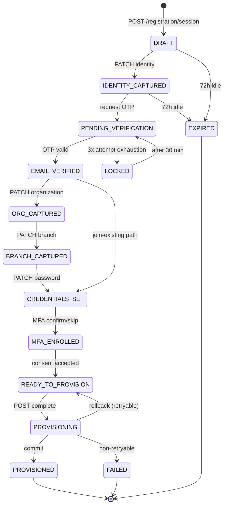
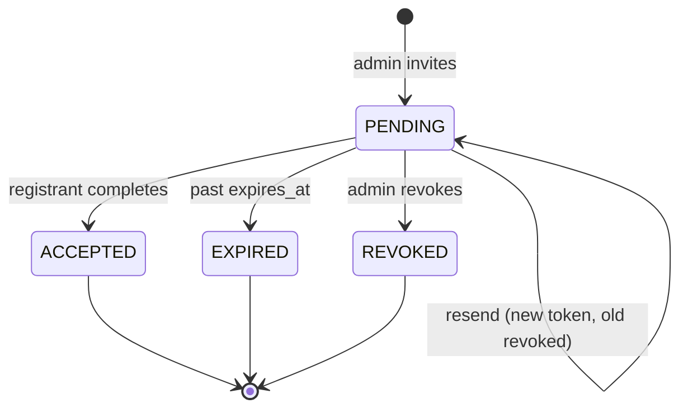
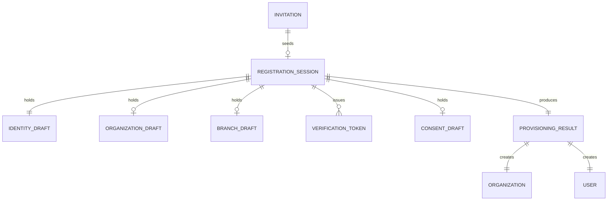

# Zellavora Control Center — Enterprise Registration Module

**Product:** Zellavora Control Center (ZCC)
**Company:** Zellavora Solutions
**Document type:** Production Engineering Specification (Build-Ready)
**Version:** 1.0.0
**Status:** Approved for Implementation
**Audience:** Frontend, Backend, QA, DevOps, UI/UX, Product, Security

---

## Document Control

| Field | Value |
|---|---|
| Owner | Principal Architect, ZCC Platform |
| Reviewers | Security Engineering, Product, UX, QA Lead, DevOps |
| Classification | Internal — Confidential |
| Supersedes | `REGISTRATION_13_STEPS_IMPLEMENTATION.md`, `REGISTRATION_CHECKLIST.md` |
| Related | `docs/RBAC_ARCHITECTURE.md`, `docs/MULTI_TENANT_ARCHITECTURE.md`, `docs/AUTHENTICATION_ARCHITECTURE.md` |

### Stack Alignment Notice (Read First)

This specification targets the stack mandated by Product:

- **Frontend:** Angular 22, standalone components, signals, zoneless change detection, SSR-compatible, Tailwind CSS, Angular CDK, RxJS, TypeScript (strict).
- **Backend:** NestJS + PostgreSQL + Prisma + JWT/Refresh rotation + Redis + BullMQ.
- **Storage:** Supabase Storage.

§7 defines the NestJS backend target directly. The contracts in §8 (Database) and §9 (API) are transport-agnostic and binding regardless of the HTTP framework in place at implementation time.

### Terminology

| Term | Meaning |
|---|---|
| **Organization** | The tenant root. Formerly `tenant` (renamed; see migration `rename tenants to organizations`). |
| **Workspace** | A provisioned functional surface inside an Organization (Dashboard, Users, Roles, …). |
| **Branch** | A physical/legal location belonging to an Organization. |
| **Registration Session** | Server-side, resumable, expiring record of an in-flight registration. |
| **Provisioning** | The single-transaction creation of Organization + Owner + Workspace + Branch + Roles + Settings. |
| **Owner** | The first user of an Organization; holds `organization.owner` role, non-deletable while sole owner. |

---

# 1. Functional Requirements

## 1.1 Requirement Register

Legend — Priority: `P0` launch-blocking, `P1` launch, `P2` fast-follow.

### 1.1.1 Entry & Routing

| ID | Requirement | Priority |
|---|---|---|
| FR-001 | System SHALL present an unauthenticated Welcome screen at `/register` describing the product, with actions: Register Organization, Login, Contact Sales, View Pricing. | P0 |
| FR-002 | System SHALL allow the registrant to choose a registration type: Create Organization, Join Existing Organization (invitation code), or Federated (Google / Microsoft / GitHub). | P0 |
| FR-003 | System SHALL honour platform-level `registration_mode` (`PUBLIC`, `INVITE_ONLY`, `DISABLED`) and hide/disable non-permitted paths with an explanatory message. | P0 |
| FR-004 | System SHALL deep-link invitation acceptance via `/register?invite=<token>`, pre-resolving the invitation and skipping organization/branch steps. | P0 |
| FR-005 | System SHALL redirect an already-authenticated user hitting `/register` to `/dashboard` unless `?force=1` and an active elevated session. | P1 |

### 1.1.2 Identity Capture

| ID | Requirement | Priority |
|---|---|---|
| FR-010 | System SHALL capture First Name, Last Name, Display Name, Business Email, Mobile Number (E.164), Country, Timezone, Language. | P0 |
| FR-011 | System SHALL auto-derive Display Name as `First Last` and allow override; override SHALL disable further auto-derivation. | P0 |
| FR-012 | System SHALL perform debounced (400 ms) asynchronous uniqueness checks on email and mobile against the global identity space. | P0 |
| FR-013 | System SHALL classify the email domain as `BUSINESS`, `FREE`, `DISPOSABLE`, or `ROLE_ACCOUNT` and enforce policy per registration type. | P0 |
| FR-014 | System SHALL reject disposable domains for `CREATE_ORGANIZATION`; free-mail domains SHALL produce a non-blocking warning. | P0 |
| FR-015 | System SHALL auto-detect Country/Timezone/Language from request geo-IP and `Accept-Language`, pre-filling but never locking the fields. | P1 |
| FR-016 | System SHALL validate the mobile number against the selected country's numbering plan (libphonenumber) and normalise to E.164. | P0 |
| FR-017 | System SHALL auto-save the registration session server-side on every step transition and every 10 s of form idle-after-change. | P0 |
| FR-018 | System SHALL allow resumption of an incomplete registration from a signed resume link valid for 72 h. | P1 |

### 1.1.3 Verification

| ID | Requirement | Priority |
|---|---|---|
| FR-020 | System SHALL verify the email via 6-digit numeric OTP, expiring in 15 minutes. | P0 |
| FR-021 | System SHALL also support a Magic Link alternative carrying a single-use token with identical 15-minute expiry. | P1 |
| FR-022 | System SHALL permit a maximum of 5 OTP sends per session with an exponential resend cooldown: 30 s, 60 s, 120 s, 300 s. | P0 |
| FR-023 | System SHALL permit a maximum of 5 verification attempts per issued OTP; exceeding invalidates the OTP and requires a resend. | P0 |
| FR-024 | System SHALL lock the registration session for 30 minutes after 3 consecutive OTP invalidations. | P0 |
| FR-025 | System SHALL optionally verify mobile via SMS OTP when `require_phone_verification` is enabled. | P1 |
| FR-026 | System SHALL display a live countdown for OTP expiry and resend cooldown. | P0 |
| FR-027 | System SHALL invalidate all outstanding OTPs when the target email is changed. | P0 |

### 1.1.4 Organization

| ID | Requirement | Priority |
|---|---|---|
| FR-030 | System SHALL capture Organization Name, Organization Code (slug), Industry, Organization Size, Website, Tax/GST identifier, Currency, Fiscal Year Start, Timezone, Logo. | P0 |
| FR-031 | System SHALL auto-generate the Organization Code from the name (lowercase, ASCII-folded, hyphenated, ≤40 chars) and check availability in real time. | P0 |
| FR-032 | System SHALL reject codes matching the reserved-word list (§10.6) and enforce global uniqueness on `LOWER(code)`. | P0 |
| FR-033 | System SHALL suggest up to 3 alternative codes when the desired code is taken. | P1 |
| FR-034 | System SHALL validate the GST/Tax ID against the country-specific format when the country has a known pattern. | P0 |
| FR-035 | System SHALL accept a logo of type PNG/JPEG/WEBP/SVG, ≤2 MB, ≤2048×2048, and store it in Supabase Storage under a private bucket. | P0 |
| FR-036 | System SHALL derive default Currency and Fiscal Year Start from the selected country, overridable. | P1 |

### 1.1.5 Branch

| ID | Requirement | Priority |
|---|---|---|
| FR-040 | System SHALL capture a primary Branch: Name, Address lines, Country, State, City, Postal Code, Phone, Latitude, Longitude. | P0 |
| FR-041 | System SHALL mark the first branch as both `is_primary` and `is_default` and prevent unsetting while it is the only branch. | P0 |
| FR-042 | System SHALL validate the postal code against the country pattern where defined. | P0 |
| FR-043 | System SHALL offer optional geocoding of the entered address to populate latitude/longitude; failure is non-blocking. | P2 |
| FR-044 | System SHALL allow the branch step to be skipped when `CREATE_ORGANIZATION` is performed under `quick_start` mode, defaulting to a "Head Office" branch. | P2 |

### 1.1.6 Credentials & MFA

| ID | Requirement | Priority |
|---|---|---|
| FR-050 | System SHALL enforce the enterprise password policy in §10.5 with a live strength meter (zxcvbn score ≥ 3 required). | P0 |
| FR-051 | System SHALL provide show/hide toggles and SHALL disable copy and cut on password inputs; paste SHALL be permitted (password-manager compatibility). | P0 |
| FR-052 | System SHALL check the password against a breach corpus via k-anonymity range query and reject known-breached passwords. | P0 |
| FR-053 | System SHALL reject passwords containing the user's name, email local-part, or organization name/code. | P0 |
| FR-054 | System SHALL offer optional MFA enrolment (TOTP, SMS, Email) during registration, mandatory when `require_mfa` is on. | P0 |
| FR-055 | System SHALL issue 10 single-use recovery codes upon MFA enrolment and require explicit acknowledgement of download/copy. | P0 |

### 1.1.7 Review, Consent, Provisioning

| ID | Requirement | Priority |
|---|---|---|
| FR-060 | System SHALL present an editable review summary grouped by step with inline "Edit" deep-links preserving state. | P0 |
| FR-061 | System SHALL present a validation summary enumerating errors, missing optional fields, and warnings, and SHALL block submission on errors. | P0 |
| FR-062 | System SHALL require explicit acceptance of Terms of Service and Privacy Policy with recorded version, timestamp, and IP. | P0 |
| FR-063 | System SHALL capture optional marketing-communication consent, defaulted to unchecked. | P0 |
| FR-064 | System SHALL provision Organization, Owner, Workspace, Branch, Roles, Permissions, Settings, Preferences, Notification channels, Storage bucket, and Audit entries in a single atomic transaction. | P0 |
| FR-065 | System SHALL roll back completely on any provisioning failure, leaving no partial tenant, and SHALL return a correlation ID. | P0 |
| FR-066 | System SHALL be idempotent on retry via an `Idempotency-Key` header, returning the original result for a repeated key. | P0 |
| FR-067 | System SHALL issue an access token and a rotating refresh token upon successful provisioning and register the device. | P0 |

### 1.1.8 Onboarding

| ID | Requirement | Priority |
|---|---|---|
| FR-070 | System SHALL present a 7-step Welcome Wizard: Logo, Theme, Invite Users, Departments, Branch, Notifications, Finish. | P1 |
| FR-071 | Every wizard step SHALL be skippable, and progress SHALL persist so the wizard resumes at the first incomplete step. | P1 |
| FR-072 | System SHALL surface remaining wizard tasks as a dismissible checklist on the Dashboard until complete. | P2 |

### 1.1.9 Join-Existing / Federated

| ID | Requirement | Priority |
|---|---|---|
| FR-080 | System SHALL validate an invitation code/token for existence, expiry, revocation, and email binding. | P0 |
| FR-081 | System SHALL bind the invited user to the invitation's Organization, Branch, Department, and Role without allowing elevation. | P0 |
| FR-082 | System SHALL skip email OTP when the invitation was delivered to the same address and the token proves possession. | P1 |
| FR-083 | System SHALL support OIDC registration with Google, Microsoft (Entra ID), and GitHub, mapping verified provider email to the identity. | P1 |
| FR-084 | System SHALL link a federated identity to an existing local account only after step-up verification of the local account. | P0 |
| FR-085 | System SHALL support Just-In-Time provisioning into an organization when the provider domain matches a verified `allowed_domain`. | P2 |

## 1.2 Out of Scope (v1)

SAML 2.0 IdP-initiated flows; SCIM user provisioning; organization mergers; self-serve billing at registration; multi-owner registration; on-premise deployment mode.

## 1.3 Global Acceptance Criteria

- **AC-G1** — A new visitor can go from Welcome to a provisioned, logged-in Dashboard in ≤ 13 steps with zero support contact.
- **AC-G2** — No step loses data on refresh, back-navigation, browser crash, or 72 h absence.
- **AC-G3** — Every failure path yields a human-readable message, a correlation ID, and a recovery action.
- **AC-G4** — All 20 sections of this document have passing automated coverage per §19.
- **AC-G5** — Zero partial tenants exist in the database after chaos-testing 1,000 injected provisioning failures.

---

# 2. Business Requirements

## 2.1 Objectives

| ID | Objective | Metric | Target |
|---|---|---|---|
| BR-001 | Minimise time-to-value for new organizations | Median Welcome → Dashboard | ≤ 6 minutes |
| BR-002 | Maximise funnel completion | Started → Provisioned | ≥ 65 % |
| BR-003 | Guarantee tenant isolation from creation | Cross-tenant leakage incidents | 0 |
| BR-004 | Ensure regulatory defensibility of consent | Consent records with version+IP+timestamp | 100 % |
| BR-005 | Suppress fraudulent/bot registrations | Disposable/bot registrations reaching provisioning | < 0.5 % |
| BR-006 | Support enterprise procurement | Orgs registered via invitation-only mode | Supported at GA |
| BR-007 | Contain support cost | Registration-related tickets per 100 signups | ≤ 2 |

## 2.2 Business Rules

| ID | Rule | Enforcement |
|---|---|---|
| BRU-001 | An email address is globally unique across the platform identity space. | DB unique index + API check |
| BRU-002 | An organization code is globally unique, case-insensitive, and immutable after provisioning. | DB unique index on `LOWER(code)`; no PATCH route |
| BRU-003 | Every organization has exactly one Owner at creation; the Owner cannot be removed while sole owner. | Provisioning + RBAC guard |
| BRU-004 | Every organization has at least one branch, exactly one of which is `is_default`. | Partial unique index + trigger |
| BRU-005 | A user may belong to many organizations; roles are scoped per organization membership. | `user_organizations` composite key |
| BRU-006 | Registration is only complete when email is verified, password set, and consent recorded. | Provisioning precondition checks |
| BRU-007 | An invitation is single-use, expires in 7 days (configurable 1–30), and is bound to the invited email. | Token table + status machine |
| BRU-008 | An organization starts on the `TRIAL` plan for 14 days unless the invitation carries a plan grant. | Provisioning default |
| BRU-009 | Free-mail domains are permitted but flagged `requires_review` for organizations with size ≥ 201. | Risk engine |
| BRU-010 | Registration data for abandoned sessions is purged after 30 days. | BullMQ nightly job |
| BRU-011 | GST/Tax ID is mandatory when country is India and org size ≥ 51; otherwise optional. | Conditional validator |
| BRU-012 | The trial organization is capped at 25 users, 5 branches, and 5 GB storage until upgrade. | Quota records at provisioning |
| BRU-013 | Country restrictions (sanctions list) block registration with a generic refusal and an audit entry. | Geo/IP + declared-country check |
| BRU-014 | An organization code, once released by deletion, is quarantined for 180 days. | Soft-delete + reservation table |

## 2.3 Stakeholders & RACI

| Activity | Product | Architect | Frontend | Backend | Security | QA | DevOps |
|---|---|---|---|---|---|---|---|
| Requirements sign-off | **A** | C | I | I | C | C | I |
| Flow & IA | **A/R** | C | C | I | I | I | I |
| Frontend build | I | C | **A/R** | C | C | C | I |
| Backend & provisioning | I | **A** | I | **R** | C | C | C |
| Threat model & pen-test | I | C | I | C | **A/R** | C | C |
| Test strategy & release gate | C | C | C | C | C | **A/R** | C |
| Infra, secrets, rollout | I | C | I | C | C | I | **A/R** |

## 2.4 Assumptions, Dependencies, Risks

**Assumptions** — Transactional email provider ≥ 99.9 % availability; SMS provider covers all target countries; geo-IP database refreshed monthly; Supabase Storage reachable from the backend network.

**Dependencies** — Redis (sessions, rate limits, OTP), BullMQ (email/SMS/provisioning side-effects), Supabase Storage (logos), CAPTCHA provider (Cloudflare Turnstile), breach corpus API, libphonenumber dataset.

| Risk | Impact | Likelihood | Mitigation |
|---|---|---|---|
| Email provider outage blocks all verification | High | Med | Secondary provider with automatic failover; magic-link fallback; queue with retry+DLQ |
| Provisioning transaction exceeds statement timeout on large seed | High | Low | Seed roles/permissions from pre-built templates; move non-critical seeds to post-commit jobs |
| Bot-driven org squatting on codes | Med | Med | CAPTCHA at type-selection; code reserved only at provisioning; rate limits per IP/ASN |
| Slug collisions at scale | Low | High | Suggestion engine + numeric suffix strategy |
| GDPR erasure vs. audit retention conflict | High | Low | Pseudonymise PII in audit rows; retain hashed identifiers |

---

# 3. User Journey

## 3.1 Personas

| Persona | Goal | Entry point | Success signal |
|---|---|---|---|
| **Priya — Founder / Org Owner** | Stand up a workspace for a 40-person firm | Marketing site → Register Organization | Dashboard with branding + 5 invited users |
| **Marcus — Enterprise IT Admin** | Evaluate ZCC under corporate policy | Procurement link → invitation-only | MFA enforced, SSO domain verified |
| **Aisha — Invited Manager** | Join her employer's existing workspace | Invitation email | Lands in assigned branch with correct role |
| **Diego — Employee via SSO** | Access with corporate Google account | SSO button | One-click into workspace, no password |
| **Sam — Viewer / Auditor** | Read-only access to audit logs | Invitation with Viewer role | Sees only permitted screens |

## 3.2 Journey Map — Priya (Create Organization)

| Stage | Actions | Thoughts | Emotion | Pain risk | Design mitigation |
|---|---|---|---|---|---|
| Discover | Lands on Welcome | "Is this credible?" | Curious | Trust gap | Security badges, SOC2/ISO marks, customer logos |
| Choose | Picks Create Organization | "How long is this?" | Cautious | Length anxiety | Stepper with "≈5 min", progress %, save-and-resume note |
| Identify | Enters name, email, phone | "Will they spam me?" | Neutral | Consent unclear | Inline privacy microcopy, marketing consent unchecked |
| Verify | Enters OTP | "Did it arrive?" | Impatient | Email delay | Countdown, resend, magic-link alt, spam-folder hint |
| Organize | Org name → code auto-fills | "Is this name taken?" | Engaged | Slug rejection | Live availability + suggestions |
| Locate | Enters branch address | "Why do they need this?" | Mildly resistant | Perceived friction | "Used for tax and locale defaults" tooltip; skip option |
| Secure | Sets password, enables MFA | "Is this strong enough?" | Focused | Policy frustration | Live checklist, strength meter, generate-password |
| Review | Scans summary | "Did I get it right?" | Careful | Editing fear | Inline edit returning to review |
| Provision | Waits ~2 s | "Is it working?" | Anxious | Blank wait | Staged progress: Creating org → Workspace → Roles → Done |
| Onboard | Runs wizard | "Now what?" | Motivated | Overwhelm | Skippable steps, dashboard checklist |

## 3.3 Journey Map — Aisha (Invitation)

Email → click → invite resolved server-side → identity pre-filled and email locked → password + MFA → consent → membership created → lands on assigned workspace. Steps 5–8 (Organization, Branch) are suppressed entirely. Target: ≤ 90 seconds.

## 3.4 Emotional Curve & Drop-off Instrumentation

Highest measured drop-off risk in order: (1) OTP entry, (2) Password policy, (3) Branch address, (4) Organization code collision. Each is instrumented with `registration.step.abandoned` carrying `step_id`, `dwell_ms`, `error_count`, `last_error_code` (§17.4).

---

# 4. Registration Flow Diagram

## 4.1 Canonical 13-Step Flow

| # | Step ID | Screen | Applies to | Skippable |
|---|---|---|---|---|
| 1 | `WELCOME` | Welcome | All | n/a |
| 2 | `TYPE` | Registration Type | All | No |
| 3 | `IDENTITY` | Personal Information | All | No |
| 4 | `EMAIL_VERIFY` | Email Verification | All (auto-pass on bound invite) | Conditional |
| 5 | `ORGANIZATION` | Organization Details | Create only | No |
| 6 | `BRANCH` | Primary Branch | Create only | Quick-start only |
| 7 | `PASSWORD` | Password & Policy | Local auth only | Skipped for SSO |
| 8 | `MFA` | MFA Enrolment | All | Unless `require_mfa` |
| 9 | `PREFERENCES` | Preferences & Notifications | All | Yes |
| 10 | `CONSENT` | Terms & Privacy | All | No |
| 11 | `REVIEW` | Review & Confirm | All | No |
| 12 | `PROVISION` | Provisioning | All | n/a (system) |
| 13 | `WIZARD` | Welcome Wizard | Owner only | Yes |

## 4.2 Master Flow


## 4.3 Provisioning Sequence

```mermaid
sequenceDiagram
    autonumber
    participant FE as Angular SPA
    participant API as NestJS RegistrationController
    participant SVC as ProvisioningService
    participant DB as PostgreSQL (Prisma tx)
    participant R as Redis
    participant Q as BullMQ
    participant ST as Supabase Storage

    FE->>API: POST /registration/complete (Idempotency-Key, sessionId)
    API->>R: GET idem:{key}
    alt cached result
        R-->>API: stored response
        API-->>FE: 200 (replayed)
    else new
        API->>R: SET NX idem:{key} = IN_PROGRESS (ttl 24h)
        API->>SVC: provision(sessionId)
        SVC->>R: load + validate session (state = READY_TO_PROVISION)
        SVC->>DB: BEGIN (isolation: READ COMMITTED, timeout 10s)
        SVC->>DB: INSERT organizations
        SVC->>DB: INSERT organization_settings, organization_quotas
        SVC->>DB: INSERT users (argon2id hash)
        SVC->>DB: INSERT user_organizations (role=owner)
        SVC->>DB: INSERT branches (primary+default)
        SVC->>DB: INSERT roles + role_permissions from template
        SVC->>DB: INSERT workspaces (11 modules)
        SVC->>DB: INSERT user_preferences, notification_preferences
        SVC->>DB: INSERT storage_containers
        SVC->>DB: INSERT audit_logs (ORG_CREATED, USER_CREATED, ...)
        SVC->>DB: COMMIT
        DB-->>SVC: ok
        SVC->>Q: enqueue welcome-email, org-created-email, search-index, crm-sync
        SVC->>ST: finalize logo (move temp → org bucket)
        SVC->>R: DEL registration session; SET idem:{key} = response
        SVC-->>API: {organizationId, userId, tokens}
        API-->>FE: 201 Created + Set-Cookie refresh_token
    end
```

## 4.4 Registration Session State Machine



## 4.5 Invitation State Machine



---

# 5. Information Architecture

## 5.1 Route Map

| Route | Guard | Resolver | SSR | Purpose |
|---|---|---|---|---|
| `/register` | `guestGuard` | `registrationConfigResolver` | Yes (prerender) | Welcome |
| `/register/type` | `guestGuard`, `registrationOpenGuard` | — | Yes | Registration type |
| `/register/invite/:token` | `guestGuard` | `invitationResolver` | No | Invitation landing |
| `/register/identity` | `registrationSessionGuard` | `sessionResolver` | No | Personal information |
| `/register/verify` | `registrationSessionGuard`, `stepGuard('IDENTITY_CAPTURED')` | — | No | Email verification |
| `/register/organization` | `registrationSessionGuard`, `stepGuard('EMAIL_VERIFIED')` | `industriesResolver` | No | Organization |
| `/register/branch` | `registrationSessionGuard`, `stepGuard('ORG_CAPTURED')` | `geoResolver` | No | Branch |
| `/register/password` | `registrationSessionGuard` | `passwordPolicyResolver` | No | Password |
| `/register/mfa` | `registrationSessionGuard` | — | No | MFA |
| `/register/preferences` | `registrationSessionGuard` | — | No | Preferences |
| `/register/consent` | `registrationSessionGuard` | `legalDocsResolver` | No | Terms |
| `/register/review` | `registrationSessionGuard`, `stepGuard('READY_TO_PROVISION')` | — | No | Review |
| `/register/provisioning` | `registrationSessionGuard` | — | No | Progress |
| `/onboarding` | `authGuard`, `ownerGuard` | `wizardStateResolver` | No | Welcome wizard |
| `/register/resume/:token` | none | `resumeResolver` | No | Resume link |
| `/register/blocked` | none | — | Yes | Country/mode block |

Deep-linking beyond the current session state redirects to the furthest legal step and raises `registration.deeplink.redirected`.

## 5.2 Content Model



## 5.3 Navigation Rules

1. **Forward** is permitted only when the current step is valid and the server has acknowledged the patch.
2. **Backward** is always permitted to any completed step; data is retained and re-editable.
3. **Editing an earlier step** that invalidates a later one (e.g. changing email after verification) resets the dependent steps and warns before applying.
4. **Exit** prompts a confirmation dialog offering "Email me a resume link".
5. **Stepper** is clickable only for completed steps; future steps are `aria-disabled`.

## 5.4 Copy Hierarchy per Screen

`Eyebrow (step x of 13)` → `H1 title` → `supporting paragraph` → `form region` → `inline help` → `primary action` → `secondary action` → `legal footnote`.

## 5.5 Provisioned Workspace IA

| Workspace | Key | Default Route | Min Role |
|---|---|---|---|
| Dashboard | `dashboard` | `/dashboard` | viewer |
| User Management | `users` | `/admin/users` | manager |
| Role Management | `roles` | `/admin/roles` | admin |
| Permission Management | `permissions` | `/admin/permissions` | super_admin |
| Settings | `settings` | `/admin/settings` | admin |
| Notifications | `notifications` | `/notifications` | viewer |
| Audit Logs | `audit-logs` | `/admin/audit` | admin |
| Activity Logs | `activity-logs` | `/admin/activity` | manager |
| Storage | `storage` | `/admin/storage` | admin |
| API Keys | `api-keys` | `/admin/api-keys` | super_admin |
| Webhooks | `webhooks` | `/admin/webhooks` | super_admin |

---

# 6. Frontend Architecture

## 6.1 Folder Structure

```
apps/admin/src/app/features/registration/
├── registration.routes.ts
├── pages/
│   ├── welcome/                welcome.page.ts|html|css
│   ├── type/                   type.page.*
│   ├── identity/               identity.page.*
│   ├── verify-email/           verify-email.page.*
│   ├── organization/           organization.page.*
│   ├── branch/                 branch.page.*
│   ├── password/               password.page.*
│   ├── mfa/                    mfa.page.*
│   ├── preferences/            preferences.page.*
│   ├── consent/                consent.page.*
│   ├── review/                 review.page.*
│   ├── provisioning/           provisioning.page.*
│   └── blocked/                blocked.page.*
├── components/
│   ├── registration-stepper/
│   ├── registration-shell/
│   ├── otp-input/
│   ├── password-strength-meter/
│   ├── password-policy-checklist/
│   ├── availability-indicator/
│   ├── logo-uploader/
│   ├── phone-field/
│   ├── country-select/
│   ├── timezone-select/
│   ├── industry-select/
│   ├── address-field/
│   ├── review-section/
│   ├── validation-summary/
│   ├── recovery-codes-panel/
│   ├── provisioning-progress/
│   └── security-badges/
├── dialogs/
│   ├── exit-registration.dialog.ts
│   ├── change-email-warning.dialog.ts
│   ├── recovery-codes.dialog.ts
│   └── terms-viewer.dialog.ts
├── store/
│   ├── registration.store.ts
│   ├── registration.state.ts
│   └── registration.selectors.ts
├── services/
│   ├── registration.api.ts
│   ├── registration-autosave.service.ts
│   ├── otp-timer.service.ts
│   ├── password-policy.service.ts
│   ├── geo.service.ts
│   ├── slug.service.ts
│   └── analytics.service.ts
├── guards/
│   ├── guest.guard.ts
│   ├── registration-session.guard.ts
│   ├── step.guard.ts
│   └── registration-open.guard.ts
├── resolvers/
│   ├── registration-config.resolver.ts
│   ├── invitation.resolver.ts
│   ├── password-policy.resolver.ts
│   └── legal-docs.resolver.ts
├── models/
│   ├── registration.models.ts
│   ├── organization.models.ts
│   ├── branch.models.ts
│   └── api-contracts.ts
├── validators/
│   ├── async-unique.validator.ts
│   ├── password.validators.ts
│   ├── phone.validator.ts
│   ├── slug.validator.ts
│   └── tax-id.validator.ts
└── animations/registration.animations.ts
```

## 6.2 Routing (Lazy, Deferred)

```ts
// registration.routes.ts
import { Routes } from '@angular/router';
import { guestGuard } from './guards/guest.guard';
import { registrationSessionGuard } from './guards/registration-session.guard';
import { stepGuard } from './guards/step.guard';
import { registrationConfigResolver } from './resolvers/registration-config.resolver';

export const REGISTRATION_ROUTES: Routes = [
  {
    path: '',
    loadComponent: () => import('./components/registration-shell/registration-shell.component')
      .then(m => m.RegistrationShellComponent),
    resolve: { config: registrationConfigResolver },
    children: [
      { path: '', canActivate: [guestGuard],
        loadComponent: () => import('./pages/welcome/welcome.page').then(m => m.WelcomePage),
        data: { ssr: true, title: 'Create your Zellavora organization' } },
      { path: 'type', canActivate: [guestGuard],
        loadComponent: () => import('./pages/type/type.page').then(m => m.TypePage) },
      { path: 'identity', canActivate: [registrationSessionGuard],
        loadComponent: () => import('./pages/identity/identity.page').then(m => m.IdentityPage) },
      { path: 'verify', canActivate: [registrationSessionGuard, stepGuard('IDENTITY_CAPTURED')],
        loadComponent: () => import('./pages/verify-email/verify-email.page').then(m => m.VerifyEmailPage) },
      { path: 'organization', canActivate: [registrationSessionGuard, stepGuard('EMAIL_VERIFIED')],
        loadComponent: () => import('./pages/organization/organization.page').then(m => m.OrganizationPage) },
      { path: 'branch', canActivate: [registrationSessionGuard, stepGuard('ORG_CAPTURED')],
        loadComponent: () => import('./pages/branch/branch.page').then(m => m.BranchPage) },
      { path: 'password', canActivate: [registrationSessionGuard],
        loadComponent: () => import('./pages/password/password.page').then(m => m.PasswordPage) },
      { path: 'mfa', canActivate: [registrationSessionGuard],
        loadComponent: () => import('./pages/mfa/mfa.page').then(m => m.MfaPage) },
      { path: 'preferences', canActivate: [registrationSessionGuard],
        loadComponent: () => import('./pages/preferences/preferences.page').then(m => m.PreferencesPage) },
      { path: 'consent', canActivate: [registrationSessionGuard],
        loadComponent: () => import('./pages/consent/consent.page').then(m => m.ConsentPage) },
      { path: 'review', canActivate: [registrationSessionGuard, stepGuard('READY_TO_PROVISION')],
        loadComponent: () => import('./pages/review/review.page').then(m => m.ReviewPage) },
      { path: 'provisioning', canActivate: [registrationSessionGuard],
        loadComponent: () => import('./pages/provisioning/provisioning.page').then(m => m.ProvisioningPage) },
      { path: 'blocked',
        loadComponent: () => import('./pages/blocked/blocked.page').then(m => m.BlockedPage) },
      { path: '**', redirectTo: '' },
    ],
  },
];
```

## 6.3 Signal Store

```ts
// registration.state.ts
export type RegistrationType = 'CREATE_ORGANIZATION' | 'JOIN_EXISTING' | 'SSO';
export type SessionState =
  | 'DRAFT' | 'IDENTITY_CAPTURED' | 'PENDING_VERIFICATION' | 'EMAIL_VERIFIED'
  | 'ORG_CAPTURED' | 'BRANCH_CAPTURED' | 'CREDENTIALS_SET' | 'MFA_ENROLLED'
  | 'READY_TO_PROVISION' | 'PROVISIONING' | 'PROVISIONED' | 'FAILED' | 'LOCKED' | 'EXPIRED';

export interface RegistrationState {
  sessionId: string | null;
  sessionState: SessionState;
  type: RegistrationType | null;
  currentStep: number;
  furthestStep: number;
  identity: IdentityDraft;
  organization: OrganizationDraft;
  branch: BranchDraft;
  credentials: { passwordSet: boolean; strengthScore: number };
  mfa: { enabled: boolean; method: 'TOTP' | 'SMS' | 'EMAIL' | null; recoveryCodesAcknowledged: boolean };
  preferences: PreferencesDraft;
  consent: ConsentDraft;
  invitation: ResolvedInvitation | null;
  otp: { sentAt: string | null; expiresAt: string | null; resendCount: number;
         cooldownEndsAt: string | null; attemptsRemaining: number };
  availability: { email: AvailabilityStatus; mobile: AvailabilityStatus; orgCode: AvailabilityStatus };
  provisioning: { stage: ProvisioningStage | null; correlationId: string | null };
  ui: { loading: boolean; saving: boolean; submitting: boolean; dirty: boolean;
        lastSavedAt: string | null; error: ApiError | null; warnings: Warning[] };
}
```

```ts
// registration.store.ts (excerpt)
@Injectable({ providedIn: 'root' })
export class RegistrationStore {
  private readonly api = inject(RegistrationApi);
  private readonly analytics = inject(AnalyticsService);
  private readonly state = signal<RegistrationState>(INITIAL_REGISTRATION_STATE);

  // ---- selectors -------------------------------------------------------
  readonly sessionId       = computed(() => this.state().sessionId);
  readonly currentStep     = computed(() => this.state().currentStep);
  readonly type            = computed(() => this.state().type);
  readonly identity        = computed(() => this.state().identity);
  readonly organization    = computed(() => this.state().organization);
  readonly branch          = computed(() => this.state().branch);
  readonly otp             = computed(() => this.state().otp);
  readonly isOwnerPath     = computed(() => this.state().type === 'CREATE_ORGANIZATION');
  readonly visibleSteps    = computed(() => STEP_DEFS.filter(s => s.appliesTo(this.state())));
  readonly progressPercent = computed(() => Math.round(
      (this.state().currentStep / this.visibleSteps().length) * 100));
  readonly canAdvance      = computed(() => !this.state().ui.saving && !this.state().ui.error);
  readonly otpExpired      = computed(() => {
    const e = this.state().otp.expiresAt; return !!e && Date.parse(e) <= Date.now();
  });
  readonly validationSummary = computed(() => buildValidationSummary(this.state()));
  readonly reviewModel       = computed(() => buildReviewModel(this.state()));

  // ---- effects ---------------------------------------------------------
  constructor() {
    effect(() => {              // autosave on dirty
      const s = this.state();
      if (s.ui.dirty && s.sessionId && !s.ui.saving) queueMicrotask(() => this.persist());
    });
    effect(() => this.analytics.track('registration.step.viewed',
      { step: this.state().currentStep, type: this.state().type }));
  }

  // ---- mutations -------------------------------------------------------
  patchIdentity(v: Partial<IdentityDraft>) {
    this.state.update(s => ({ ...s, identity: { ...s.identity, ...v }, ui: { ...s.ui, dirty: true } }));
  }

  async verifyOtp(code: string): Promise<void> {
    this.state.update(s => ({ ...s, ui: { ...s.ui, submitting: true, error: null } }));
    try {
      const r = await firstValueFrom(this.api.verifyOtp(this.state().sessionId!, code));
      this.state.update(s => ({ ...s, sessionState: r.sessionState,
        otp: { ...s.otp, attemptsRemaining: r.attemptsRemaining },
        ui: { ...s.ui, submitting: false } }));
    } catch (e) {
      const err = toApiError(e);
      this.state.update(s => ({ ...s,
        otp: { ...s.otp, attemptsRemaining: err.meta?.attemptsRemaining ?? s.otp.attemptsRemaining },
        ui: { ...s.ui, submitting: false, error: err } }));
      throw e;
    }
  }
}
```

**Rules:** the state signal is private and never exposed; components read only `computed` selectors; all mutations are immutable spreads; async work sets `submitting` and always clears it in a `finally`-equivalent path.

## 6.4 Form Architecture

- Typed reactive forms (`FormGroup<{...}>`), one form per page, hydrated from the store on `ngOnInit` and pushed back via `valueChanges` → `patch*` with `debounceTime(250)` + `distinctUntilChanged`.
- Async validators are `debounceTime(400)` + `switchMap`, wired only on `blur` for the network-hitting ones to avoid keystroke amplification.
- Cross-field validators live at the group level (`passwordsMatch`, `latLngPair`, `gstRequiredForIndia`).
- `updateOn: 'blur'` for email/mobile/code; `'change'` for password (live meter).

```ts
this.form = this.fb.group({
  firstName:   this.fb.control('', { validators: [V.required, V.maxLength(50), nameCharset()] }),
  lastName:    this.fb.control('', { validators: [V.required, V.maxLength(50), nameCharset()] }),
  displayName: this.fb.control('', { validators: [V.required, V.maxLength(100)] }),
  email:       this.fb.control('', {
                 validators: [V.required, V.email, V.maxLength(254)],
                 asyncValidators: [uniqueEmailValidator(this.api), businessEmailValidator(this.api)],
                 updateOn: 'blur' }),
  mobile:      this.fb.control('', { validators: [V.required, phoneValidator(() => this.country())],
                 asyncValidators: [uniqueMobileValidator(this.api)], updateOn: 'blur' }),
  country:     this.fb.control('', { validators: [V.required] }),
  timezone:    this.fb.control('', { validators: [V.required] }),
  language:    this.fb.control('en', { validators: [V.required] }),
});
```

## 6.5 Interceptors

| Interceptor | Order | Responsibility |
|---|---|---|
| `correlationIdInterceptor` | 1 | Attach `X-Correlation-Id` (UUID v4 per request) |
| `registrationSessionInterceptor` | 2 | Attach `X-Registration-Session` header |
| `csrfInterceptor` | 3 | Attach `X-CSRF-Token` from the `XSRF-TOKEN` cookie on mutating verbs |
| `captchaInterceptor` | 4 | Attach `X-Captcha-Token` on protected endpoints |
| `retryInterceptor` | 5 | Retry idempotent GETs 2× with jittered backoff |
| `errorNormalizeInterceptor` | 6 | Map RFC 7807 problem+json → `ApiError` |
| `loadingInterceptor` | 7 | Drive a global progress bar |
| `telemetryInterceptor` | 8 | Emit latency/status to analytics |

## 6.6 Reusable Components (Contracts)

| Component | Inputs | Outputs | Notes |
|---|---|---|---|
| `zc-registration-stepper` | `steps`, `current`, `furthest` | `stepSelected` | `role="list"`, `aria-current="step"` |
| `zc-otp-input` | `length=6`, `disabled`, `invalid`, `autoFocus` | `completed`, `changed` | One input per digit, paste-distributes, arrow-key nav, `inputmode="numeric"`, `autocomplete="one-time-code"` |
| `zc-password-strength-meter` | `password`, `userInputs[]` | `scoreChange` | zxcvbn lazy-loaded via `@defer` |
| `zc-password-policy-checklist` | `password`, `policy` | — | `aria-live="polite"`, per-rule pass/fail |
| `zc-availability-indicator` | `status`, `suggestions[]` | `suggestionPicked` | idle / checking / available / taken / error |
| `zc-logo-uploader` | `maxBytes`, `accept[]`, `aspect` | `uploaded`, `removed` | Drag-drop, CDK a11y, client-side crop, EXIF strip |
| `zc-phone-field` | `country`, `value` | `valueChange`, `validityChange` | Country dial-code combobox + national number |
| `zc-review-section` | `title`, `items[]`, `editRoute` | `editRequested` | Renders label/value/warning triplets |
| `zc-validation-summary` | `errors[]`, `warnings[]`, `missing[]` | `focusRequested` | Focus-jumps to the offending control |
| `zc-provisioning-progress` | `stage`, `stages[]` | — | `aria-live="polite"` stage narration |
| `zc-recovery-codes-panel` | `codes[]` | `acknowledged` | Copy/download/print; ack required |

## 6.7 Loading, Empty, Skeleton, Animation

- **Skeletons** for resolver-fed data (industries, countries, legal docs) using shimmering Tailwind blocks matched to final layout dimensions to avoid CLS.
- **Deferred blocks** — `@defer (on viewport)` for security badges and pricing teaser; `@defer (on interaction)` for the terms viewer and zxcvbn.
- **Empty states** — no invitations found, no suggestions available, geocoding returned nothing: each with an icon, one-line explanation, and a corrective action.
- **Animations** — 200 ms horizontal slide between steps, 120 ms fade for inline errors, 400 ms staged checkmarks in provisioning. All wrapped in `prefers-reduced-motion` guards that collapse to instant transitions.

## 6.8 SSR & Zoneless Notes

- Only `/register` and `/register/type` are server-rendered/prerendered; all session-bearing routes are CSR to avoid leaking draft PII into the SSR cache.
- No `window`/`document` access outside `afterNextRender`; timers use `PLATFORM_ID` guards so OTP countdowns never run on the server.
- Zoneless: every async completion must mutate a signal — no `setTimeout` mutating a plain field. `provideZonelessChangeDetection()` is asserted in the app config test.
- `TransferState` carries the registration config so the client does not refetch it.
