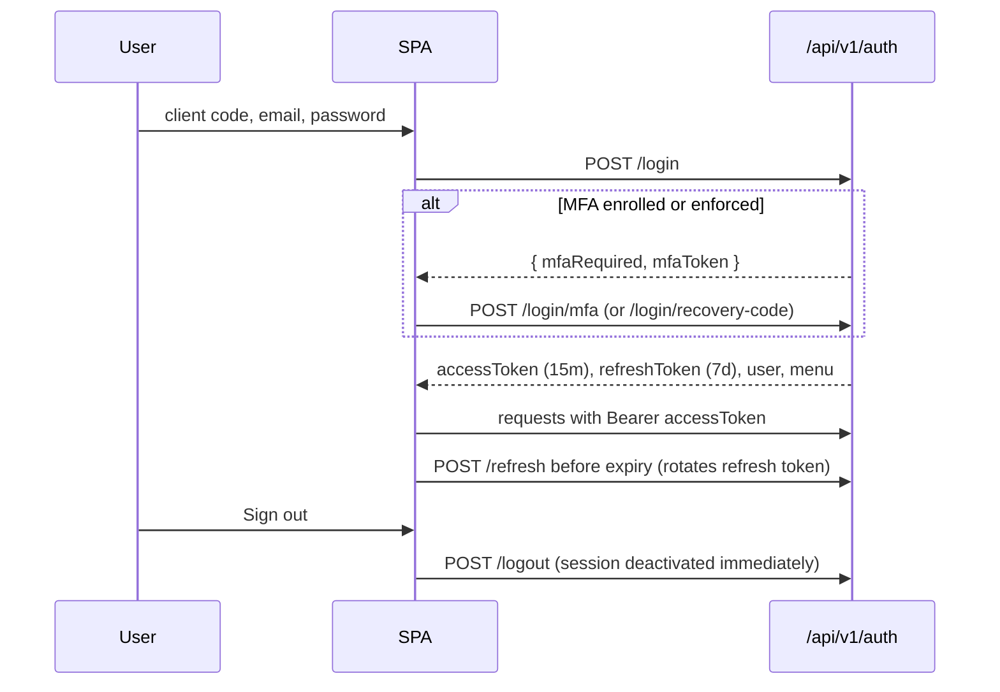

# Authentication, invitations and account security

Sign-in, two-factor authentication, sessions, token refresh, onboarding by invitation, email verification, password recovery, organization switching, and the signed-in user's own security settings.

## Code

| Layer                         | Path                                                                                                                                                            |
| ----------------------------- | --------------------------------------------------------------------------------------------------------------------------------------------------------------- |
| Routes / controller / service | `apps/backend/src/modules/auth/` (`auth.routes.ts`, `auth.controller.ts`, `auth.service.ts`, `auth.repository.ts`, `auth.dto.ts`, `auth.types.ts`)              |
| Auth services                 | `apps/backend/src/services/auth/`: `token`, `session`, `mfa`, `password`, `rate-limit`, `one-time-token`, `tenant`, `menu`, `permission`, `encryption`, `audit` |
| Invitations (admin side)      | `apps/backend/src/modules/invitation/`                                                                                                                          |
| Frontend sign-in flow         | `apps/zcc-frontend/src/app/features/auth/` (13 pages, shared `auth-layout`, `auth-field`, `otp-input`, `password-requirements`, `auth-alert`)                   |
| Frontend account pages        | `apps/zcc-frontend/src/app/features/account/` (`security`, `change-password`, cards for 2FA, recovery codes, sessions, re-auth)                                 |
| Frontend core                 | `core/auth/auth.service.ts`, `auth.store.ts`, `auth.guard.ts`, `auth.interceptor.ts`, `auth-errors.ts`                                                          |

## Flows

- **Onboarding is by invitation.** An admin invites (`POST /api/v1/invitations`), the user opens `/auth/accept-invitation?token=…`, sets a password, then signs in. Tokens are single-use, purpose-bound and stored hashed. Self-registration exists but is off unless `ALLOW_SELF_REGISTRATION=true`.
- **Email verification** is required by default (`REQUIRE_EMAIL_VERIFICATION`).
- **Password recovery**: `forgot-password` always answers the same way; `reset-password/validate` checks the token; `reset-password` sets the password and revokes sessions.
- **Organization switching**: `GET /tenants` lists the user's organizations; `POST /switch-tenant` issues tokens for another one. No frontend screen uses it yet; users pick the organization by client code at sign-in.

## Security properties

- Enumeration resistance: one message for login failures; forgot-password, resend-verification and registration answer identically whether or not the account exists.
- Lockout: per-IP (10 failures / 15 min) and per-account (`ACCOUNT_LOCKOUT_THRESHOLD`, default 5) using the `login_attempts` table.
- Route rate limits (per IP): login 30/15 min, MFA challenge 15/5 min, email-sending 5/15 min, token endpoints 20/15 min, register 5/hour, sensitive actions 10/15 min. Plus 120/min across all of `/api/v1/auth`.
- Tokens: HS256, algorithm pinned on verify. Refresh tokens are stored hashed; reuse of a rotated token revokes the whole family.
- Sessions: every authenticated request checks the session is active and inside the organization's idle timeout (`security-policy`), so logout and revocation are immediate.
- MFA: TOTP (`otplib`) with QR enrolment and one-time recovery codes. Organizations can enforce it.
- Password history (`PASSWORD_HISTORY_DEPTH`, default 5) and policy from `security-policy`.

## API

Base path `/api/v1/auth`.

| Method       | Path                                                                 | Guard                   | Purpose                                               |
| ------------ | -------------------------------------------------------------------- | ----------------------- | ----------------------------------------------------- |
| GET          | `/config`                                                            | Public                  | Public auth settings (self-registration on/off, etc.) |
| GET          | `/clients`                                                           | Public                  | Organizations offered on the sign-in screen           |
| POST         | `/login`                                                             | login limiter           | Password sign-in; returns tokens or an MFA challenge  |
| POST         | `/login/mfa`                                                         | challenge limiter       | Complete sign-in with a TOTP code                     |
| POST         | `/login/recovery-code`                                               | challenge limiter       | Complete sign-in with a recovery code                 |
| POST         | `/refresh`                                                           | —                       | Rotate refresh token, new access token                |
| POST         | `/register`                                                          | register limiter        | Self-registration (when enabled)                      |
| POST         | `/invitations/preview`                                               | token limiter           | Show who invited whom before accepting                |
| POST         | `/invitations/accept`                                                | token limiter           | Accept invitation and set password                    |
| POST         | `/verify-email`                                                      | token limiter           | Confirm email address                                 |
| POST         | `/resend-verification`                                               | email limiter           | Send a new verification email                         |
| POST         | `/forgot-password`                                                   | email limiter           | Start password reset                                  |
| POST         | `/reset-password/validate`                                           | token limiter           | Check a reset token                                   |
| POST         | `/reset-password`                                                    | token limiter           | Set a new password                                    |
| POST         | `/logout`                                                            | authenticate            | End this session                                      |
| POST         | `/logout-all`                                                        | authenticate, sensitive | End every session (password required)                 |
| GET          | `/me`                                                                | authenticate            | Current user, permissions and sidebar menu            |
| PUT          | `/me/avatar`                                                         | authenticate            | Update avatar                                         |
| GET          | `/tenants`                                                           | authenticate            | Organizations the user belongs to                     |
| POST         | `/switch-tenant`                                                     | authenticate            | Re-issue tokens for another organization              |
| POST         | `/change-password`                                                   | authenticate, sensitive | Change password                                       |
| GET          | `/security`                                                          | authenticate            | MFA state, recovery codes left, sessions summary      |
| POST         | `/mfa/enroll`, `/mfa/confirm`, `/mfa/disable`, `/mfa/recovery-codes` | authenticate, sensitive | Manage 2FA                                            |
| GET / DELETE | `/sessions`                                                          | authenticate            | List sessions / revoke all others                     |
| DELETE       | `/sessions/:sessionId`                                               | authenticate            | Revoke one session                                    |

Invitations (admin), base path `/api/v1/invitations`:

| Method | Path                    | Permission                     |
| ------ | ----------------------- | ------------------------------ |
| GET    | `/`                     | `users:read` or `users:manage` |
| POST   | `/`                     | `users:manage`                 |
| POST   | `/:invitationId/resend` | `users:manage`                 |
| POST   | `/:invitationId/revoke` | `users:manage`                 |

## Data model

`User`, `UserTenant` (membership and organization role), `Session`, `RefreshToken`, `AuthChallenge` (MFA), `LoginAttempt`, `PasswordHistory`, `PasswordReset`, `EmailVerification`, `MobileVerification`, `Otp`, `RegistrationSession`, `Invitation`, `AuditLog`.

## Frontend

| Route                                                                           | Page                                              |
| ------------------------------------------------------------------------------- | ------------------------------------------------- |
| `/auth/login`                                                                   | Client code, email, password; "keep me signed in" |
| `/auth/two-factor`, `/auth/recovery-code`                                       | Second factor                                     |
| `/auth/register`                                                                | Self-registration (hidden when disabled)          |
| `/auth/accept-invitation`, `/auth/verify-email`, `/auth/resend-verification`    | Onboarding                                        |
| `/auth/forgot-password`, `/auth/reset-password`, `/auth/password-reset-success` | Recovery                                          |
| `/auth/account-locked`, `/auth/session-expired`                                 | Status pages                                      |
| `/account/security`                                                             | 2FA, recovery codes, active sessions              |
| `/account/change-password`                                                      | Change password (re-auth)                         |

The app initialiser loads `assets/appsettings.json`, then `AuthService.initialize()` restores the session from the stored refresh token. `authGuard` stores the requested URL and redirects to sign-in; `canMatchPermission(code)` hides routes the user cannot use. Sign-in screens are always dark.

## Tests

`modules/auth/auth.service.spec.ts`, `services/auth/menu.service.spec.ts`, `services/auth/tenant.service.spec.ts`, `core/auth/auth.service.spec.ts`. No specs for the 13 sign-in pages or the account pages.

## Review notes

- Strongest module in the codebase; keep it as the reference for others.
- Refresh token lives in Web Storage on the client (review **M3**).
- Secrets fall back to fixed strings when unset (**H1**).
- The `invitation` module has no tests.

## Related

[USERS_MODULE.md](../USERS_MODULE.md), [EMAIL_SERVICE.md](../EMAIL_SERVICE.md), [MENU_LIST.md](../MENU_LIST.md), [security and sessions](iam-security.md)
