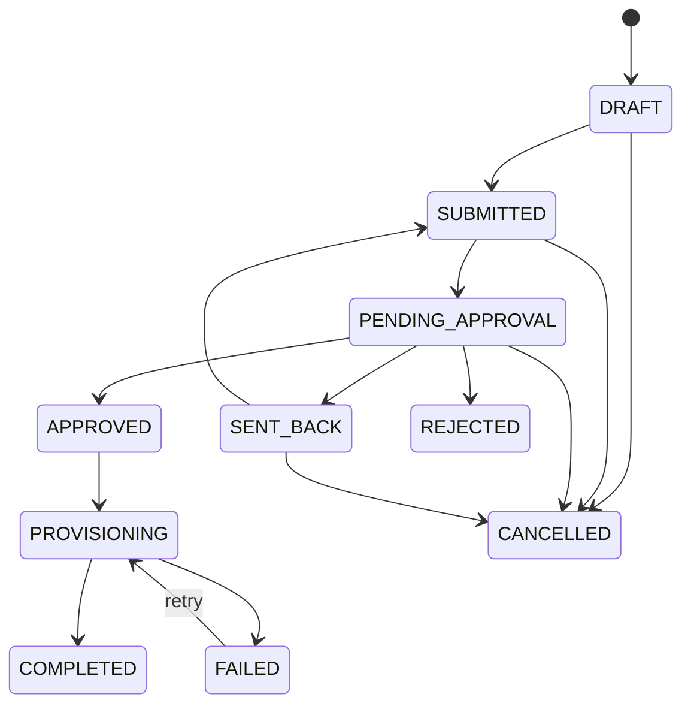

# IAM: users and user requests

The user directory and the maker-checker workflow that changes it. Users are read-only in the directory: every account or access change is raised as a **User Request**, approved, then provisioned. Only emergency actions (lock, revoke sessions) and messages that change no account data (password-reset email, resend invitation) act directly.

## Code

| Layer                | Path                                                                                                                                                                                |
| -------------------- | ----------------------------------------------------------------------------------------------------------------------------------------------------------------------------------- |
| Users API            | `apps/backend/src/modules/users/` (`iam-user.*` for the directory, `user-admin.*` for the profile/detail sub-resources, `user-actions.ts`, `approved-user.ts`, `account-status.ts`) |
| User Requests API    | `apps/backend/src/modules/user-requests/` (`user-request.service.ts`, `.repository.ts`, `.access.ts` for access preview, `.provisioner.ts`, `.notifier.ts`, `.types.ts`)            |
| Frontend             | `apps/zcc-frontend/src/app/features/iam/users/`, `features/iam/user-requests/`, shared `access-preview`, `user-select`, `entity-picker-dialog`                                      |
| Frontend API clients | `core/api/iam-admin.api.ts`, `core/api/user-requests.api.ts`, `core/api/user-admin.api.ts`                                                                                          |

## Users API

Base path `/api/v1/iam/users`. Read routes need `users:read`; direct actions need `users:manage`.

| Method                                                                                                                                                                                          | Path                                                                                                  | Guard          | Purpose                                                                                                             |
| ----------------------------------------------------------------------------------------------------------------------------------------------------------------------------------------------- | ----------------------------------------------------------------------------------------------------- | -------------- | ------------------------------------------------------------------------------------------------------------------- |
| GET                                                                                                                                                                                             | `/`                                                                                                   | `users:read`   | Search approved users (name, email, employee code, status, type, branch, department, team, role, group, MFA, dates) |
| GET                                                                                                                                                                                             | `/stats`                                                                                              | `users:read`   | Counts by status                                                                                                    |
| GET                                                                                                                                                                                             | `/:id`                                                                                                | `users:read`   | User summary                                                                                                        |
| GET                                                                                                                                                                                             | `/:id/profile`, `/access`, `/sessions`, `/notes`, `/requests`, `/status-history`, `/emails`, `/audit` | `users:read`   | Detail-page sections                                                                                                |
| POST                                                                                                                                                                                            | `/:id/lock`                                                                                           | `users:manage` | Emergency lock                                                                                                      |
| DELETE                                                                                                                                                                                          | `/:id/sessions`, `/:id/sessions/:sessionId`                                                           | `users:manage` | Revoke sessions                                                                                                     |
| POST                                                                                                                                                                                            | `/:id/notes`                                                                                          | `users:manage` | Add an internal note                                                                                                |
| POST                                                                                                                                                                                            | `/:id/password-reset`                                                                                 | `users:manage` | Send a reset email                                                                                                  |
| POST                                                                                                                                                                                            | `/:id/resend-invitation`                                                                              | `users:manage` | Resend invitation                                                                                                   |
| POST `/`, PATCH `/:id`, PUT `/:id/status`, `/:id/roles`, `/:id/groups`, POST `/:id/unlock`, `/require-password-change`, `/reset-mfa`, `/cancel-invitation`, PATCH `/:id/profile`, DELETE `/:id` | —                                                                                                     | authenticate   | Always **409 `CHANGE_REQUIRES_REQUEST`**: raise a User Request instead                                              |

A user appears in search only after access was approved (an approved `NEW_USER` request or a role granted by an administrator). Self-registered and directly invited accounts stay hidden until then (`approved-user.ts`).

## User Requests API

Base path `/api/v1/iam/user-requests`. Each route needs the listed permission.

| Method | Path                         | Permission                                                         |
| ------ | ---------------------------- | ------------------------------------------------------------------ |
| GET    | `/`                          | `user-requests:read`                                               |
| POST   | `/`                          | `user-requests:create`                                             |
| GET    | `/lookups`                   | `user-requests:read` (branches, departments, teams, groups, roles) |
| POST   | `/access-preview`            | `user-requests:read` (effective permissions a draft would grant)   |
| GET    | `/:id`, `/:id/access`        | `user-requests:read`                                               |
| PATCH  | `/:id`                       | `user-requests:update` (Draft or Sent Back only)                   |
| GET    | `/:id/audit`                 | `user-requests:audit:read`                                         |
| POST   | `/:id/submit`                | `user-requests:submit`                                             |
| POST   | `/:id/approve`               | `user-requests:approve`                                            |
| POST   | `/:id/reject`                | `user-requests:reject` (comment required)                          |
| POST   | `/:id/send-back`             | `user-requests:send-back` (comment required)                       |
| POST   | `/:id/cancel`                | `user-requests:cancel`                                             |
| POST   | `/:id/retry-provisioning`    | `user-requests:retry`                                              |
| POST   | `/:id/notes`                 | `user-requests:notes:create`                                       |
| POST   | `/:id/emails/:emailId/retry` | `user-requests:retry`                                              |

### Request types

`NEW_USER`, `UPDATE_USER`, `ACCESS_CHANGE`, `ADD_ROLE`, `REMOVE_ROLE`, `ADD_GROUP`, `REMOVE_GROUP`, `TRANSFER`, `ACTIVATE_USER`, `DEACTIVATE_USER`, `UNLOCK_ACCOUNT`, `RESET_MFA`. Every type except `NEW_USER` targets an existing user.

### Lifecycle

Requests are editable in `DRAFT` and `SENT_BACK`, and cancellable from `DRAFT`, `SUBMITTED`, `PENDING_VERIFICATION`, `PENDING_APPROVAL` and `SENT_BACK` (`user-request.types.ts`).

- The approval chain is built on submit: manager (when a reporting manager is set and is not the requester), then IAM/admin, then security when the change grants a privileged role or permission (`owner`, `admin`, `super_admin`, `*:*`, `users:manage`, `roles:manage`, `settings:manage`).
- Provisioning writes the change. For `NEW_USER` it creates the account, memberships, groups and roles, then sends an invitation; the request completes when the invitee accepts.
- Events, notes and email attempts are append-only, and every step is audited.
- Reference numbers look like `UR-2026-000124`.

## Data model

`User` (adds `employee_code`, `user_type`, `branch_id`, `reporting_manager_id`), `UserTenant`, `UserRoleAssignment`, `UserGroup`, `UserStatusHistory`, `UserNote`, `UserEmailLog`, `UserRequest`, `UserRequestApproval`, `UserRequestEvent`, `UserRequestNote`, `UserRequestEmail`.

## Frontend

| Route                                | Permission           | Screen                                                                                                |
| ------------------------------------ | -------------------- | ----------------------------------------------------------------------------------------------------- |
| `/iam/users`                         | `users:read`         | Search with filters and status counts                                                                 |
| `/iam/users/:id`                     | `users:read`         | Detail with sections; "Request change" opens a prefilled request                                      |
| `/iam/user-requests`                 | `user-requests:read` | Request search                                                                                        |
| `/iam/user-requests/create`          |                      | Step form that adapts to the request type, with live access preview                                   |
| `/iam/user-requests/:requestId`      |                      | Detail: request, user, access, approval chain, notes, history, emails, audit (`?section=` deep links) |
| `/iam/user-requests/:requestId/edit` |                      | Edit a Draft or Sent Back request                                                                     |

## Tests

`users/user-actions.spec.ts`, `user-requests/user-request.service.spec.ts`, `user-requests/user-request.repository.spec.ts`, `core/api/iam-admin.api.spec.ts`.

## Review notes

- **Directory is not scoped to the caller's organization** (review **H5**): list, get, stats, lock and session revocation work across organizations. User Requests are scoped.
- The legacy `/api/v1/admin/users/save` endpoint writes users directly with only a sign-in check, bypassing this workflow (review **C2**). Retire it.
- `/users` is a second users page on the same API; `/admin/users` already redirects here. See [legacy admin](legacy-admin.md).

## Related

[USERS_MODULE.md](../USERS_MODULE.md), [USER_REQUESTS.md](../USER_REQUESTS.md), [access control](iam-access-control.md)
