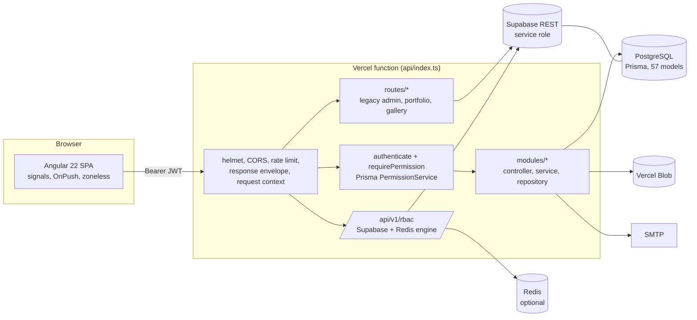

# Application review: Zellavora Control Center

|                      |                                                                                            |
| -------------------- | ------------------------------------------------------------------------------------------ |
| Reviewed             | 2026-10-04                                                                                 |
| Commit               | `6518866` (branch `claude/design-system-extraction-j0ky79`)                                |
| Scope                | `apps/backend` (Express + Prisma), `apps/zcc-frontend` (Angular 22), CI, deployment config |
| Module documentation | [docs/modules/README.md](../modules/README.md)                                             |

## 1. Summary

ZCC is a multi-tenant admin platform: identity and access management (IAM), a maker-checker user-request workflow, freelancer timesheets, a CMS and blog, a media library, organization themes, analytics and operations tooling. It ships as an Angular SPA and an Express API that runs as a single Vercel function.

The newer code is good. Auth, User Requests, the sheet modules and the tenant-scoped content modules (blog, CMS, themes, media) are layered, validated with Zod, guarded by permissions, and covered by tests. The frontend is consistently built: standalone components, signals, 100% OnPush, zoneless change detection, every feature lazy-loaded, and a 68 KB initial download.

The risk sits in older and parallel code that was never brought up to the same standard:

- **Three endpoint groups are reachable without signing in** (organizations, notifications, legacy upload). One of them can switch off an organization's mandatory 2FA.
- **The legacy `/api/v1/admin/*` API checks only that a caller is signed in.** Any member can create or edit any user through it, which bypasses the approval workflow the IAM module enforces.
- **The IAM user directory and the dashboard activity feed are not scoped to the caller's organization**, and **permission checks ignore role status, deny rules and group-granted roles**.
- **Some screens call endpoints the backend does not serve**: every portfolio request and the notifications page's broadcast/templates calls return 404.
- **CI cannot go green as configured** (Node version, lint, install steps, retired actions).

Fix the Critical and High items in section 4 before any further production rollout. Most are small: add a guard, delete a dead route, or derive the organization from the token.

### Scorecard

| Area               | Rating          | Notes                                                                                                 |
| ------------------ | --------------- | ----------------------------------------------------------------------------------------------------- |
| Security           | Needs work      | Strong auth core; 3 critical and 6 high-severity security issues, mostly in older or parallel code    |
| Architecture       | Good, with debt | Clean module pattern; legacy route layer and duplicate features remain mounted                        |
| Code quality       | Mixed           | Both apps type-check under strict mode; frontend lint reports 1,552 errors                            |
| Tests              | Fair            | Backend 364/367 pass; frontend 133/133 pass; 9 backend modules and 11 frontend features have no tests |
| CI/CD              | Broken          | Frontend jobs need a newer Node; backend test job never installs backend deps                         |
| Performance        | Good            | Small initial bundle, lazy chunks; one DB write per authenticated request                             |
| Accessibility / UX | Good            | 44px targets, focus rings, reduced-motion support; a few contrast misses (see design system)          |

## 2. What was run

| Check                       | Command                                                   | Result                                                                                                                     |
| --------------------------- | --------------------------------------------------------- | -------------------------------------------------------------------------------------------------------------------------- |
| Backend type-check          | `npx tsc --noEmit` (apps/backend)                         | Pass                                                                                                                       |
| Backend tests               | `npx jest --runInBand`                                    | **364 passed, 3 failed** (all in `src/routes/api-contract.spec.ts`)                                                        |
| Backend lint                | `npx eslint src --ext .ts`                                | **Does not run**: the root `.eslintrc.json` references `@angular-eslint/eslint-plugin`, which the backend does not install |
| Frontend type-check         | `tsc --noEmit -p tsconfig.app.json`                       | Pass                                                                                                                       |
| Frontend tests              | `ng test --watch=false` (Chrome headless, `--no-sandbox`) | **133 passed**                                                                                                             |
| Frontend lint               | `ng lint`                                                 | **1,552 errors** (missing return types, `any`, accessibility modifiers, Prettier)                                          |
| Formatting                  | `prettier --check "apps/**/*"`                            | **51 files** need formatting                                                                                               |
| Frontend build              | `ng build`                                                | Pass. Initial: 340.9 kB raw / 68.1 kB transfer. Largest lazy chunk: pdf worker 1.19 MB                                     |
| Angular CLI on Node 22.22.0 | any `ng` command                                          | **Refuses to run**: needs Node ≥ 22.22.3, 24.15 or 26                                                                      |

The three backend test failures are the API contract test: the OpenAPI spec no longer matches the registered routes (106 undocumented operations, `/api/v1/health` missing, an `operations` tag not declared).

## 3. Architecture overview

- **Request path.** `api/index.ts` exports the Express app. Middleware order: Swagger, JSON body (50 MB), response envelope, CORS, helmet, auth-surface rate limit, AsyncLocalStorage request context, routes, RBAC gateway, 404, error handler.
- **Module pattern.** `modules/<name>/` holds `*.routes.ts` → `*.controller.ts` → `*.service.ts` → `*.repository.ts` with `*.dto.ts` (Zod). 31 modules follow it.
- **Legacy layer.** `routes/*.ts` (portfolio, gallery, technologies, settings, the `admin-*` family) predates the pattern: handlers inline, Supabase client instead of Prisma, little validation.
- **Two permission systems.** `requirePermission` in `middleware/auth.ts` (Prisma role assignments) guards nearly everything. A second engine in `rbac/` (Supabase tables, Redis cache, deny-wins inheritance) is mounted at `/api/v1/rbac` but is not wired to authentication (finding M1).
- **Tenancy.** The access token carries the organization (`tid`). Newer modules take the organization from the token; the IAM directory and several legacy routes do not (findings H5, M11).
- **Frontend.** `core/` (auth store, interceptors, API clients, RBAC store, theme runtime), `shared/` (layout, data table, dialog, pagination, IAM widgets), and 22 lazy `features/`. The sidebar menu is served by the backend (`GET /auth/me`).

## 4. Findings

Severity: **Critical**, exploitable without special access and high impact. **High**, exploitable by any signed-in user or breaks a security boundary. **Medium**, real weakness with limited reach. **Low**, hygiene.

### Critical

#### C1. Organization endpoints need no sign-in

`apps/backend/src/modules/organization/organization.routes.ts:24,37,55`

`GET /api/v1/organizations/:id`, `POST /api/v1/organizations` and `PUT /api/v1/organizations/:id` have no `authenticate` guard. Anyone on the internet can read an organization by id, create organizations, and rename any organization or set `enforce2fa: false` on it (`organization.dto.ts`). The same router is also mounted at `/api/v1/clean/organizations`.

**Fix.** Add `authenticate` and a platform-level permission to all three. For updates, require `req.tenantId === :id` unless the caller holds a platform permission. Remove the `/clean/` alias.

#### C2. Legacy admin API checks sign-in only, and bypasses the approval workflow

`apps/backend/src/routes/admin-users.ts:609` and every handler in `admin-roles.ts`, `admin-groups.ts`, `admin-resources.ts`, `admin-configs.ts`

All `/api/v1/admin/*` handlers use `authenticate` and nothing else (0 calls to `requirePermission` across the seven files). They write through the Supabase **service-role** client with no organization filter. `POST /api/v1/admin/users/save` creates a user or updates any user by serial id, including `is_account_locked`, `enable_two_factor_authentication`, `password_reset_flag`, `otp` and `key_token`.

This defeats the design of the IAM module, where direct user changes are refused with `CHANGE_REQUIRES_REQUEST` (`modules/users/iam-user.routes.ts:15`) and must go through an approved User Request.

**Fix.** Retire the legacy admin API: the IAM module covers users, roles, groups, resources, branches and configuration. Until then, put `requirePermission('users:manage')` (and the matching keys) on every write and block user writes outright. In the frontend, only the resource manager at `/admin/resources` (`features/admin/services/admin-api.service.ts`) and the legacy path mappings in `core/http/api-base-url.interceptor.ts:50` still reach it; `/admin/users` and `/admin/roles` already redirect to IAM. The API itself stays callable by anyone with a token.

#### C3. Notification endpoints need no sign-in

`apps/backend/src/modules/notification/notification.routes.ts:19,32`

`GET /api/v1/notifications?organizationId=…` returns any organization's notifications. `POST /api/v1/notifications/send` creates notifications for any organization and enqueues a `send-otp` job to the hard-coded address `admin@zellavora.com` with the request body as the "OTP" (`notification.service.ts:30`).

The `/notifications` page in the frontend (`core/api/notification.api.ts`) also calls `/notifications/broadcast` and `/notifications/templates`, which the backend does not serve. In-app messages that do work are sent through `/api/v1/iam/communications`.

**Fix.** Add `authenticate`, take the organization from the token, and either finish the module (recipient resolution, broadcast, templates) or remove it and point the page at the communications API.

### High

#### H1. JWT secrets fall back to known values

`apps/backend/src/config/env.ts:45-46`

When `JWT_SECRET` or `REFRESH_TOKEN_SECRET` is unset, the app signs and verifies tokens with `'dev-secret-change-in-production'` / `'dev-refresh-secret'`. On Vercel the app deliberately keeps serving with a degraded `/health` instead of failing (`env.ts` comments, `api/index.ts`). A deployment that loses the variable accepts tokens anyone can forge.

**Fix.** In `TokenService`, refuse to sign or verify when the secret is missing, shorter than 32 bytes, or equal to a default, and return 503. Keep the "do not throw at import" behaviour.

#### H2. Unauthenticated upload writes to local disk

`apps/backend/src/modules/storage/storage.routes.ts:20` → `storage.repository.ts:17`

`POST /api/v1/storage/upload` has no guard. It decodes up to 50 MB of base64 and writes it under `./scratch/` with a caller-chosen extension. Nothing serves that folder, and Vercel's filesystem is read-only, so the route only works as a disk-filling vector on a long-lived server. (Path traversal was checked: the extension cannot contain `..`, so writes stay inside `scratch/`.)

**Fix.** Delete the route. `POST /api/v1/storage/media` is the guarded, tenant-scoped replacement.

#### H3. Any signed-in user can write audit records for any organization

`apps/backend/src/modules/audit/audit.routes.ts:118`, schema `audit.dto.ts:24`

`POST /api/v1/audit-logs/log` accepts `organizationId`, `actorId`, `action`, `ipAddress` and before/after data from the body, guarded only by `authenticate`. Anyone can plant or impersonate entries in another organization's audit trail, which undermines its value as evidence.

**Fix.** Remove the endpoint (server code already audits through `infrastructure/audit.ts`), or force `organizationId` and `actorId` from the token and require a dedicated permission.

#### H4. Legacy audit read skips the audit permission

`apps/backend/src/routes/admin-audit.ts:275,292`

`GET /api/v1/admin/audit` and `/admin/audit/export` return up to 1,000 of the organization's audit records (actor, action, IP) to any signed-in member. The canonical `/api/v1/operations/audit-logs` requires `AUDIT_LOG_VIEW`. The frontend's `core/api/audit.api.ts:11,15` still uses the legacy path.

**Fix.** Point the frontend at `/operations/audit-logs` and delete the legacy routes, or add `requirePermission('AUDIT_LOG_VIEW', 'system:audit:read')`.

#### H5. IAM directory and dashboard are not scoped to the caller's organization

`apps/backend/src/modules/users/iam-user.repository.ts:67`; `modules/dashboard/dashboard.repository.ts:70,153,199`; also `groups`, `resources`, `roles` (optional filter only)

`IamUserService.list`, `getById`, `stats` and `lock` never filter by organization. A user with `users:read` in one organization lists every approved user on the platform; with `users:manage` they can lock any of them (`POST /api/v1/iam/users/:id/lock`) and revoke their sessions. The dashboard has the same gap: `GET /api/v1/dashboard/overview` counts members, sessions and audit events across every organization, and `GET /api/v1/dashboard/activity` returns the latest audit entries (actor, action, resource) of all organizations to anyone with `dashboard:read`. User Requests, departments, teams, branches and sessions _are_ scoped, so this is inconsistent rather than intentional.

**Fix.** Filter through `userTenants: { some: { organizationId: req.tenantId } }` in list, get, stats and every action; pass `req.tenantId` into the dashboard repository; or declare IAM and the dashboard a platform-operator console and gate it behind a platform permission that tenant admins never receive.

#### H6. Permission checks ignore role status, deny rules and group roles

`apps/backend/src/services/auth/permission.service.ts:15`

`PermissionService.loadForUser`, which backs every `requirePermission` call, collects the `allow` permissions of the user's direct role assignments and nothing else:

- An administrator who sets a role to `INACTIVE` expects its holders to lose access. They keep it, because role status is never read.
- `deny` entries are skipped instead of subtracted, so a deny on one role does not cancel an allow on another.
- Roles granted through a group (`group_roles`) are never loaded, so group-based access silently grants nothing. The User Request access preview (`user-request.access.ts:125,211`) does count group roles, so approvers see access the user will not actually get.

**Fix.** Filter assignments to `role.status = ACTIVE` and `isDeleted = false`; add roles reached through `userGroups → group.groupRoles`; compute allows minus denies. Add unit tests for each case.

#### H7. CI cannot pass as configured

`.github/workflows/ci.yml`

- `node-version: '20'`, but the Angular 22 CLI exits on anything below Node 22.22.3. Every frontend job fails before it starts.
- `npm run lint` runs the frontend linter, which reports 1,552 errors; `format:check` flags 51 files.
- The `backend-test` job runs `npm ci` at the root only. The root workspace contains just the frontend, so backend dependencies (Jest, Prisma) are never installed.
- `actions/upload-artifact@v3` and `github/codeql-action/upload-sarif@v2` are retired and fail on GitHub-hosted runners.
- The frontend artifact path `dist/apps/zcc-frontend` does not exist; the build writes to `apps/zcc-frontend/dist/zcc-frontend`.
- Workflows trigger only on `main` and `develop`; feature branches get no CI.

**Fix.** Use Node 24, add `npm ci --prefix apps/backend` to backend jobs, bump to `upload-artifact@v4` and `codeql-action@v3`, fix the artifact path, run `ng lint --fix` plus a manual pass (or temporarily scope lint to changed files), and add `pull_request` on all branches.

### Medium

| ID  | Finding                                                                                                                                                                                                                                                                                                                 | Location                                                                                                                                              | Fix                                                                                                                                       |
| --- | ----------------------------------------------------------------------------------------------------------------------------------------------------------------------------------------------------------------------------------------------------------------------------------------------------------------------- | ----------------------------------------------------------------------------------------------------------------------------------------------------- | ----------------------------------------------------------------------------------------------------------------------------------------- |
| M1  | `/api/v1/rbac` router has no `authenticate`; its middleware reads `req.auth`, which nothing sets. Guarded routes always 401, `/permissions/groups` is public, `/me/policy` throws a TypeError (500). It is a second permission engine beside `PermissionService`.                                                       | `app.ts` (rbac gateway), `rbac/middleware/permission.middleware.ts`, `rbac/controllers/rbac.controller.ts:163,760`                                    | Remove the RBAC router, or put `authenticate` in front and map `req.userId/tenantId` to `req.auth`. Keep one engine.                      |
| M2  | Mass assignment: portfolio, gallery and technology handlers pass `req.body` straight to Supabase `.update()` / `.insert()`. Owners can rewrite `user_id`; any member can add global technologies.                                                                                                                       | `routes/portfolio.ts:94,242,433,624,815,1006`, `routes/gallery.ts:245`, `routes/technologies.ts:69`                                                   | Validate with Zod allow-lists; require `projects:write` for technologies.                                                                 |
| M3  | Refresh token kept in `localStorage` ("keep me signed in") or `sessionStorage`. An XSS bug would expose a 7-day credential. Rotation and reuse detection limit the damage.                                                                                                                                              | `zcc-frontend/src/app/core/auth/auth.service.ts:159`                                                                                                  | Move the refresh token to an `HttpOnly; Secure; SameSite=Strict` cookie scoped to `/api/v1/auth/refresh`, as CLAUDE.md already specifies. |
| M4  | Public health endpoints disclose internals: `/api/v1/health` returns CPU, RAM, DB error text and dependency state; `/health` returns the list of config errors.                                                                                                                                                         | `app.ts:117,160`                                                                                                                                      | Keep `/health` as status only; move detail behind `OPERATIONS_SYSTEM_HEALTH_VIEW` (already exists at `/operations/health`).               |
| M5  | Unexplained public route `GET /api/memberportal/api/MemberPortalLogin/gettoken` returns a random key and IV.                                                                                                                                                                                                            | `app.ts:241`                                                                                                                                          | Delete it.                                                                                                                                |
| M6  | Global JSON body limit is 50 MB while media uploads cap at 3 MB and Vercel at 4.5 MB. Large bodies are parsed before auth runs.                                                                                                                                                                                         | `app.ts:34`                                                                                                                                           | Set ~1 MB globally; raise per route where needed.                                                                                         |
| M7  | CSP allows `'unsafe-inline'` scripts for the whole API to suit Swagger UI.                                                                                                                                                                                                                                              | `app.ts:53`                                                                                                                                           | Apply the relaxed CSP only under `/swagger` and `/api-docs`.                                                                              |
| M8  | Legacy admin routes map UUIDs to numeric serials in module-level `Map`s. They reset per serverless instance (ids stop matching between requests) and grow without bound.                                                                                                                                                | `routes/admin-helpers.ts`                                                                                                                             | Goes away with C2.                                                                                                                        |
| M9  | Duplicate implementations of the same feature (see section 5).                                                                                                                                                                                                                                                          | —                                                                                                                                                     | Consolidate.                                                                                                                              |
| M10 | Every authenticated request loads the organization's security policy and writes `sessions.last_activity_at`.                                                                                                                                                                                                            | `middleware/auth.ts` (`touchIfActive`)                                                                                                                | Cache the policy per organization (it changes rarely) and update `last_activity_at` at most once a minute.                                |
| M11 | `PUT /api/v1/settings/:section` stores non-profile sections in a module-level object shared by every user and organization, lost on restart.                                                                                                                                                                            | `routes/settings.ts:200`                                                                                                                              | Persist per organization via the `settings`/`configuration` module, with `settings:write`.                                                |
| M12 | SMTP settings are stored once for the whole platform (`email-settings.service.ts`), but any organization's admin with `settings:manage` can change them, redirecting every tenant's mail.                                                                                                                               | `modules/email-settings/email-settings.routes.ts`                                                                                                     | Require a platform permission, or store settings per organization.                                                                        |
| M13 | Portfolio screens call `/api/v1/portfolio/*`, but the backend serves those handlers at `/api/v1/profile`, `/api/v1/skills`, etc., so every portfolio request 404s. Their tables exist only in `supabase/migrations`, not in the Prisma schema. The interceptor also rewrites gallery calls to a path the backend lacks. | `zcc-frontend/src/app/features/portfolio/services/portfolio.service.ts:60`, `core/http/api-base-url.interceptor.ts:59`, `backend/src/routes/index.ts` | Mount the portfolio router at `/api/v1/portfolio`, add the tables to Prisma, drop the gallery rewrite; or retire the feature.             |
| M14 | `api-base-url.interceptor.ts` keeps a per-path routing table to "Supabase edge functions", but every branch now resolves to the same base URL from `appsettings.json`. It hides real routing bugs (M13) and maps legacy `/api/user`, `/role`, `/Branch` paths onto the unguarded admin API.                             | `core/http/api-base-url.interceptor.ts`                                                                                                               | Reduce to one base-URL prefix; delete the legacy mappings with the admin API.                                                             |
| M15 | The frontend retry interceptor retries every HTTP method on status 0 or 503, including POSTs (approve, submit, send email, provision). A request that reached the server before the connection dropped runs twice.                                                                                                      | `zcc-frontend/src/app/core/http/retry.interceptor.ts`                                                                                                 | Retry only GET/HEAD, or add idempotency keys to writes.                                                                                   |

### Low

| ID  | Finding                                                                                                                                                                                                                                                              |
| --- | -------------------------------------------------------------------------------------------------------------------------------------------------------------------------------------------------------------------------------------------------------------------- |
| L1  | The error handler and 72 other backend sites use `console.*` although Winston is configured (`infrastructure/logger.ts`).                                                                                                                                            |
| L2  | Frontend lint debt: 1,552 errors, 37 `any` uses in app code.                                                                                                                                                                                                         |
| L3  | `/api/v1/health` reports queue metrics as hard-coded zeros.                                                                                                                                                                                                          |
| L4  | `tailwind.config.js` keeps `primary`, `secondary` and `accent` scales that no shared component uses.                                                                                                                                                                 |
| L5  | The data table has no light-theme styles; it stays dark-tinted in light mode.                                                                                                                                                                                        |
| L6  | Documentation drift: CLAUDE.md lists Angular Material, Vite env vars and Node 20; the app uses PrimeNG + `@zellavoras/ui`, a runtime `appsettings.json`, and needs Node ≥ 22.22.3. `docs/IMPLEMENTATION_SUMMARY.md` describes an earlier state of the sheet modules. |
| L7  | Contrast misses recorded in the design system: white on `brand-500` (4.47:1), placeholder text on dark inputs (3.9:1), green/amber chips in light mode.                                                                                                              |
| L8  | `GET /api/v1/auth/clients` lists every active organization to anonymous callers (sign-in picker). Fine for a single-tenant install; on a shared platform it discloses the customer list.                                                                             |
| L9  | Daily and monthly sheets have a `rejected` status in the schema but no reject endpoint; reviewers can only approve.                                                                                                                                                  |

## 5. Duplication and dead code

| Concern                                           | Implementations                                                                                                               | Recommendation                                                                                               |
| ------------------------------------------------- | ----------------------------------------------------------------------------------------------------------------------------- | ------------------------------------------------------------------------------------------------------------ |
| User management                                   | `features/iam/users` (current) and `features/users` (a second page at `/users` on the same IAM API); `/admin/users` redirects | Keep `/iam/users`; remove `/users`.                                                                          |
| Roles, groups, resources, branches, configuration | `modules/*` + `features/iam` (current); `routes/admin-*` (legacy API) with `features/admin` resource manager still on it      | Move the resource manager to `/api/v1/iam/resources`; delete `routes/admin-*` and `features/admin/services`. |
| Permission evaluation                             | `services/auth/permission.service.ts` (used); `rbac/` engine (unwired)                                                        | Keep one.                                                                                                    |
| Timesheets                                        | `daily-sheets` + `monthly-sheets` (`/freelancer-sheets`) and `timesheets` (`/timesheets`)                                     | Decide whether both workflows are products; if not, merge.                                                   |
| Audit log UI                                      | `features/operations/audit-logs` (routed), `features/audit-logs` (not routed)                                                 | Delete `features/audit-logs`.                                                                                |
| System health UI                                  | `features/operations/system-health` (routed), `features/system-health` (not routed)                                           | Delete `features/system-health`.                                                                             |
| CMS builder                                       | `features/cms` (routed), `features/cms-builder` (redirect only)                                                               | Delete `features/cms-builder`.                                                                               |
| Settings storage                                  | `modules/settings` and `modules/configuration` (both on `common_configurations`), `routes/settings.ts` (in-memory)            | One configuration service.                                                                                   |
| Route aliases                                     | `/api/v1/clean/*`, `/api/v1/system-health`, `/api/v1/audit-logs`                                                              | Announce a removal date, then drop.                                                                          |

## 6. Test coverage gaps

Backend modules with no tests: `cms`, `dashboard`, `ddl`, `invitation`, `notification`, `organization`, `resources`, `storage`, `teams`, and the whole `routes/` legacy layer. None of the findings in section 4 would have been caught, because no test asserts that a route rejects anonymous or under-privileged callers.

Frontend features with no specs: `account`, `analytics`, `auth`, `cms`, `media`, `operations`, `portfolio`, `projects`, `settings`, `theme-builder`, `users`. There are no Playwright E2E specs for login, user requests or sheet approval.

**Add one cheap, high-value test:** walk the Express router stack and fail when a non-allow-listed route lacks `authenticate`. It would have flagged C1, C3 and H2.

## 7. Strengths worth keeping

- **Auth module.** Enumeration-resistant responses, TOTP MFA with recovery codes, per-account and per-IP rate limits, refresh-token rotation with family revocation on reuse, HS256 pinned on verify, and session checks on every request so logout and revocation take effect immediately.
- **Maker-checker IAM.** Account and access changes go through User Requests (draft → submit → approve → provision) with notes, emails, retry and a full event trail.
- **Sheet rules.** Ownership and review rules live in one place (`daily-sheets/sheets.shared.ts`): only owners edit, only reviewers approve, owners cannot approve their own sheets unless they are the organization owner.
- **Consistent validation and errors.** Zod DTOs everywhere in `modules/`, one error envelope, Zod issues mapped to field errors.
- **Serverless-aware bootstrap.** Nothing throws at import; RBAC/Redis initialise lazily; `/health` explains misconfiguration.
- **Frontend discipline.** Standalone components, signals, OnPush in 128 of 128 components, zoneless, lazy routes, permission-aware route matching, and a small initial bundle.

## 8. Recommended plan

| Order | Work                                                                                                                                                  | Effort   |
| ----- | ----------------------------------------------------------------------------------------------------------------------------------------------------- | -------- |
| 1     | C1, C3, H2: add guards or delete the routes                                                                                                           | Hours    |
| 2     | C2, H4, M8, M14: move the resource manager and `audit.api.ts` to the IAM/operations APIs; delete `routes/admin-*` and the legacy interceptor mappings | 1–2 days |
| 3     | H1: fail closed on missing/default JWT secrets                                                                                                        | Hours    |
| 4     | H3, M5: delete `/audit-logs/log` and the member-portal route                                                                                          | Hours    |
| 5     | H5, H6: tenant-scope the IAM directory and dashboard; fix permission resolution                                                                       | 1–2 days |
| 6     | H7: repair CI (Node 24, backend install, action versions, lint baseline)                                                                              | 1 day    |
| 7     | Route-guard test from section 6; fix the API contract test                                                                                            | Hours    |
| 8     | M1, M9: remove the unwired RBAC engine and dead frontend features                                                                                     | 1 day    |
| 9     | M3: refresh token to HttpOnly cookie                                                                                                                  | 1–2 days |
| 10    | M2, M4, M6, M7, M10, M11, Low items                                                                                                                   | Ongoing  |
